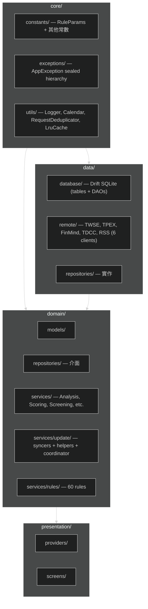
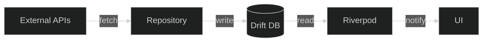

---
paths:
  - "lib/core/**"
  - "lib/data/**"
  - "lib/domain/**"
  - "lib/presentation/**"
---

# 架構分層圖

```mermaid
%%{init: {'theme': 'dark'}}%%
flowchart TB
    subgraph Core["core/"]
        Constants["constants/ — RuleParams + 其他常數"]
        Exceptions["exceptions/ — AppException sealed hierarchy"]
        Utils["utils/ — Logger, Calendar, RequestDeduplicator, LruCache"]
    end

    subgraph Data["data/"]
        Database["database/ — Drift SQLite (tables + DAOs)"]
        Remote["remote/ — TWSE, TPEX, FinMind, TDCC, RSS (6 clients)"]
        Repos["repositories/ — 實作"]
    end

    subgraph Domain["domain/"]
        Models["models/"]
        RepoIF["repositories/ — 介面"]
        Services["services/ — Analysis, Scoring, Screening, etc."]
        Update["services/update/ — syncers + helpers + coordinator"]
        Rules["services/rules/ — 60 rules"]
    end

    subgraph Presentation["presentation/"]
        Providers["providers/"]
        Screens["screens/"]
    end

    Core --> Data
    Core --> Domain
    Data --> Domain
    Domain --> Presentation
```

## 資料流

```mermaid
%%{init: {'theme': 'dark'}}%%
flowchart LR
    API["External APIs"] -->|fetch| Repo["Repository"]
    Repo -->|write| DB[("Drift DB")]
    DB -->|read| Provider["Riverpod"]
    Provider -->|notify| UI["UI"]
```
