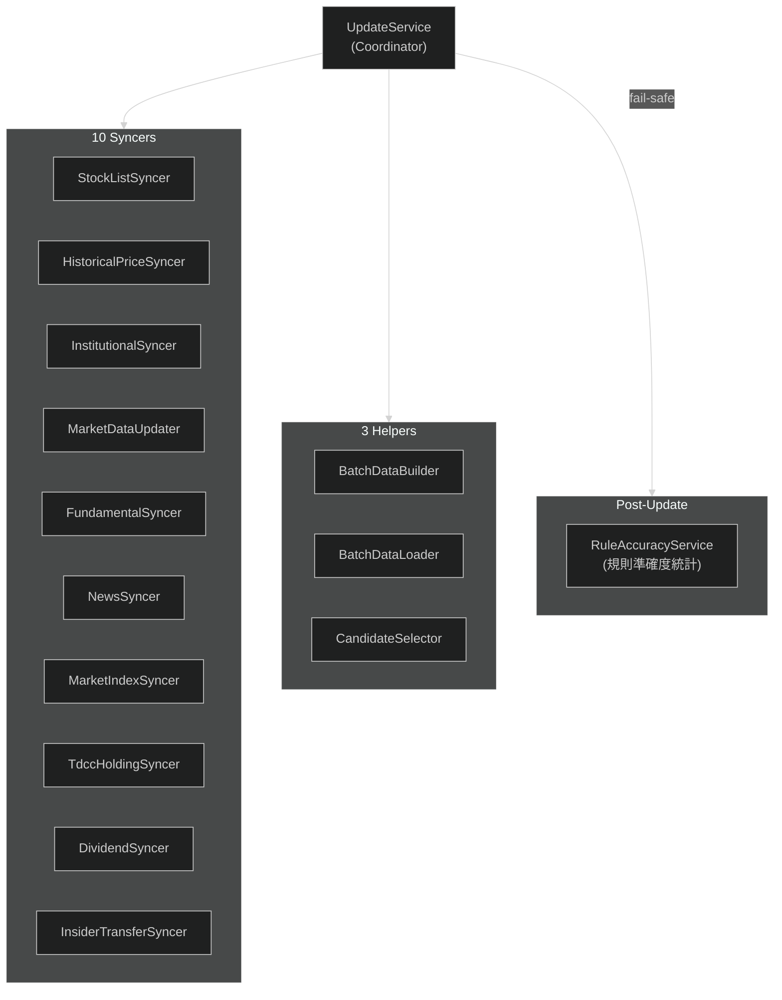

---
paths:
  - "lib/domain/services/update/**"
  - "lib/data/remote/**"
  - "**/syncer*"
  - "**/Syncer*"
  - "**/BatchData*"
  - "**/rule_accuracy*"
---

# Update Pipeline

## Update 元件

- **Coordinator**: `UpdateService` — 協調所有 syncer 執行順序 + 錯誤處理
- **10 Syncers**: 各自從 External API 拉取特定類別資料（stock list、price、institutional、market data、fundamental、news、market index、TDCC holding、dividend、insider transfer）
  - `HistoricalPriceSyncer` 兩段式：**Phase 0 市場日快照回補**（lookback 窗內整市場缺漏的交易日，1 次呼叫補該市場全部股票一天——TWSE MI_INDEX / TPEx afterTrading 歷史端點；單次上限與連續零筆斷路器見 `ApiConfig.historicalMarketDay*`）→ **Phase 1 per-symbol**（FinMind 逐檔逐月，補個股殘缺；priority＝自選+熱門追 250 天、非 priority 180 天早退）
  - `MarketDataUpdater` 除當日籌碼外含**當沖/融資缺漏日回補**（TWSE ~21:00 才發布，早更新錯過的日子掃 40 天窗補回；**per-source 斷路器 + 逐市場門檻 + 價格表當停市 ground truth**，設計取捨見 `ApiConfig.tradingBackfill*` 註解）
  - `InstitutionalSyncer` **非破壞式** force：force 只對當日繞快取，歷史回補日走 per-day 完整性檢查（已完整跳過、中斷可續傳）；全清僅由**口徑版本檢核**（`ensureDataVersion`，bump `DataFreshness.institutionalDataVersion` 觸發一次性遷移）承接；回補逐日 `onProgress` 回報
- **3 Helpers**: `BatchDataBuilder`（建構外資/董監等評分資料 Map，含衍生欄位）、`BatchDataLoader`（從 DB 平行載入評分批次資料 → `ScoringBatchData`）、`CandidateSelector`（選出評分候選；市場候選套流動性下限——20 日中位成交值 ≥ 3,000 萬 NTD，自選豁免）
- **Post-Update**: `RuleAccuracyService` 在更新後 fail-safe 聚合 per-rule 命中率統計（caller 仍 await，但錯誤不會中斷更新；從 `daily_reason` 算 unbiased，寫 `rule_accuracy`，供個股詳情規則表現顯示）；`ThesisMonitorService` 同模式檢查釘選論點失效（timeStop 單條件，全量重算冪等）
