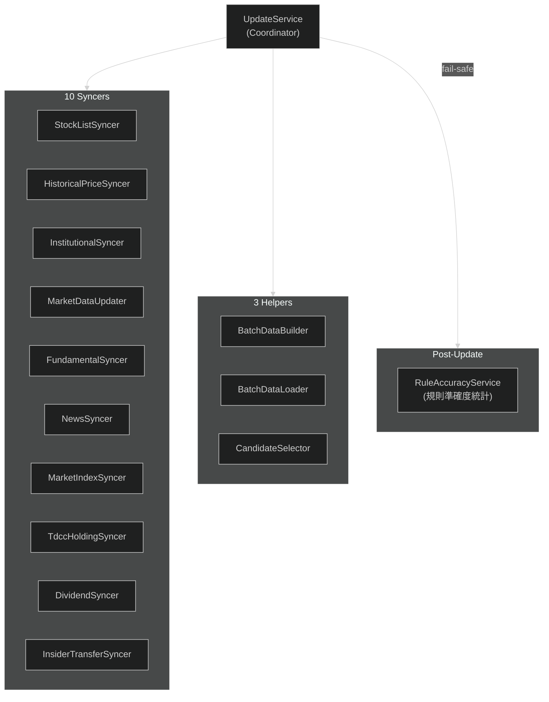

---
paths:
  - "lib/domain/services/update/**"
  - "lib/data/remote/**"
  - "**/syncer*"
  - "**/Syncer*"
  - "**/BatchData*"
  - "**/rule_accuracy*"
---

# Update Pipeline

## Update 元件

- **Coordinator**: `UpdateService` — 協調所有 syncer 執行順序 + 錯誤處理
- **10 Syncers**: 各自從 External API 拉取特定類別資料（stock list、price、institutional、market data、fundamental、news、market index、TDCC holding、dividend、insider transfer）
- **3 Helpers**: `BatchDataBuilder`（建構外資/董監等評分資料 Map，含衍生欄位）、`BatchDataLoader`（從 DB 平行載入評分批次資料 → `ScoringBatchData`）、`CandidateSelector`（選出評分候選；市場候選套流動性下限——20 日中位成交值 ≥ 3,000 萬 NTD，自選豁免）
- **Post-Update**: `RuleAccuracyService` 在更新後 fail-safe 聚合 per-rule 命中率統計（caller 仍 await，但錯誤不會中斷更新；從 `daily_reason` 算 unbiased，寫 `rule_accuracy`，供個股詳情規則表現顯示）
