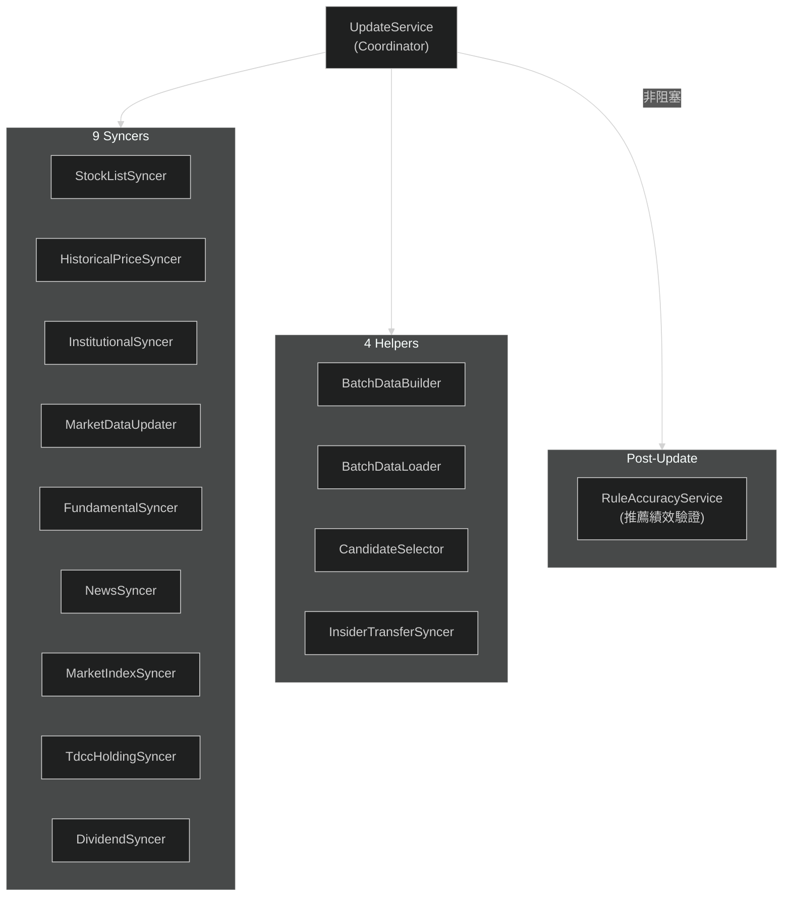

---
paths:
  - "lib/domain/services/update/**"
  - "lib/data/remote/**"
  - "**/syncer*"
  - "**/Syncer*"
  - "**/BatchData*"
  - "**/rule_accuracy*"
---

# Update Pipeline

## Update 元件

- **Coordinator**: `UpdateService` — 協調所有 syncer 執行順序 + 錯誤處理
- **9 Syncers**: 各自從 External API 拉取特定類別資料（stock list、price、institutional、market data、fundamental、news、market index、TDCC holding、dividend）
- **4 Helpers**: `BatchDataBuilder`（組裝批次寫入 DTO）、`BatchDataLoader`（批次載入 DB）、`CandidateSelector`（選出評分候選）、`InsiderTransferSyncer`（內部人轉讓同步）
- **Post-Update**: `RuleAccuracyService` 在更新後非阻塞執行推薦績效回測（多週期驗證）
