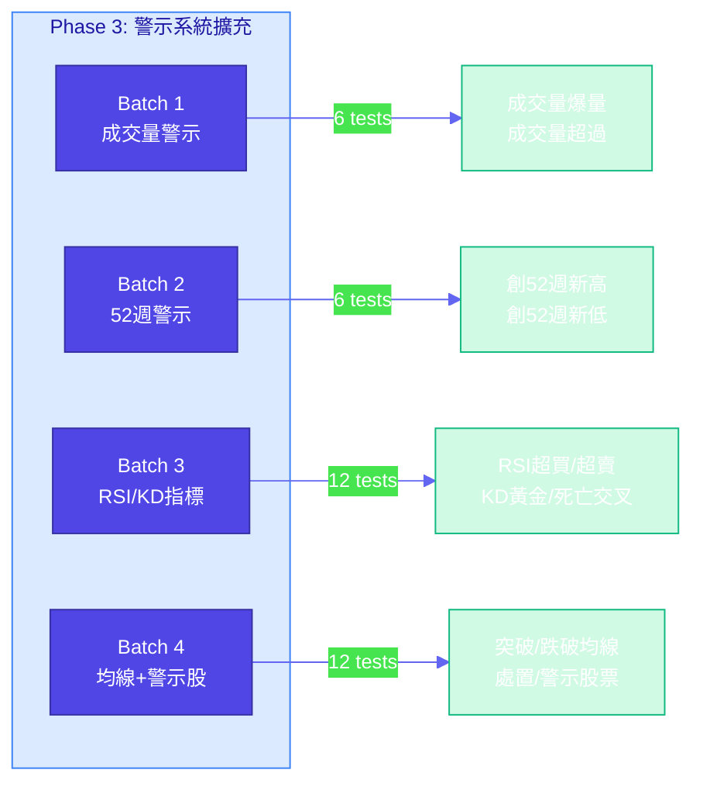
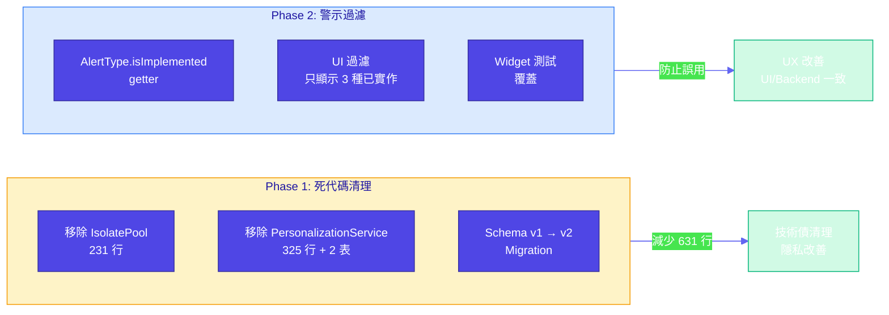
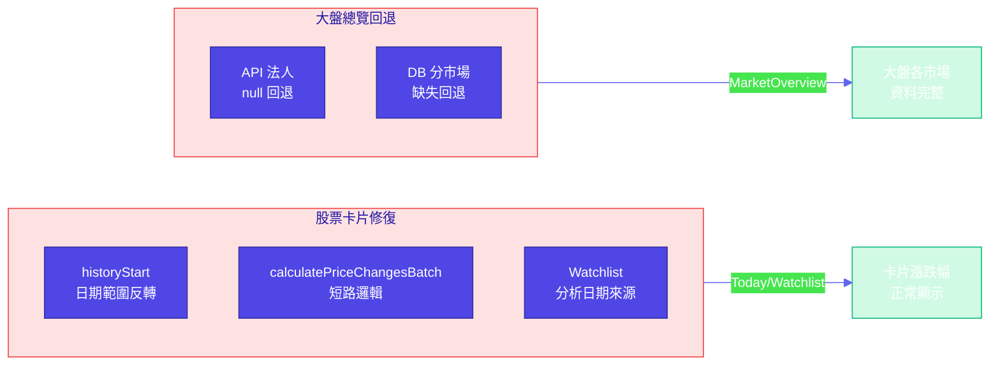
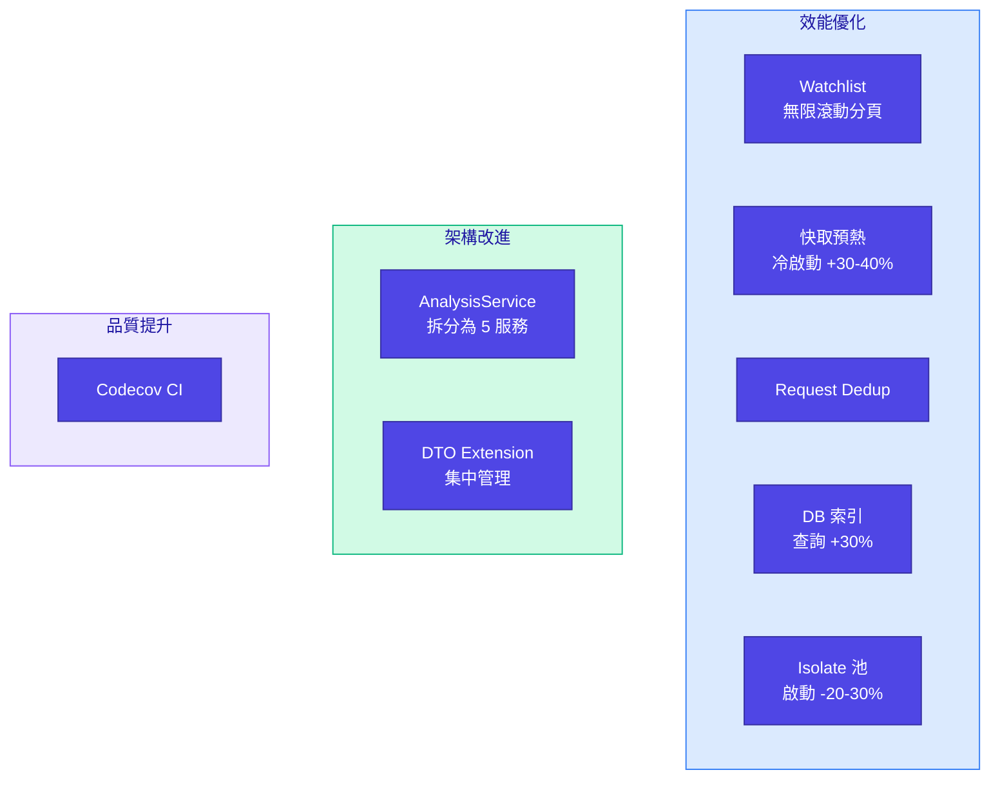

# Changelog

All notable changes to AfterClose will be documented in this file.

The format is based on [Keep a Changelog](https://keepachangelog.com/en/1.0.0/).

## [Unreleased]

### Added (2026-02-28)



#### 警示系統完整實作（Phase 3）

從 3 種基本價格警示擴充至 15 種高價值警示類型，涵蓋技術指標、成交量、風險控管等多個維度。

| 批次 | 警示類型 | 測試數 | 說明 |
|:---|:---|:---:|:---|
| **Batch 1** | 成交量警示 | 6 | `VOLUME_SPIKE`（爆量 4 倍 + 漲跌 1.5%）<br>`VOLUME_ABOVE`（成交量超過設定值） |
| **Batch 2** | 52 週警示 | 6 | `WEEK_52_HIGH`（創 52 週新高）<br>`WEEK_52_LOW`（創 52 週新低） |
| **Batch 3** | RSI/KD 指標警示 | 12 | `RSI_OVERBOUGHT`（RSI 超買）<br>`RSI_OVERSOLD`（RSI 超賣）<br>`KD_GOLDEN_CROSS`（KD 黃金交叉）<br>`KD_DEATH_CROSS`（KD 死亡交叉） |
| **Batch 4** | 均線交叉 + 警示股票 | 12 | `CROSS_ABOVE_MA`（突破均線）<br>`CROSS_BELOW_MA`（跌破均線）<br>`TRADING_WARNING`（一般警示股票）<br>`TRADING_DISPOSAL`（處置股票） |
| **總計** | **12 種新警示類型** | **36** | 從 3 種 → 15 種（13% → 65% 實作率） |

#### 技術實作細節

**核心檔案修改**：

| 檔案 | 變更內容 | 行數 |
|:---|:---|:---:|
| `user_dao.dart` | 新增 4 個批次查詢方法<br>新增 12 個檢查方法<br>擴充 switch case（12 個新 case） | +400 |
| `price_alert_provider.dart` | 更新 `isImplemented` getter（4 次更新） | +20 |
| `user_dao_alert_test.dart` | 新增 4 個測試群組（36 個測試案例） | +600 |

**批次查詢策略**（避免 N+1 問題）：

```dart
// 批次預載所有所需資料
final volumeDataMap = await _fetchVolumeDataForAlerts(symbols);
final priceHistoryMap = await _fetchPriceHistoryForAlerts(symbols);
final indicatorDataMap = await _fetchIndicatorDataForAlerts(symbols);

// switch case 處理 12 種警示類型
for (final alert in activeAlerts) {
  switch (alert.alertType) {
    case 'VOLUME_SPIKE': /* ... */ break;
    case 'WEEK_52_HIGH': /* ... */ break;
    case 'RSI_OVERBOUGHT': /* ... */ break;
    case 'CROSS_ABOVE_MA': /* ... */ break;
    // ...
  }
}
```

**KD/均線交叉檢測優化**：

- 原始設計：檢查「正在發生交叉」（太嚴格，測試資料難以產生）
- 最終設計：檢查「最近 2 天內是否發生過交叉」（更符合實際使用情境）

```dart
// 檢查最近 2 天內是否發生過黃金交叉
final startIndex = kd.k.length >= 3 ? kd.k.length - 3 : 0;
for (int i = startIndex; i < kd.k.length - 1; i++) {
  if (prevK < prevD && nextK >= nextD) return true;
}
```

#### 測試覆蓋率

- **單元測試**: 36 個測試案例，涵蓋觸發條件、邊界情況、資料不足等場景
- **整合測試**: 與現有 2460+ 測試整合，確保無破壞性變更
- **測試策略**: 每批次獨立測試群組，易於維護與擴充

#### 剩餘未實作警示類型（8 種）

未實作的 8 種警示類型主要為壓力/支撐、基本面、內部人警示：

- `BREAK_RESISTANCE`（突破壓力）、`BREAK_SUPPORT`（跌破支撐）
- `REVENUE_YOY_SURGE`（營收年增）、`HIGH_DIVIDEND_YIELD`（高股息殖利率）、`PE_UNDERVALUED`（本益比低估）
- `INSIDER_SELLING`（內部人賣出）、`INSIDER_BUYING`（內部人買入）、`HIGH_PLEDGE_RATIO`（高質押比）

這些類型因數據需求（壓力/支撐計算、董監事資料）或產品策略考量而延後實作。

---

### Refactored (2026-02-28)



#### 死代碼清理（Phase 1）

| 項目                    | 變更                                   | 效果       |
|:----------------------|:-------------------------------------|:---------|
| IsolatePool 移除        | 刪除 231 行未使用程式碼                      | 減少認知負擔   |
| PersonalizationService | 刪除 325 行服務 + 2 張資料表 + 測試 mock       | 停止無效資料收集 |
| 資料庫 Schema            | v1 → v2，migration 自動清理 user 相關表      | 自動升級     |
| CLAUDE.md 更新         | 移除 IsolatePool 引用，更新 Isolate 並行描述 | 文件一致性    |

**Commits**: `95f8b93`

#### 警示系統過濾（Phase 2）

| 項目                | 變更                                                      | 效果             |
|:------------------|:--------------------------------------------------------|:---------------|
| `isImplemented` getter | 新增到 `AlertType` enum（只有 ABOVE/BELOW/CHANGE_PCT 為 true） | 標記已實作類型        |
| UI 過濾             | `CreatePriceAlertDialog` 只顯示 3 種已實作警示類型                | 防止建立不會觸發的警示    |
| Widget 測試         | 驗證過濾邏輯：應顯示 3 種、不應顯示其餘 20 種                             | 測試覆蓋率提升        |
| 使用者體驗             | 從 23 種 → 3 種可建立警示                                      | UI/Backend 一致性 |

**Commits**: `3d6f6c8`

**測試狀態**: 所有 2460 個測試通過

---

### Fixed (2026-02-22)



#### 今日/自選股票卡片資料修復

| 修復項目    | 說明                                                                     |
|:--------|:-----------------------------------------------------------------------|
| 漲跌幅日期範圍 | `historyStart` 改以 `analysisDate` 為基準，避免長假後範圍反轉                         |
| 批次計算短路  | 移除 `calculatePriceChangesBatch` 錯誤短路，API `priceChange` 可在 history 空時使用 |
| 自選分析日期  | 改用 `analysisRepo.findLatestAnalysisDate()`，修復趨勢/分數/訊號缺失                |

#### 大盤總覽資料回退機制

| 修復項目         | 說明                                  |
|:-------------|:------------------------------------|
| fallbackDate | 主要日期無資料時，自動回退到前一個交易日補齊              |
| API 法人回退     | TWSE/TPEX 法人 API 回傳 null 時，用前一交易日重試 |
| DB 分市場回退     | 漲跌家數、融資融券、成交額缺少某市場時，用前一交易日補齊        |

---

### Added (2026-02-13)



#### Performance Optimizations

| 項目                    | 效果                         |
|:----------------------|:---------------------------|
| Watchlist 無限滾動分頁      | 與 Scan 一致，降低記憶體佔用          |
| 快取預熱服務                | 預載自選股 + Top 20，冷啟動快 30-40% |
| Request Deduplication | 減少 30-50% 網路請求             |
| 資料庫索引優化               | 4 個關鍵索引，查詢速度 +30%          |
| Isolate 池重用           | 減少 20-30% 啟動開銷             |

#### Architecture Improvements

- **AnalysisService 架構重構**: 拆分 991 行為 5 個專門服務（TrendDetection, ReversalDetection, CandlestickAnalysis, IndicatorCalculation, Coordinator）
- **DTO Extension 集中管理**: 提取 `toDatabaseCompanion()` 為 Extension methods

#### Quality & Safety

- **Codecov CI**: 自動上傳覆蓋率報告

### Changed

- **Watchlist 畫面**: 使用與 Scan 一致的無限滾動分頁邏輯
- **InstitutionalRepository**: 使用 `FinMindInstitutionalExt.toDatabaseCompanion()` 統一轉換
- **MarketIndexSyncer**: 使用 `TwseMarketIndexExt.toDatabaseCompanion()` 統一轉換

---

### Technical Details

#### Commits

| Commit  | 內容                                                       |
|:--------|:---------------------------------------------------------|
| cfacc84 | Watchlist 分頁 + 快取預熱 + DTO Extension                      |
| 0ae2e3e | Request Dedup + DB 索引                                    |
| 1056b61 | AnalysisService 架構重構                                     |
| 239957e | 測試覆蓋率 + TodayProvider 測試                                 |

#### Key Files

| 類型 | 檔案                          | 說明                    |
|:---|:----------------------------|:----------------------|
| 新增 | `cache_warmup_service.dart` | 快取預熱服務                |
| 新增 | `dto_extensions.dart`       | DTO Extension 集中管理    |
| 新增 | `request_deduplicator.dart` | Request Deduplication |
| 新增 | `isolate_pool.dart`         | Isolate 池重用           |
| 修改 | `watchlist_provider.dart`   | 分頁邏輯                  |
| 修改 | `watchlist_screen.dart`     | 無限滾動                  |
| 修改 | `main.dart`                 | 整合快取預熱                |

---

## Project Information

**Repository**: [afterclose](https://github.com/yourusername/afterclose)
**License**: MIT
**Maintainer**: AfterClose Team
