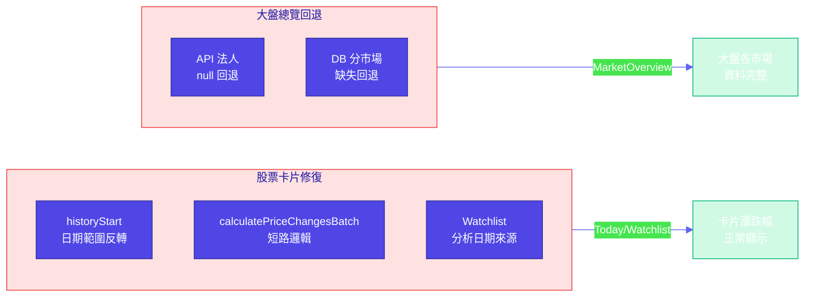
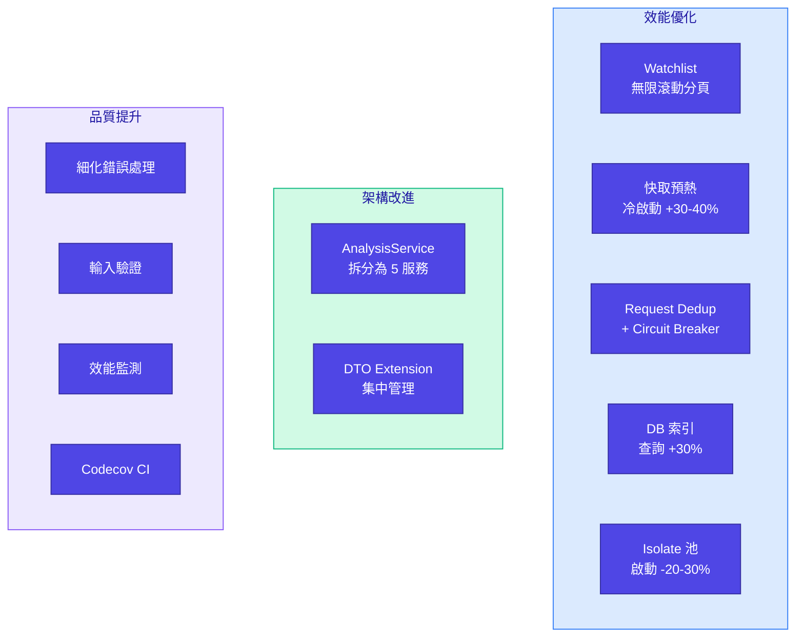

# Changelog

All notable changes to AfterClose will be documented in this file.

The format is based on [Keep a Changelog](https://keepachangelog.com/en/1.0.0/).

## [Unreleased]

### Fixed (2026-02-22)

#### 今日/自選股票卡片資料修復

| 修復項目    | 說明                                                                     |
|:--------|:-----------------------------------------------------------------------|
| 漲跌幅日期範圍 | `historyStart` 改以 `analysisDate` 為基準，避免長假後範圍反轉                         |
| 批次計算短路  | 移除 `calculatePriceChangesBatch` 錯誤短路，API `priceChange` 可在 history 空時使用 |
| 自選分析日期  | 改用 `analysisRepo.findLatestAnalysisDate()`，修復趨勢/分數/訊號缺失                |

#### 大盤總覽資料回退機制

| 修復項目         | 說明                                  |
|:-------------|:------------------------------------|
| fallbackDate | 主要日期無資料時，自動回退到前一個交易日補齊              |
| API 法人回退     | TWSE/TPEX 法人 API 回傳 null 時，用前一交易日重試 |
| DB 分市場回退     | 漲跌家數、融資融券、成交額缺少某市場時，用前一交易日補齊        |

---

### Added (2026-02-13)

#### Performance Optimizations

| 項目                                      | 效果                         |
|:----------------------------------------|:---------------------------|
| Watchlist 無限滾動分頁                        | 與 Scan 一致，降低記憶體佔用          |
| 快取預熱服務                                  | 預載自選股 + Top 20，冷啟動快 30-40% |
| Request Deduplication + Circuit Breaker | 減少 30-50% 網路請求             |
| 資料庫索引優化                                 | 4 個關鍵索引，查詢速度 +30%          |
| Isolate 池重用                             | 減少 20-30% 啟動開銷             |

#### Architecture Improvements

- **AnalysisService 架構重構**: 拆分 991 行為 5 個專門服務（TrendDetection, ReversalDetection, CandlestickAnalysis, IndicatorCalculation, Coordinator）
- **DTO Extension 集中管理**: 提取 `toDatabaseCompanion()` 為 Extension methods

#### Quality & Safety

- **細化錯誤處理**: 區分 NetworkException / ParseException / RateLimitException
- **輸入驗證**: 防止 SQL injection 和資源耗盡
- **效能監測**: PerformanceMonitor 追蹤關鍵操作耗時
- **Codecov CI**: 自動上傳覆蓋率報告

### Changed

- **Watchlist 畫面**: 使用與 Scan 一致的無限滾動分頁邏輯
- **InstitutionalRepository**: 使用 `FinMindInstitutionalExt.toDatabaseCompanion()` 統一轉換
- **MarketIndexSyncer**: 使用 `TwseMarketIndexExt.toDatabaseCompanion()` 統一轉換

---

### Technical Details

#### Commits

| Commit  | 內容                                                       |
|:--------|:---------------------------------------------------------|
| cfacc84 | Watchlist 分頁 + 快取預熱 + DTO Extension                      |
| 0ae2e3e | Request Dedup + Circuit Breaker + DB 索引 + 錯誤處理 + 驗證 + 監測 |
| 1056b61 | AnalysisService 架構重構                                     |
| 239957e | 測試覆蓋率 + TodayProvider 測試                                 |

#### Key Files

| 類型 | 檔案                          | 說明                    |
|:---|:----------------------------|:----------------------|
| 新增 | `cache_warmup_service.dart` | 快取預熱服務                |
| 新增 | `dto_extensions.dart`       | DTO Extension 集中管理    |
| 新增 | `request_deduplicator.dart` | Request Deduplication |
| 新增 | `circuit_breaker.dart`      | Circuit Breaker       |
| 新增 | `error_handler.dart`        | 細化錯誤處理                |
| 新增 | `performance_monitor.dart`  | 效能監測                  |
| 新增 | `validators.dart`           | 輸入驗證                  |
| 新增 | `isolate_pool.dart`         | Isolate 池重用           |
| 修改 | `watchlist_provider.dart`   | 分頁邏輯                  |
| 修改 | `watchlist_screen.dart`     | 無限滾動                  |
| 修改 | `main.dart`                 | 整合快取預熱                |

---

## Project Information

**Repository**: [afterclose](https://github.com/yourusername/afterclose)
**License**: MIT
**Maintainer**: AfterClose Team
