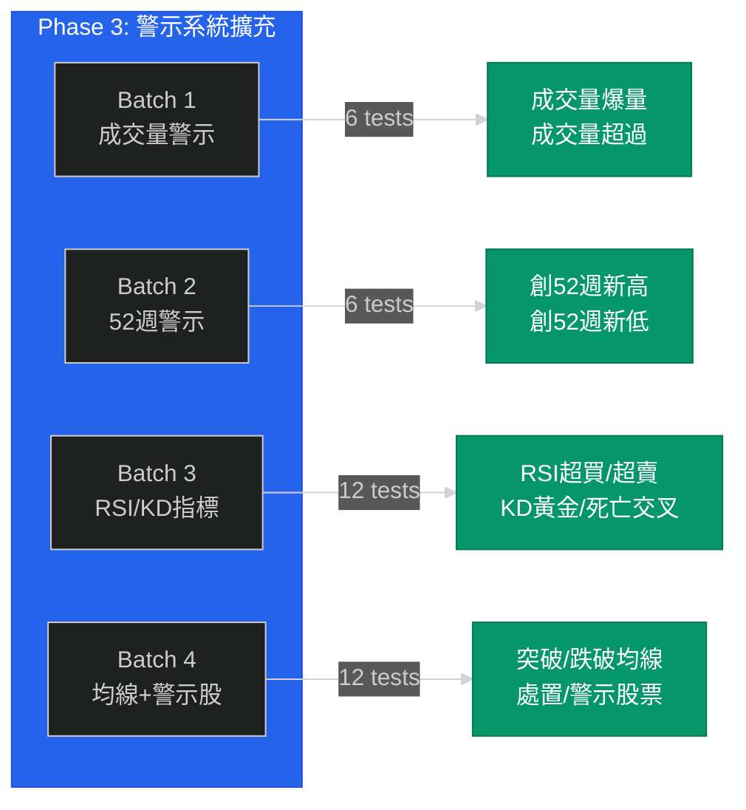
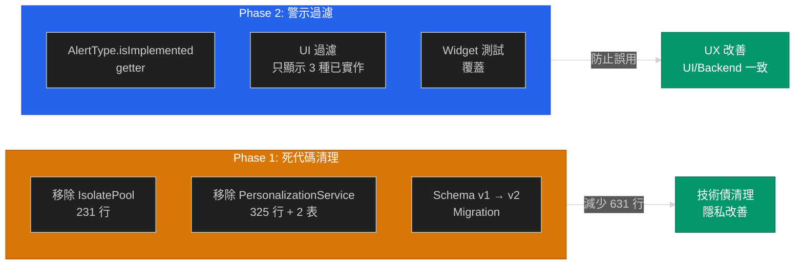
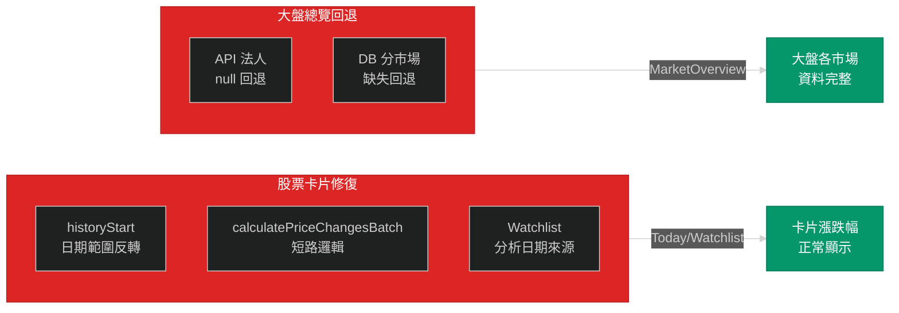
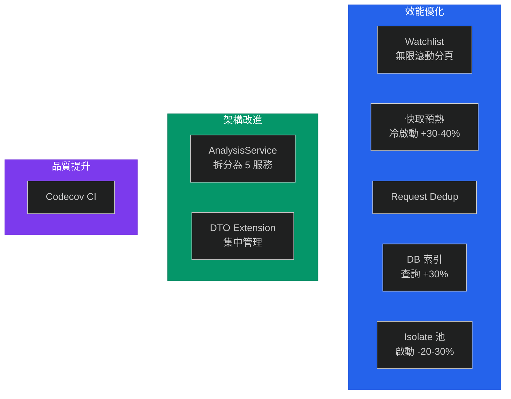

# Changelog

All notable changes to AfterClose will be documented in this file.

The format is based on [Keep a Changelog](https://keepachangelog.com/en/1.0.0/).

## [0.6.0] — 2026-07-09 — Today 三模式選股 analyst-grounded 重設計

> 取代舊「短/長線」雙 horizon tab，改為對應「股票在趨勢中的階段」（Weinstein /
> Minervini / CAN SLIM 框架）的三個觀察模式。

### ✨ Added

- **自選清單自訂分組**：watchlist 支援使用者自訂分組管理。
- **3-Mode Today UI**：三個觀察模式取代雙 horizon tab：
  - **起漲候選**（momentumEntry）— 還沒漲、即將起漲（Stage 1→2）
  - **強勢觀察**（strengthObserve）— 已漲、強勢領導（Stage 2）
  - **回檔觀察**（weaknessObserve v2）— 強股回檔進場時機（buy-the-dip）
- **風險警示徽章**：neutral 分類的警訊（處置股 / 高質押 / 空頭排列 / 死叉 / 高當沖…）
  以卡片右上角聚合 `⚠ N` 徽章浮回主畫面，依嚴重度分 🔴 紅 / 🟡 橘、tap 展開明細。
  補回階段重設計後主畫面失去的風險可見性（純顯示層、不影響 routing / score）。
- **Mode C 回檔觀察 v2**：3 條新回檔進場主訊號（回檔到 MA20 / MA10、支撐錘子、
  KD 高檔回落）+ MA10 淺回檔提高日常可用頻率。
- **動態 header**：顯示實際推薦清單長度（取代固定「Top 20」）。

### 🔧 Changed — analyst-grounded

- **階段分類歸位**：依分析師框架重分類 rule — 多頭排列 A→B（趨勢已確立 Stage 2）、
  KD 低檔金叉 B→A（反轉啟動）、高當沖 → neutral（投機過熱、非趨勢強度）。
- **Mode A 乖離率 gate**：用 MA20 正乖離 ≤ +15%（analyst「not extended」原則）取代
  舊「5D 漲幅 + 強訊號豁免 + 20D 副條件」整套補丁 — 已延伸股自動導去 Mode B。
- **Mode B 60D 報酬排序**：用 60D 報酬（相對強度 RS proxy）取代 score 排序
  （實測 corr+0.17 無鑑別力）— top N 真的是最強 N 檔、cap（30）才有意義。
- **三 tab 全濾 ETF**：個股掃描純化（ETF 走勢平滑、淺回檔幾乎天天成立 = 雜訊）。

### 🗑️ Removed — 退役舊推薦系統（daily_recommendation）

> 舊「雙 horizon Top-20」推薦系統（`daily_recommendation`）與 3-mode（走
> `daily_reason`）平行存在；其「推薦績效追蹤」頁追蹤的是這份已隱形、survivorship-biased
> 的舊清單，製造困惑。窮盡依賴 audit 後分 4 步安全退役（淨刪約 -2,600 行）。

- **推薦績效追蹤頁 + 市場儀表板績效摘要列**：移除（量錯對象 + 統計有已知偏差）。
  保留個股詳情的 per-rule 命中率（`rule_accuracy`、走 `daily_reason`、unbiased）。
- **recommendation_validation 讀寫**：移除（解耦保留 `rule_accuracy` 更新）。
- **daily_recommendation 停寫**：`_generateRecommendations` 移除；表保留但永不再寫，
  3-mode 全程從 `daily_reason` 即時聚合。
- **cooldown 懲罰**：「最近 2 天推薦過 −15 分」退役 — 舊 Top-20「換血」邏輯，與
  3-mode「持續強股本就該天天看到」模型衝突。
- **更新通知「推薦數」**：移除恆為 0 的 `recommendationsGenerated`，通知不再顯示
  誤導的「0 推薦」。

### 🔧 Fixed

- **輔助資料同步失敗不再靜默**：TDCC / 股利 / 內部人轉讓 / 財報 / 上櫃補充
  的 generic 失敗原本只寫 log、UI 照樣顯示「更新完成」；現在記入 partial
  警告（「N 項警告」可展開明細），規則用 stale 資料評分時使用者可察覺。
- **評分中斷不再留下當日真空**：當日舊分析的清除移入寫入 transaction
  （原本先清後寫跨 transaction，評分中途被殺會使三模式／掃描頁對該日全空）。
- **ROE 死碼**：3 條 ROE rule 用幻影欄位 `NetIncome`（DB 0 筆）→ 改 `IncomeAfterTaxes`
  （稅後淨利、單季 ×4 年化），同步修個股詳情頁稅後淨利率 / ROE。
- **priceHistory 窗口太短**：載入窗口僅 ~4 筆 → Mode A 漲幅 filter 從 commit 253f732
  起一直是死的（只有 today filter 活著）→ 修為足夠窗口（後續 Wave 2 改乖離 gate）。
- **Mode C score 壓分 bug**：負分 warning rule 污染 Mode C 正分加總、冤枉隱藏合格的
  強股回檔 → 7 條 warning 移出 neutral，Mode C 變純正分「進場機會」tab。
- **calibrated 0 fallback**：scoring isolate 的 `CalibratedScoreContext.lookup` 也把
  0 視為 null fallback（與 table lookup 雙 class 對齊）。

### 🧪 Tests

- 新增 risk_warnings taxonomy / RiskBadgeCluster widget / 乖離 + 60D helper /
  Mode C pullback rule 等測試；退役舊推薦系統後移除對應的 validation / cooldown
  測試（測試總數以 CI 為準）。

## [0.5.1] — 2026-03-28

### 🔧 Changed

- **drift_flutter 遷移**：資料庫連線改用 drift_flutter；StockDetailHeader 以
  `.select()` isolation 減少 rebuild。
- **Schema version 重置為 1**（pre-launch、無既有使用者）。

### 🐛 Fixed

- CI build 失敗（pin `dart_style` 3.1.5）、平台設定與依賴清理。

## [0.5.0] — 2026-03-28

### ✨ Added

- **Phase 1-4 功能收尾**：i18n、資料新鮮度指示、無障礙（Semantics）、空狀態；
  alerts / events / transactions / strategies 的 CRUD 編輯；8 種進階 AlertType
  評估邏輯；搜尋、分享、通知、undo。

### 🐛 Fixed

- 多輪 review 收尾：查詢去重、時間基準統一、排序契約、背景通知與股票股利缺口、
  隱性 provider 耦合。

## [0.4.0] — 2026-03-25

### ✨ Added

- **Market Dashboard 增強**：情緒分析、籌碼異動偵測、關鍵洞察、產業表現
- **行事曆功能**：股東會 / 除權息事件追蹤
- **內部人轉讓**：董監事股權轉讓申報同步與顯示
- **新上市股智慧跳過**：歷史同步不再每次重複嘗試無資料的新上市 ETF

### 🔧 Fixed — 架構與安全

- **消除循環依賴**：Domain→Presentation import 消除，13 個 data struct 搬至 `domain/models/`
- **API error 不洩漏**：`e.toString()` 替換為通用錯誤訊息，防止 URL/token 暴露
- **TextField maxLength**：備註欄位加上 500 字限制

### 🔧 Fixed — 商業邏輯

- **Portfolio 報酬率**：`totalReturn` 分母改用歷史總買入成本（含已平倉），修正獲利 portfolio 顯示 0% 的 bug
- **Period Returns**：SELL proceeds 不再從分母扣減，修正 `totalInvested ≤ 0` 導致報酬全為空的問題
- **KD 指標**：Fast Stochastic (SMA) → 台灣標準 Slow Stochastic (EMA 1/3, K₀=D₀=50)
- **latestRSI**：從完整歷史初始化 Wilder's smoothing，與 `calculateRSI` 結果一致
- **歷史同步**：新上市股不再每次觸發 TWSE 歷史查詢（009818 修復）

### 🧹 Refactored

- **Dead code 清理**（5 輪）：移除未使用的 services、DAO methods、model classes、rule boilerplate
- **Type-safe Isolate DTOs**：替換 `Map<String, dynamic>` 為 typed DTOs
- **DesignTokens**：全面替換 spacing magic numbers

### 🧪 Tests

- **測試品質提升**：清理 217 個低價值測試（2446 → 2229）
- **Flaky 修復**：`DateTime.now()` 替換為固定日期、race condition 改 Completer 控制、async drain 修正
- **2229 tests, 0 failures**

### 🎨 Style

- **註解統一**：全面中文 doc comments、import 排序、test description 直接動詞風格
- **文件同步**：所有 .md 與 codebase 數字同步、Mermaid dark theme

### 📄 Docs

- CLAUDE.md、README.md、RULE_ENGINE.md、TEST_COVERAGE_PLAN.md 全面更新

---

## [Pre-v0.4.0 History]

### ✨ Added (2026-03-13)

#### Dashboard 7 項增強

大盤總覽新增 6 項資料區塊 + UI 架構重構。

| Feature     | 說明                  |
|:------------|:--------------------|
| 券資比         | 融券/融資餘額比率           |
| 漲停/跌停家數     | DAO 計算 ±9.5% 門檻     |
| 成交額 vs 5 日均 | 當日成交額與均值比較          |
| 注意/處置股摘要    | 各市場 active 警示股數量    |
| 法人連續買賣超     | 外資/投信/自營商 streak 天數 |
| 產業表現        | 產業平均漲跌幅與漲跌家數        |

重構：提取 6 個子 widget、ComparisonCalculator、scoring_isolate converters

**Commits**: `a800199`

---

### 🔧 Fixed (2026-03-13)

| 修復項目        | 說明                                                     | Commit    |
|:------------|:-------------------------------------------------------|:----------|
| 高股息指數名稱     | 對齊 TWSE API 回傳格式                                       | `b0acaf6` |
| Dio timeout | 裸 `Dio()` 改用 `BaseOptions` 配置超時                        | `64d4f75` |
| 排序重複        | `comparison_table.dart` 提取方法避免 3 次排序                   | `64d4f75` |
| KD 陣列對齊     | 統一過濾 OHLC 非 null 記錄再提取                                 | `64d4f75` |
| DI 分層       | `user_dao.checkAlerts()` 支援注入 `AlertEvaluationService` | `64d4f75` |

---

### ♻️ Refactored (2026-03-12)

| 項目             | 說明                                            | Commit    |
|:---------------|:----------------------------------------------|:----------|
| Lint 警告        | 修復全部 68 項 flutter analyze info-level warnings | `90595dd` |
| Design Tokens  | 統一間距/圓角使用 `DesignTokens` 常數                   | `37d4924` |
| Gradle Wrapper | 升級至 8.14.2 for AGP 8.11.1                     | `b3ced3f` |

---

### ✨ Added / ♻️ Refactored (2026-03-01~11)

| 類型       | 項目         | 說明                              | Commit    |
|:---------|:-----------|:--------------------------------|:----------|
| feat     | AI 分析摘要    | 7 項改進提升摘要精確度                    | `cb8a2a3` |
| fix      | 財報同步上限     | 限制 150 檔避免 FinMind 配額耗盡         | `04a570e` |
| refactor | Code Smell | 5 批次系統性改善                       | `7733c3b` |
| refactor | UI 代碼審查    | 全面 UI 層改進                       | `1b02877` |
| refactor | Dead Code  | 移除未使用檔案、類和方法                    | `8f85425` |
| ci       | CI/CD      | Actions 升級 + 快取 + pre-commit 優化 | `3bc3d20` |

**測試**: 全部 2526 cases 通過

---

### ♻️ Refactored (2026-03-01)

#### 代碼品質改進（Phase 1-2）

系統性改善代碼可維護性，消除重複代碼和 magic numbers。

| 改進項目           | 效果                                        | 檔案數 |
|:---------------|:------------------------------------------|:---:|
| **提取批次查詢分組邏輯** | 共享 `_BatchQueryHelper.groupBySymbol()` 方法 |  4  |
| **補充警示系統常數**   | 10+ magic numbers → `RuleParams` 集中管理     |  2  |
| **提取錯誤處理模板**   | `_syncDataTemplate` 統一 try-catch 模式       |  1  |
| **改善變數命名**     | 單字母變數 → 描述性命名                             |  2  |

**關鍵改進細節**：

1. **批次查詢工具（user_dao.dart）**
   - 新增 `_BatchQueryHelper.groupBySymbol<E>()` 共享分組邏輯
   - 重構 `_fetchVolumeDataForAlerts()` 等 3 個批次查詢方法
   - 消除分組邏輯重複，提升代碼一致性

2. **警示系統參數集中化（rule_params.dart）**
   - 新增 10 個警示系統常數：
     - `volumeDataLookbackDays`, `volumeSmaWindow`
     - `rsiMinDataPoints`, `kdMinDataPoints`
     - `kdKPeriod`, `kdDPeriod`
     - `maCrossoverDetectionWindow`, `kdCrossoverDetectionWindow`
     - `indicatorDataLookbackDays`, `week52LookbackDays`
   - 替換 `user_dao.dart` 中所有硬編碼數值

3. **錯誤處理模板（fundamental_repository.dart）**
   - 新增 `_syncDataTemplate<T, C>()` 通用同步方法
   - 重構 `syncMonthlyRevenue()`, `syncValuationData()` 使用模板
   - 統一異常處理：空資料檢查 + `RateLimitException` 重拋 + 日誌記錄

**測試驗證**：
- 所有 2526 個測試通過 ✓
- 警示系統 36 個測試通過 ✓
- 基本面資料同步 15 個測試通過 ✓

**Commits**: `0b42f88`

---

### ✨ Added (2026-02-28)


```mermaid
%%{init: {'theme': 'dark'}}%%
flowchart LR
    subgraph Phase3["Phase 3: 警示系統擴充"]
        P3A["Batch 1\n成交量警示"]
        P3B["Batch 2\n52週警示"]
        P3C["Batch 3\nRSI/KD指標"]
        P3D["Batch 4\n均線+警示股"]
    end

    P3A -->|6 tests| Result1["成交量爆量\n成交量超過"]
    P3B -->|6 tests| Result2["創52週新高\n創52週新低"]
    P3C -->|12 tests| Result3["RSI超買/超賣\nKD黃金/死亡交叉"]
    P3D -->|12 tests| Result4["突破/跌破均線\n處置/警示股票"]

    style Phase3 fill:#2563EB,color:#fff,stroke:#1D4ED8
    style Result1 fill:#059669,color:#fff,stroke:#047857
    style Result2 fill:#059669,color:#fff,stroke:#047857
    style Result3 fill:#059669,color:#fff,stroke:#047857
    style Result4 fill:#059669,color:#fff,stroke:#047857
```

#### 警示系統完整實作（Phase 3）

從 3 種基本價格警示擴充至 15 種高價值警示類型，涵蓋技術指標、成交量、風險控管等多個維度。

| 批次          | 警示類型          |  測試數   | 說明                                                                                                            |
|:------------|:--------------|:------:|:--------------------------------------------------------------------------------------------------------------|
| **Batch 1** | 成交量警示         |   6    | `VOLUME_SPIKE`（爆量 4 倍 + 漲跌 1.5%）<br>`VOLUME_ABOVE`（成交量超過設定值）                                                  |
| **Batch 2** | 52 週警示        |   6    | `WEEK_52_HIGH`（創 52 週新高）<br>`WEEK_52_LOW`（創 52 週新低）                                                           |
| **Batch 3** | RSI/KD 指標警示   |   12   | `RSI_OVERBOUGHT`（RSI 超買）<br>`RSI_OVERSOLD`（RSI 超賣）<br>`KD_GOLDEN_CROSS`（KD 黃金交叉）<br>`KD_DEATH_CROSS`（KD 死亡交叉） |
| **Batch 4** | 均線交叉 + 警示股票   |   12   | `CROSS_ABOVE_MA`（突破均線）<br>`CROSS_BELOW_MA`（跌破均線）<br>`TRADING_WARNING`（一般警示股票）<br>`TRADING_DISPOSAL`（處置股票）     |
| **總計**      | **12 種新警示類型** | **36** | 從 3 種 → 15 種（13% → 65% 實作率）                                                                                   |

#### 技術實作細節

**核心檔案修改**：

| 檔案                          | 變更內容                                                      |  行數  |
|:----------------------------|:----------------------------------------------------------|:----:|
| `user_dao.dart`             | 新增 4 個批次查詢方法<br>新增 12 個檢查方法<br>擴充 switch case（12 個新 case） | +400 |
| `price_alert_provider.dart` | 更新 `isImplemented` getter（4 次更新）                          | +20  |
| `user_dao_alert_test.dart`  | 新增 4 個測試群組（36 個測試案例）                                      | +600 |

**批次查詢策略**（避免 N+1 問題）：

```dart
// 批次預載所有所需資料
final volumeDataMap = await _fetchVolumeDataForAlerts(symbols);
final priceHistoryMap = await _fetchPriceHistoryForAlerts(symbols);
final indicatorDataMap = await _fetchIndicatorDataForAlerts(symbols);

// switch case 處理 12 種警示類型
for (final alert in activeAlerts) {
  switch (alert.alertType) {
    case 'VOLUME_SPIKE': /* ... */ break;
    case 'WEEK_52_HIGH': /* ... */ break;
    case 'RSI_OVERBOUGHT': /* ... */ break;
    case 'CROSS_ABOVE_MA': /* ... */ break;
    // ...
  }
}
```

**KD/均線交叉檢測優化**：

- 原始設計：檢查「正在發生交叉」（太嚴格，測試資料難以產生）
- 最終設計：檢查「最近 2 天內是否發生過交叉」（更符合實際使用情境）

```dart
// 檢查最近 2 天內是否發生過黃金交叉
final startIndex = kd.k.length >= 3 ? kd.k.length - 3 : 0;
for (int i = startIndex; i < kd.k.length - 1; i++) {
  if (prevK < prevD && nextK >= nextD) return true;
}
```

#### 測試覆蓋率

- **單元測試**: 36 個測試案例，涵蓋觸發條件、邊界情況、資料不足等場景
- **整合測試**: 與現有 2526+ 測試整合，確保無破壞性變更
- **測試策略**: 每批次獨立測試群組，易於維護與擴充

#### 警示類型實作狀態

全部 23 種 AlertType 已於 Phase 3 完成實作（實作率 100%）。

---

### ♻️ Refactored (2026-02-28)


```mermaid
%%{init: {'theme': 'dark'}}%%
flowchart LR
    subgraph Phase1["Phase 1: 死代碼清理"]
        P1A["移除 IsolatePool\n231 行"]
        P1B["移除 PersonalizationService\n325 行 + 2 表"]
        P1C["Schema v1 → v2\nMigration"]
    end

    subgraph Phase2["Phase 2: 警示過濾"]
        P2A["AlertType.isImplemented\ngetter"]
        P2B["UI 過濾\n只顯示 3 種已實作"]
        P2C["Widget 測試\n覆蓋"]
    end

    Phase1 -->|減少 631 行| Result1["技術債清理\n隱私改善"]
    Phase2 -->|防止誤用| Result2["UX 改善\nUI/Backend 一致"]

    style Phase1 fill:#D97706,color:#fff,stroke:#B45309
    style Phase2 fill:#2563EB,color:#fff,stroke:#1D4ED8
    style Result1 fill:#059669,color:#fff,stroke:#047857
    style Result2 fill:#059669,color:#fff,stroke:#047857
```

#### 死代碼清理（Phase 1）

| 項目                     | 變更                                | 效果       |
|:-----------------------|:----------------------------------|:---------|
| IsolatePool 移除         | 刪除 231 行未使用程式碼                    | 減少認知負擔   |
| PersonalizationService | 刪除 325 行服務 + 2 張資料表 + 測試 mock     | 停止無效資料收集 |
| 資料庫 Schema             | v1 → v2，migration 自動清理 user 相關表   | 自動升級     |
| CLAUDE.md 更新           | 移除 IsolatePool 引用，更新 Isolate 並行描述 | 文件一致性    |

**Commits**: `95f8b93`

#### 警示系統過濾（Phase 2）

| 項目                     | 變更                                                     | 效果             |
|:-----------------------|:-------------------------------------------------------|:---------------|
| `isImplemented` getter | 新增到 `AlertType` enum（只有 ABOVE/BELOW/CHANGE_PCT 為 true） | 標記已實作類型        |
| UI 過濾                  | `CreatePriceAlertDialog` 只顯示 3 種已實作警示類型                | 防止建立不會觸發的警示    |
| Widget 測試              | 驗證過濾邏輯：應顯示 3 種、不應顯示其餘 20 種                             | 測試覆蓋率提升        |
| 使用者體驗                  | 從 23 種 → 3 種可建立警示                                      | UI/Backend 一致性 |

**Commits**: `3d6f6c8`

**測試狀態**: 所有 2526 個測試通過

---

### 🔧 Fixed (2026-02-22)


```mermaid
%%{init: {'theme': 'dark'}}%%
flowchart LR
    subgraph Fix1["股票卡片修復"]
        A["historyStart\n日期範圍反轉"]
        B["calculatePriceChangesBatch\n短路邏輯"]
        C["Watchlist\n分析日期來源"]
    end

    subgraph Fix2["大盤總覽回退"]
        D["API 法人\nnull 回退"]
        E["DB 分市場\n缺失回退"]
    end

    Fix1 -->|Today/Watchlist| UI["卡片漲跌幅\n正常顯示"]
    Fix2 -->|MarketOverview| UI2["大盤各市場\n資料完整"]

    style Fix1 fill:#DC2626,color:#fff,stroke:#B91C1C
    style Fix2 fill:#DC2626,color:#fff,stroke:#B91C1C
    style UI fill:#059669,color:#fff,stroke:#047857
    style UI2 fill:#059669,color:#fff,stroke:#047857
```

#### 今日/自選股票卡片資料修復

| 修復項目    | 說明                                                                     |
|:--------|:-----------------------------------------------------------------------|
| 漲跌幅日期範圍 | `historyStart` 改以 `analysisDate` 為基準，避免長假後範圍反轉                         |
| 批次計算短路  | 移除 `calculatePriceChangesBatch` 錯誤短路，API `priceChange` 可在 history 空時使用 |
| 自選分析日期  | 改用 `analysisRepo.findLatestAnalysisDate()`，修復趨勢/分數/訊號缺失                |

#### 大盤總覽資料回退機制

| 修復項目         | 說明                                  |
|:-------------|:------------------------------------|
| fallbackDate | 主要日期無資料時，自動回退到前一個交易日補齊              |
| API 法人回退     | TWSE/TPEX 法人 API 回傳 null 時，用前一交易日重試 |
| DB 分市場回退     | 漲跌家數、融資融券、成交額缺少某市場時，用前一交易日補齊        |

---

### ✨ Added (2026-02-13)


```mermaid
%%{init: {'theme': 'dark'}}%%
flowchart TB
    subgraph Perf["效能優化"]
        P1["Watchlist\n無限滾動分頁"]
        P2["快取預熱\n冷啟動 +30-40%"]
        P3["Request Dedup"]
        P4["DB 索引\n查詢 +30%"]
        P5["Isolate 池\n啟動 -20-30%"]
    end

    subgraph Arch["架構改進"]
        A1["AnalysisService\n拆分為 5 服務"]
        A2["DTO Extension\n集中管理"]
    end

    subgraph Quality["品質提升"]
        Q4["Codecov CI"]
    end

    style Perf fill:#2563EB,color:#fff,stroke:#1D4ED8
    style Arch fill:#059669,color:#fff,stroke:#047857
    style Quality fill:#7C3AED,color:#fff,stroke:#6D28D9
```

#### Performance Optimizations

| 項目                    | 效果                         |
|:----------------------|:---------------------------|
| Watchlist 無限滾動分頁      | 與 Scan 一致，降低記憶體佔用          |
| 快取預熱服務                | 預載自選股 + Top 20，冷啟動快 30-40% |
| Request Deduplication | 減少 30-50% 網路請求             |
| 資料庫索引優化               | 4 個關鍵索引，查詢速度 +30%          |
| Isolate 池重用           | 減少 20-30% 啟動開銷             |

#### Architecture Improvements

- **AnalysisService 架構重構**: 拆分 991 行為 5 個專門服務（TrendDetection, ReversalDetection, CandlestickAnalysis, IndicatorCalculation, Coordinator）
- **DTO Extension 集中管理**: 提取 `toDatabaseCompanion()` 為 Extension methods

#### Quality & Safety

- **Codecov CI**: 自動上傳覆蓋率報告

### 🔄 Changed

- **Watchlist 畫面**: 使用與 Scan 一致的無限滾動分頁邏輯
- **InstitutionalRepository**: 使用 `FinMindInstitutionalExt.toDatabaseCompanion()` 統一轉換
- **MarketIndexSyncer**: 使用 `TwseMarketIndexExt.toDatabaseCompanion()` 統一轉換

---

### Technical Details

#### Commits

| Commit  | 內容                                                       |
|:--------|:---------------------------------------------------------|
| cfacc84 | Watchlist 分頁 + 快取預熱 + DTO Extension                      |
| 0ae2e3e | Request Dedup + DB 索引                                    |
| 1056b61 | AnalysisService 架構重構                                     |
| 239957e | 測試覆蓋率 + TodayProvider 測試                                 |

#### Key Files

| 類型 | 檔案                          | 說明                    |
|:---|:----------------------------|:----------------------|
| 新增 | `cache_warmup_service.dart` | 快取預熱服務                |
| 新增 | `dto_extensions.dart`       | DTO Extension 集中管理    |
| 新增 | `request_deduplicator.dart` | Request Deduplication |
| 新增 | ~~`isolate_pool.dart`~~     | Isolate 池重用（後已移除）     |
| 修改 | `watchlist_provider.dart`   | 分頁邏輯                  |
| 修改 | `watchlist_screen.dart`     | 無限滾動                  |
| 修改 | `main.dart`                 | 整合快取預熱                |

---

## Project Information

**Repository**: [afterclose](https://github.com/Neal75418/afterclose)
**License**: MIT
**Maintainer**: Neal Chen
