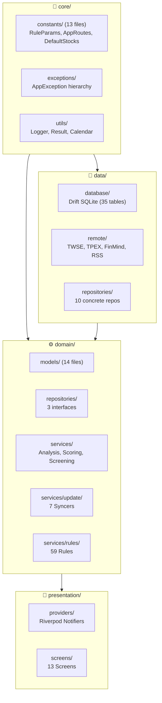
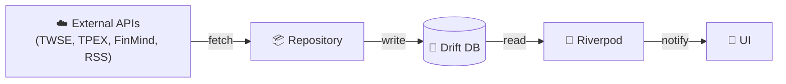
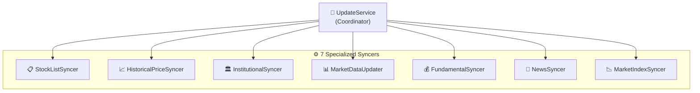

# CLAUDE.md

本檔案為 Claude Code 提供專案開發指引。

---

## 專案概述

**AfterClose** — 本地優先盤後台股掃描 App。所有運算在裝置端完成，無雲端依賴。


---

## 常用指令

```bash
flutter pub get                    # 安裝依賴
flutter test                       # 執行測試
flutter analyze                    # 靜態分析
dart run build_runner build --delete-conflicting-outputs  # Drift 程式碼生成
```

---

## 架構

### 分層結構



### 資料流



---

## 關鍵路徑

| 路徑 | 說明 |
|------|------|
| `lib/core/constants/rule_params.dart` | 規則引擎參數（175+ 閾值） |
| `lib/core/constants/app_routes.dart` | 路由常數（集中管理） |
| `lib/core/exceptions/app_exception.dart` | 例外階層（sealed class） |
| `lib/domain/repositories/` | 3 個抽象介面 |
| `lib/domain/services/rules/` | 59 條規則（12 檔案） |
| `lib/domain/services/scoring_isolate.dart` | Isolate 評分（型別安全） |
| `lib/domain/services/ohlcv_data.dart` | OHLCV 提取 extension |
| `lib/data/database/tables/` | 35 張資料表（10 檔案） |

---

## Repository 介面

| 介面 | 位置 | 職責 |
|------|------|------|
| `IAnalysisRepository` | `domain/repositories/` | 分析結果存取、推薦紀錄 |
| `IPriceRepository` | `domain/repositories/` | 價格資料、漲跌幅批次查詢 |
| `IScreeningRepository` | `domain/repositories/` | 自訂篩選 SQL 執行、批次載入 |

---

## Update Services



---

## 編碼標準

| 原則 | 說明 |
|------|------|
| **Repository Pattern** | Domain 透過介面存取資料，Data 層提供實作 |
| **錯誤處理** | `RateLimitException` / `NetworkException` 必須 rethrow，其餘包裝為 `DatabaseException` |
| **狀態管理** | `AsyncNotifier` / `StateNotifier`，避免 `StateProvider` |
| **Rule Engine** | 純函數：輸入 `AnalysisContext` → 輸出 `TriggeredReason` |
| **配置集中** | 所有閾值放 `lib/core/constants/`，禁止魔術數字 |
| **路由** | 使用 `AppRoutes` 常數，禁止硬編碼路由字串 |
| **Isolate 通訊** | 使用 typed class（`IsolateReasonOutput`），避免 `Map<String, dynamic>` |
| **OHLCV 提取** | 使用 `prices.extractOhlcv()` extension，避免重複迴圈 |
| **Dart 3** | Records, Pattern Matching, Sealed Classes |

---

## 關鍵文件

| 文件 | 說明 |
|------|------|
| [docs/RULE_ENGINE.md](docs/RULE_ENGINE.md) | 規則引擎詳解（59 條規則） |
| [RELEASE.md](RELEASE.md) | 發布建置指南 |
| [.agent/skills/flutter-riverpod-architect/SKILL.md](.agent/skills/flutter-riverpod-architect/SKILL.md) | 架構模式指南 |
