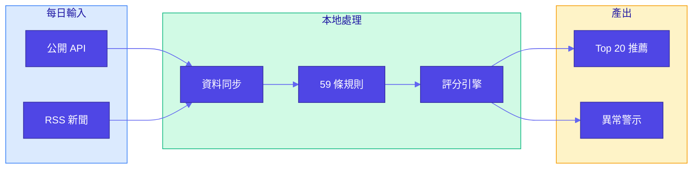
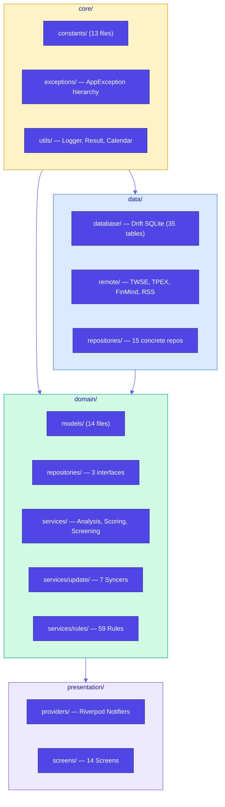
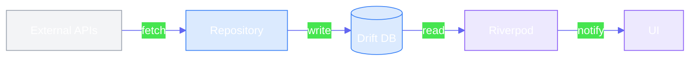
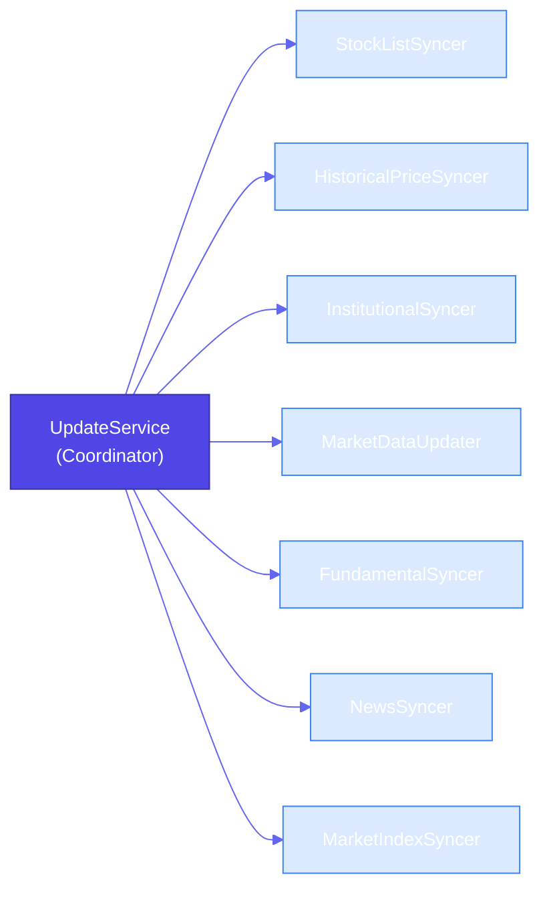

# CLAUDE.md

本檔案為 Claude Code 提供專案開發指引。

---

## 專案概述

**AfterClose** — 本地優先盤後台股掃描 App。所有運算在裝置端完成，無雲端依賴。



---

## 常用指令

```bash
flutter pub get                    # 安裝依賴
flutter test                       # 執行測試
flutter test --coverage            # 執行測試並生成覆蓋率報告
flutter analyze                    # 靜態分析
dart format .                      # 格式化程式碼（pre-commit hook 要求）
dart run build_runner build --delete-conflicting-outputs  # Drift 程式碼生成
```

---

## 架構

### 分層結構



### 資料流



---

## 關鍵路徑

| 路徑                                         | 說明                       |
|:-------------------------------------------|:-------------------------|
| `lib/core/constants/rule_params.dart`      | 規則引擎參數 (200+ 閾值)         |
| `lib/core/constants/app_routes.dart`       | 路由常數 (集中管理)              |
| `lib/core/exceptions/app_exception.dart`   | 例外階層 (sealed class)      |
| `lib/core/utils/request_deduplicator.dart` | Request Deduplication 機制 |
| `lib/core/utils/circuit_breaker.dart`      | Circuit Breaker 熔斷器      |
| `lib/core/utils/error_handler.dart`        | 細化錯誤處理 wrapper          |
| `lib/core/utils/performance_monitor.dart`  | 效能監測系統（P50/P95/P99）      |
| `lib/core/utils/validators.dart`           | 輸入驗證（防 SQL injection）    |
| `lib/domain/repositories/`                 | 3 個抽象介面                  |
| `lib/domain/services/rules/`               | 59 條規則 (12 檔案)           |
| `lib/domain/services/scoring_isolate.dart` | Isolate 評分 (型別安全)        |
| `lib/domain/services/isolate_pool.dart`    | Isolate 池重用機制            |
| `lib/domain/services/ohlcv_data.dart`      | OHLCV 提取 extension       |
| `lib/data/database/tables/`                | 35 張資料表 (10 檔案)          |

---

## Repository 介面

| 介面                     | 職責               |
|:-----------------------|:-----------------|
| `IAnalysisRepository`  | 分析結果存取、推薦紀錄      |
| `IPriceRepository`     | 價格資料、漲跌幅批次查詢     |
| `IScreeningRepository` | 自訂篩選 SQL 執行、批次載入 |

---

## Update Services



---

## 開發工作流程

### 檢查現有實作

修改前先確認功能是否已實作：

```bash
# 檢查工具檔案
ls lib/core/utils/request_deduplicator.dart
ls lib/core/utils/circuit_breaker.dart
ls lib/core/utils/error_handler.dart
ls lib/core/utils/performance_monitor.dart
ls lib/core/utils/validators.dart
ls lib/domain/services/isolate_pool.dart

# 檢查資料庫索引
grep "@TableIndex" lib/data/database/tables/*.dart

# 檢查 CI 配置
cat .github/workflows/flutter.yml

# 查看最近改進
git log --oneline -10
```

### Pre-commit Hooks

專案使用自訂 pre-commit hooks，提交前自動執行：

1. **格式檢查** - `dart format --set-exit-if-changed .`
2. **靜態分析** - `flutter analyze --no-fatal-infos`

若檢查失敗，需手動修復：
```bash
dart format .              # 修復格式問題
flutter analyze            # 檢查分析錯誤
```

### 資料庫變更流程

修改資料表後必須重新生成程式碼：

```bash
# 1. 修改 lib/data/database/tables/*.dart
# 2. 執行 code generation
dart run build_runner build --delete-conflicting-outputs
# 3. 執行測試確認無迴歸
flutter test
```

### 測試要求

- 所有變更必須通過完整測試套件（2458+ 個測試）
- 測試執行時間約 25-30 秒
- Critical 功能變更需補充對應測試

```bash
# 完整測試（含覆蓋率）
flutter test --coverage

# 快速測試（不含覆蓋率）
flutter test

# 測試特定檔案
flutter test test/domain/services/analysis_service_test.dart

# 測試特定目錄
flutter test test/domain/services/
```

### 測試覆蓋率現況

| Layer | 覆蓋率 |
|:------|:------|
| Domain | 85%+ |
| Data | 85%+ |
| Presentation | 70%+ |

### Widget 測試慣例

**基本結構**：使用 `test/helpers/widget_test_helpers.dart` 提供的工具

```dart
import 'package:afterclose/...widget.dart';
import '../../helpers/widget_test_helpers.dart';

void main() {
  setUpAll(() async {
    await setupTestLocalization(); // 使用 .tr() 的 widget 必須呼叫
  });

  void widenViewport(WidgetTester tester) {
    tester.view.physicalSize = const Size(5000, 4000);
    addTearDown(() => tester.view.resetPhysicalSize());
  }

  testWidgets('example', (tester) async {
    widenViewport(tester); // 避免 i18n key 未翻譯導致 RenderFlex overflow
    await tester.pumpWidget(buildTestApp(MyWidget(), brightness: Brightness.light));
  });
}
```

**注意事項**：
- `SectionHeader` 使用 `flutter_animate` 動畫，需在 `pumpWidget` 後加 `await tester.pump(const Duration(seconds: 1))` 推進動畫
- `TechnicalIndicatorService` 為 plain class，可直接 `new` 出來使用，不需 mock
- `FinMindRevenue.date` 型別為 `String`（非 `DateTime`）
- `PortfolioPositionData.quantity` 型別為 `double`（非 `int`）
- 每個測試檔案自行宣告 mock classes，不使用共享 mock 檔案

---

## 編碼標準

| 原則                        | 說明                                                                             |
|:--------------------------|:-------------------------------------------------------------------------------|
| **Repository Pattern**    | Domain 透過介面存取資料，Data 層提供實作                                                     |
| **錯誤處理**                  | `RateLimitException` / `NetworkException` 必須 rethrow，其餘包裝為 `DatabaseException` |
| **Request Deduplication** | Repository 層使用 `RequestDeduplicator` 避免重複 API 呼叫                               |
| **Circuit Breaker**       | API Client 使用 `CircuitBreaker` 實現熔斷保護（5 次失敗後開啟，60 秒冷卻）                          |
| **狀態管理**                  | `AsyncNotifier` / `StateNotifier`，避免 `StateProvider`                           |
| **Rule Engine**           | 純函數：輸入 `AnalysisContext` → 輸出 `TriggeredReason`                                |
| **配置集中**                  | 所有閾值放 `lib/core/constants/`，禁止魔術數字                                             |
| **路由**                    | 使用 `AppRoutes` 常數，禁止硬編碼路由字串                                                    |
| **Isolate 通訊**            | 使用 typed class (`IsolateReasonOutput`)，避免 `Map<String, dynamic>`               |
| **Isolate 池**             | 使用 `IsolatePool` 重用 worker，避免重複啟動開銷                                            |
| **OHLCV 提取**              | 使用 `prices.extractOhlcv()` extension，避免重複迴圈                                    |
| **效能監測**                  | 使用 `PerformanceMonitor.measure()` 追蹤關鍵操作耗時                                     |
| **輸入驗證**                  | 使用 `InputValidators` 驗證股票代碼、日期範圍等，防止 SQL injection                            |
| **Dart 3**                | Records, Pattern Matching, Sealed Classes                                      |

---

## 效能優化記錄

### 2026-02-13 改進 ✅ (已完成並推送)

| 項目       | 改進內容                                                                       | 預期效果           | 實作狀態  | Commit  |
|:---------|:---------------------------------------------------------------------------|:---------------|:------|:--------|
| **API 優化** | Request Deduplication + Circuit Breaker                                   | 減少 30-50% API 呼叫 | ✅ 已實作 | 0ae2e3e |
| **資料庫優化** | 4 個關鍵索引（`daily_analysis`, `daily_institutional`, `insider_holding`, `trading_warning`） | 查詢速度提升 30%      | ✅ 已實作 | 0ae2e3e |
| **並行處理**  | Isolate 池重用機制                                                              | 減少 20-30% 啟動開銷  | ✅ 已實作 | 0ae2e3e |
| **錯誤處理**  | 細化錯誤處理 wrapper 區分不同錯誤類型                                                    | 提升穩定性和診斷能力     | ✅ 已實作 | 0ae2e3e |
| **安全性**   | 輸入驗證機制（股票代碼、日期範圍）                                                          | 防止 SQL injection | ✅ 已實作 | 0ae2e3e |
| **可觀測性**  | PerformanceMonitor 追蹤關鍵操作耗時                                                | 識別效能瓶頸         | ✅ 已實作 | 0ae2e3e |
| **CI/CD** | Codecov 測試覆蓋率上傳                                                           | 追蹤品質趨勢         | ✅ 已實作 | 0ae2e3e |
| **架構重構**  | 拆分 AnalysisService (991行) 為 5 個專門服務                                        | 提升可維護性         | ✅ 已實作 | 1056b61 |
| **測試增強**  | 新增 TodayProvider 完整測試 + 測試覆蓋率計劃                                           | 提升測試覆蓋率        | ✅ 已實作 | 239957e |
| **UI 優化**  | Watchlist 無限滾動分頁（與 Scan 保持一致）                                           | 提升大列表效能       | ✅ 已實作 | cfacc84 |
| **啟動優化**  | CacheWarmupService 預熱自選股 + Top 20 推薦                                    | 冷啟動快 30-40%   | ✅ 已實作 | cfacc84 |
| **架構優化**  | DTO Extension 集中管理（提取 toDatabaseCompanion 邏輯）                         | 減少程式碼重複       | ✅ 已實作 | cfacc84 |

---

## 關鍵文件

| 文件                                                                                                     | 說明              |
|:-------------------------------------------------------------------------------------------------------|:----------------|
| [docs/RULE_ENGINE.md](docs/RULE_ENGINE.md)                                                             | 規則引擎詳解 (59 條規則) |
| [docs/PENDING_UPGRADES.md](docs/PENDING_UPGRADES.md)                                                   | 待完成的依賴升級任務      |
| [RELEASE.md](RELEASE.md)                                                                               | 發布建置指南          |
| [.agent/skills/flutter-riverpod-architect/SKILL.md](.agent/skills/flutter-riverpod-architect/SKILL.md) | 架構模式指南          |

---

## 依賴版本（2026-02-13 更新）

### State Management
- `flutter_riverpod`: ^3.2.1 ⬆️ (from 2.6.1)
- `riverpod_annotation`: ^4.0.2 ⬆️ (from 2.6.1)

### Code Generation
- `build_runner`: 自動選擇相容版本
- `riverpod_generator`: ^4.0.3 ⬆️ (from 2.6.4)
- `freezed`: ^3.2.5 ⬆️ (from 2.5.8)
- `freezed_annotation`: ^3.1.0 ⬆️ (from 2.4.4)
- `json_serializable`: ^6.12.0 ⬆️ (from 6.9.5)
- `drift_dev`: ^2.31.0 ⬆️ (from 2.28.0)

### Database
- `drift`: ^2.31.0 ⬆️ (from 2.28.2)
- `sqlite3_flutter_libs`: ^0.5.30

### Important Notes
- **Riverpod 3.x**: StateNotifier/StateNotifierProvider 需從 `flutter_riverpod/legacy.dart` 導入
- **dependency_overrides**: 使用 `analyzer: ^10.0.0`, `dart_style: ^3.1.5`, `io: ^1.0.3` 解決依賴衝突
