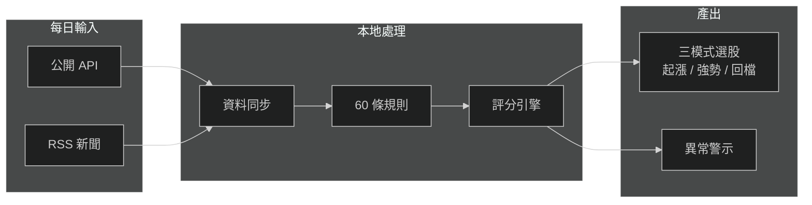

# CLAUDE.md

本檔案為 Claude Code 提供專案開發指引。專題知識按需載入自 `.claude/rules/`。

---

## 專案概述

**AfterClose** — 本地優先盤後台股掃描 App（Flutter / Dart 3）。所有運算在裝置端完成，無雲端依賴。


```mermaid
%%{init: {'theme': 'dark'}}%%
flowchart LR
    subgraph Input["每日輸入"]
        API["公開 API"]
        RSS["RSS 新聞"]
    end

    subgraph Process["本地處理"]
        Sync["資料同步"]
        Rules["60 條規則"]
        Score["評分引擎"]
    end

    subgraph Output["產出"]
        Modes["三模式選股<br/>起漲 / 強勢 / 回檔"]
        Alert["異常警示"]
    end

    API --> Sync
    RSS --> Sync
    Sync --> Rules --> Score --> Modes
    Score --> Alert
```

---

## 常用指令

```bash
flutter pub get                                                # 安裝依賴
dart run build_runner build --delete-conflicting-outputs        # 程式碼生成 (僅 Drift)
flutter test                                                   # 執行測試
flutter test --coverage                                        # 含覆蓋率報告
flutter analyze --no-fatal-infos                               # 靜態分析
dart format .                                                  # 格式化 (pre-commit hook 自動執行)
```

---

## 關鍵路徑

| 路徑                                               | 說明                                    |
|:-------------------------------------------------|:--------------------------------------|
| `lib/core/constants/rule_params.dart`            | 規則參數 barrel（8 domain param 檔 + enums + scores） |
| `lib/core/constants/analysis_params.dart`        | 分析摘要 + 交易成本參數                         |
| `lib/core/exceptions/app_exception.dart`         | 例外階層 (sealed class)                   |
| `lib/core/utils/request_deduplicator.dart`       | Request Deduplication 機制              |
| `lib/domain/services/rules/`                     | 60 條規則 (14 檔案)                        |
| `lib/domain/services/scoring_isolate.dart`       | Isolate 評分 (typed DTO 序列化)            |
| `lib/domain/services/update/`                    | 更新元件 (10 syncers + 3 helpers + coordinator) |
| `lib/data/database/tables/`                      | Drift 資料表定義                           |
| `lib/data/database/dao/batch_query_mixin.dart`   | 批次查詢共享工具 (groupBySymbol)              |
| `lib/domain/services/rule_accuracy_service.dart` | 推薦績效回測引擎 (多週期驗證)                      |

---

## 開發工作流程

### Pre-commit Hook

提交時自動執行（`.git/hooks/pre-commit`）：
1. **Auto-format** — 格式化 staged `.dart` 檔案並重新 stage
2. **Analyze** — `flutter analyze --no-fatal-infos lib/`

### 資料庫變更流程

```bash
# 1. 修改 lib/data/database/tables/*.dart
# 2. 執行 code generation
dart run build_runner build --delete-conflicting-outputs
# 3. 確認無迴歸
flutter test
```

### 測試

| Layer        | 覆蓋率目標 |
|:-------------|:-------|
| Domain       | 85%+   |
| Data         | 85%+   |
| Presentation | 70%+   |

```bash
flutter test                                          # 快速測試
flutter test --coverage                               # 含覆蓋率
flutter test test/domain/services/                    # 測試特定目錄
```

### Widget 測試慣例

```dart
import '../../helpers/widget_test_helpers.dart';

void main() {
  setUpAll(() async {
    await setupTestLocalization(); // 使用 .tr() 的 widget 必須呼叫
  });

  void widenViewport(WidgetTester tester) {
    tester.view.physicalSize = const Size(5000, 4000);
    addTearDown(() => tester.view.resetPhysicalSize());
  }

  testWidgets('example', (tester) async {
    widenViewport(tester); // 避免 RenderFlex overflow
    await tester.pumpWidget(buildTestApp(MyWidget(), brightness: Brightness.light));
  });
}
```

**注意事項**：
- `SectionHeader` 使用 `flutter_animate`，需 `await tester.pump(const Duration(seconds: 1))` 推進動畫
- `TechnicalIndicatorService` 為 plain class，直接 `new` 使用，不需 mock
- `FinMindRevenue.date` 型別為 `String`（非 `DateTime`）
- `PortfolioPositionData.quantity` 型別為 `double`（非 `int`）
- 每個測試檔案自行宣告 mock classes，不使用共享 mock 檔案

---

## 編碼標準

| 原則                        | 說明                                                                                                      |
|:--------------------------|:--------------------------------------------------------------------------------------------------------|
| **Repository Pattern**    | Domain 透過介面存取資料，Data 層提供實作                                                                              |
| **錯誤處理**                  | `RateLimitException` / `NetworkException` 必須 rethrow，其餘包裝為 `DatabaseException`                          |
| **Request Deduplication** | Repository 層使用 `RequestDeduplicator` 避免重複 API 呼叫                                                        |
| **狀態管理**                  | `AsyncNotifier` / `StateNotifier`，避免 `StateProvider`                                                    |
| **Rule Engine**           | 純函數：輸入 `AnalysisContext` → 輸出 `TriggeredReason`                                                         |
| **配置集中**                  | 所有閾值放 `lib/core/constants/`，禁止魔術數字                                                                      |
| **路由**                    | 使用 `AppRoutes` 常數，禁止硬編碼路由字串                                                                             |
| **Isolate 通訊**            | 使用 typed DTO (`ShareholdingData`, `WarningDataContext`, `InsiderDataContext`)，避免 `Map<String, dynamic>` |
| **OHLCV 提取**              | 使用 `prices.extractOhlcv()` extension，避免重複迴圈                                                             |
| **Dart 3**                | Records, Pattern Matching, Sealed Classes                                                               |

---

## 關鍵文件

| 文件                                                   | 說明              |
|:-----------------------------------------------------|:----------------|
| [docs/RULE_ENGINE.md](docs/RULE_ENGINE.md)           | 規則引擎詳解 (60 條規則) |
| [docs/PENDING_UPGRADES.md](docs/PENDING_UPGRADES.md) | 依賴升級紀錄          |
| [RELEASE.md](RELEASE.md)                             | 發布建置指南          |
| [CHANGELOG.md](CHANGELOG.md)                         | 版本變更紀錄          |

---

## 按需載入的規則（`.claude/rules/`）

| 規則檔 | 內容 | 載入條件（`paths:` frontmatter） |
|---|---|---|
| `architecture.md` | 四層架構 Mermaid 圖、資料流圖 | `lib/core/**`、`lib/data/**`、`lib/domain/**`、`lib/presentation/**` |
| `update-pipeline.md` | Update Pipeline Mermaid 圖、10 syncers + 3 helpers 詳解 | `lib/domain/services/update/**`、`lib/data/remote/**`、`**/syncer*`、`**/Syncer*`、`**/BatchData*`、`**/rule_accuracy*` |
