# CLAUDE.md

本檔案為 Claude Code 提供專案開發指引。

---

## 專案概述

**AfterClose** - 本地優先盤後台股掃描 App。所有資料處理在裝置端完成，無雲端依賴。


---

## 常用指令

```bash
flutter pub get                    # 安裝依賴
flutter test                       # 執行測試
flutter analyze lib/               # 靜態分析
dart run build_runner build --delete-conflicting-outputs  # 程式碼生成
```

---

## 架構

### 目錄結構

```mermaid
flowchart TB
    subgraph Core["🔧 core/"]
        Constants["constants/<br/>RuleParams, DefaultStocks"]
        Utils["utils/<br/>Logger, Result, Calendar"]
    end

    subgraph Data["💾 data/"]
        Database["database/<br/>Drift SQLite"]
        Remote["remote/<br/>TWSE, FinMind API"]
        Repos["repositories/"]
    end

    subgraph Domain["⚙️ domain/"]
        Models["models/<br/>7 Domain Objects"]
        Services["services/"]
        Update["services/update/<br/>6 Specialized Syncers"]
        Rules["services/rules/<br/>51 Rules"]
    end

    subgraph Presentation["📱 presentation/"]
        Providers["providers/<br/>Riverpod Notifiers"]
        Screens["screens/<br/>UI"]
    end

    Core --> Data
    Data --> Domain
    Domain --> Presentation
```



### 資料流

```mermaid
flowchart LR
    API["☁️ External APIs<br/>(TWSE, FinMind, RSS)"]
    Repo["📦 Repository"]
    DB[("💾 Drift DB")]
    Provider["🔄 Riverpod"]
    UI["📱 UI"]

    API -->|fetch| Repo
    Repo -->|write| DB
    DB -->|read| Provider
    Provider -->|notify| UI
```



---

## 配置管理

| 檔案                                       | 用途               |
|------------------------------------------|------------------|
| `lib/core/constants/rule_params.dart`    | 規則引擎參數（閾值、權重、天數） |
| `lib/core/constants/default_stocks.dart` | 預設股票清單           |


---

## Domain Models


---

## Update Services

```mermaid
flowchart TB
    US["🎯 UpdateService<br/>(Coordinator)"]

    subgraph Syncers["⚙️ Specialized Syncers"]
        SLS["📋 StockListSyncer"]
        HPS["📈 HistoricalPriceSyncer"]
        IS["🏛️ InstitutionalSyncer"]
        MDU["📊 MarketDataUpdater"]
        FS["💰 FundamentalSyncer"]
        NS["📰 NewsSyncer"]
    end

    US --> SLS
    US --> HPS
    US --> IS
    US --> MDU
    US --> FS
    US --> NS
```



---

## 關鍵文件

| 文件                                                                                                     | 說明              |
|--------------------------------------------------------------------------------------------------------|-----------------|
| [docs/RULE_ENGINE.md](docs/RULE_ENGINE.md)                                                             | 規則引擎詳解 (51 條規則) |
| [.agent/skills/flutter-riverpod-architect/SKILL.md](.agent/skills/flutter-riverpod-architect/SKILL.md) | 架構模式指南          |

---

## 編碼標準

| 原則              | 說明                                                   |
|-----------------|------------------------------------------------------|
| **Repository**  | 使用 `IAnalysisRepository` 介面，支援 mock 測試               |
| **錯誤處理**        | `Result<T>` (`lib/core/utils/result.dart`)           |
| **狀態管理**        | `AsyncNotifier` / `StateNotifier`，避免 `StateProvider` |
| **Rule Engine** | 純函數（輸入資料 → 輸出理由）                                     |
| **配置集中**        | 所有參數放 `lib/core/constants/`，禁止魔術數字                   |
| **Dart 3**      | Records、Pattern Matching                             |
