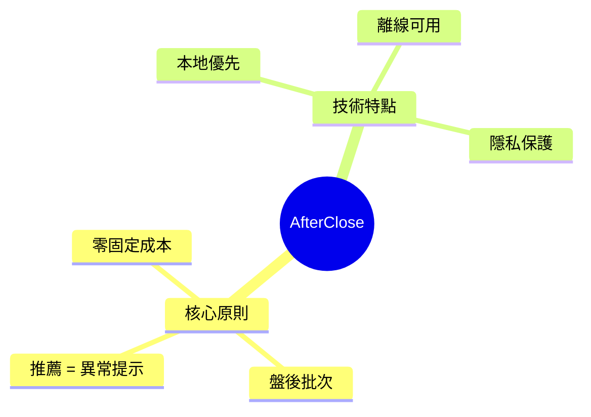
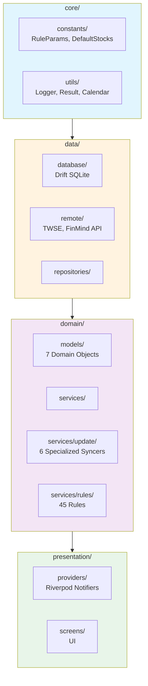
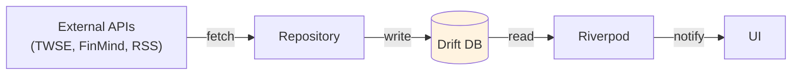
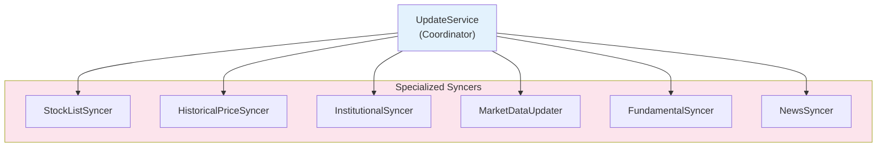

# CLAUDE.md

本檔案為 Claude Code 提供專案開發指引。

---

## 專案概述

**AfterClose** - 本地優先盤後台股掃描 App。所有資料處理在裝置端完成，無雲端依賴。



---

## 常用指令

```bash
flutter pub get                    # 安裝依賴
flutter test                       # 執行測試
flutter analyze lib/               # 靜態分析
dart run build_runner build --delete-conflicting-outputs  # 程式碼生成
```

---

## 架構

### 目錄結構



### 資料流



---

## 配置管理

| 檔案                                       | 用途               |
|------------------------------------------|------------------|
| `lib/core/constants/rule_params.dart`    | 規則引擎參數（閾值、權重、天數） |
| `lib/core/constants/default_stocks.dart` | 預設股票清單           |


---

## Domain Models


---

## Update Services



---

## 關鍵文件

| 文件                                                                                                     | 說明              |
|--------------------------------------------------------------------------------------------------------|-----------------|
| [docs/RULE_ENGINE.md](docs/RULE_ENGINE.md)                                                             | 規則引擎詳解 (45 條規則) |
| [.agent/skills/flutter-riverpod-architect/SKILL.md](.agent/skills/flutter-riverpod-architect/SKILL.md) | 架構模式指南          |

---

## 編碼標準

| 原則              | 說明                                                   |
|-----------------|------------------------------------------------------|
| **Repository**  | 使用 `IAnalysisRepository` 介面，支援 mock 測試               |
| **錯誤處理**        | `Result<T>` (`lib/core/utils/result.dart`)           |
| **狀態管理**        | `AsyncNotifier` / `StateNotifier`，避免 `StateProvider` |
| **Rule Engine** | 純函數（輸入資料 → 輸出理由）                                     |
| **配置集中**        | 所有參數放 `lib/core/constants/`，禁止魔術數字                   |
| **Dart 3**      | Records、Pattern Matching                             |
