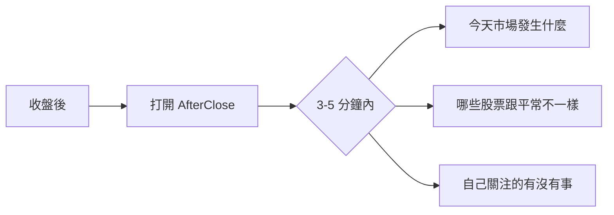
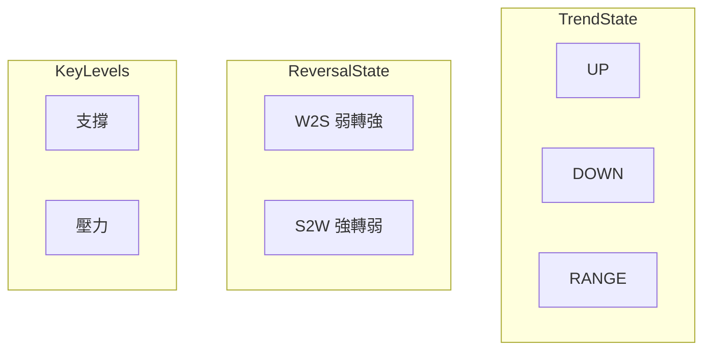
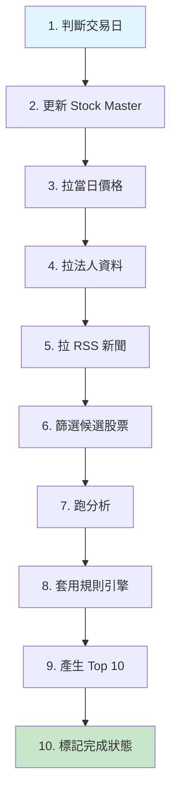
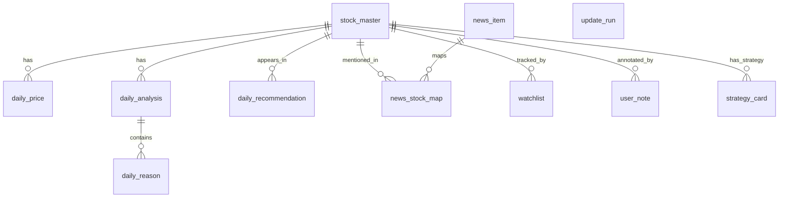
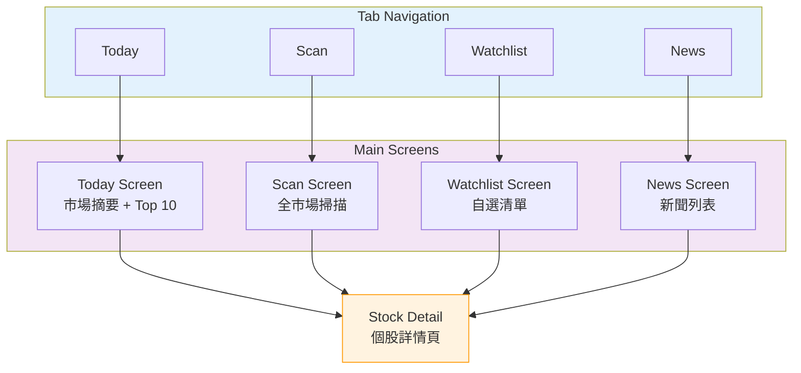

# 📱 AfterClose

### Local-First 盤後市場掃描 App

**Scan the entire market after close. See what changed — without noise.**

---

> **定位一句話**
> 收盤後，把整個市場掃一遍，只留下「今天跟平常不一樣的地方」。

---

## 📋 目錄

- [核心立場](#-核心立場)
- [產品範圍](#-產品範圍)
- [功能骨架](#-功能骨架)
- [分析輸出模型](#-分析輸出模型)
- [推薦系統](#-推薦系統)
- [更新管線](#-更新管線)
- [技術選型](#-技術選型)
- [資料設計](#-資料設計)
- [UI 結構](#-ui-結構)
- [完成標準](#-完成標準)

### 📚 延伸文件

| 文件                                          | 說明                             |
|:--------------------------------------------|:-------------------------------|
| [Rule Engine & Schema](docs/RULE_ENGINE.md) | 推薦規則引擎 v1 + SQLite Schema 完整定義 |

---

## 🎯 核心立場

> 這些不討論、不反悔

| 原則            | 說明                       |
|:--------------|:-------------------------|
| **On-Device** | 所有資料抓取、分析、推薦 **都在裝置端完成** |
| **零固定成本**     | 免費 API + RSS + 本地 SQLite |
| **盤後批次**      | 只處理「已收盤」的日資料             |
| **不做投顧**      | 不給買賣、不給預測、不給情緒           |
| **推薦 = 異常提示** | 告訴你「哪裡怪怪的」，不是「該怎麼做」      |
| **結果可因人而異**   | 依更新時間、裝置狀態而異 → 可接受       |

---

## 📦 產品範圍

### 使用情境（唯一主線）

---

## 🏗️ 功能骨架

### Daily Update（核心）

- ✅ 手動更新（主路徑）
- ✅ 自動更新（前景 + 背景 best-effort）
- 更新內容：
  - 台股 OHLCV（日）
  - 法人（可選）
  - 新聞 RSS metadata

### Today（首頁）

- 市場一句話摘要（模板）
- 今日推薦 Top 10
- 自選清單狀態（🔥 / 👀 / 😴）
- 美股背景（可選，指數）

### Scan（市場掃描）

- 上市 + 上櫃全市場
- 排序依據：**score**
- 篩選：弱轉強 / 強轉弱 / 突破 / 跌破 / 放量

### Stock Detail（單一股票）

| 區塊    | 內容                |
|:------|:------------------|
| 盤後事實  | OHLCV             |
| 趨勢狀態  | UP / DOWN / RANGE |
| 轉折狀態  | W2S / S2W         |
| 關鍵價位  | 支撐 / 壓力           |
| 推薦理由  | 最多 2 條            |
| 新聞/事件 | RSS 來源            |
| 私有資料  | 策略卡 + 筆記          |

---

## 📊 分析輸出模型

### 技術面（結構，不是指標）

### 籌碼面（可選）

- 法人買賣超
- 方向是否反轉

### 基本面（只做事件）

- 財報 / 法說 / 除權息
- 有 → 標記 | 沒 → 不顯示

---

## 🔔 推薦系統

> Rule Engine v1 — **Attention Alert**，不是選股、不是預測

### 輸出規則

| 範圍   | 限制             |
|:-----|:---------------|
| 每檔股票 | 最多 **2 條理由**   |
| 每日推薦 | Top **10 檔**   |
| 理由格式 | 類別 + 證據（數字/價位） |

### 理由類型

| 類型                    | 說明       |
|:----------------------|:---------|
| `REVERSAL_W2S`        | 弱轉強      |
| `REVERSAL_S2W`        | 強轉弱      |
| `TECH_BREAKOUT`       | 技術突破     |
| `TECH_BREAKDOWN`      | 技術跌破     |
| `VOLUME_SPIKE`        | 爆量       |
| `PRICE_SPIKE`         | 價格異動     |
| `INSTITUTIONAL_SHIFT` | 法人轉向（可選） |
| `NEWS_RELATED`        | 新聞相關（可選） |

### 剎車機制

- 同股連續出現 → 降權
- 同類理由去重
- 不讓推薦榜變成「放量排行榜」

---

## 🔄 更新管線

> Local-First 設計 — 每一步都要可落地、可中斷、可續跑

### Candidate-first 策略

> 全市場 ≠ 全市場都深算

**v1 候選條件（OR）：**

- 當日漲跌幅 ≥ 5%
- 當日量 ≥ 20 日均量 × 2
- 接近 60 日高 / 低
- 法人方向反轉（若有）

---

## 🛠️ 技術選型

### Stack

| 類別        | 技術                                      |
|:----------|:----------------------------------------|
| Framework | Flutter + Dart 3                        |
| State     | Riverpod                                |
| Database  | Drift (SQLite)                          |
| Network   | Dio                                     |
| Model     | freezed + json_serializable             |
| RSS       | xml                                     |
| 背景任務      | Android: WorkManager / iOS: best-effort |

### 資料來源

| 資料   | 來源                        |
|:-----|:--------------------------|
| 台股   | FinMind                   |
| 美股指數 | Yahoo / Alpha Vantage（可選） |
| 新聞   | RSS                       |

---

## 💾 資料設計

### 設計原則

| 類型    | 規則           |
|:------|:-------------|
| 系統資料  | **不可修改**、可回放 |
| 使用者資料 | 本機私有、可修改     |

### 必要表

---

## 📱 UI 結構

---

## ✅ 完成標準

> MVP Done — 做到這些，就已經是「高品質作品」

- [x] 能在任一裝置完成一次完整盤後更新
- [x] 能產生每日 Top 10 推薦
- [x] 每檔推薦都有「可解釋理由」
- [x] 使用者可維護自己的自選與策略
- [x] 完全本地運算，無需雲端服務

---

## ⚠️ 免責聲明

> 本應用程式僅供資訊參考，不構成任何投資建議。

### 設計原則

| 原則        | 說明              |
|:----------|:----------------|
| **客觀呈現**  | 僅呈現事實與數據，不帶主觀判斷 |
| **無預測性**  | 不提供價格預測或走勢判斷    |
| **無建議性**  | 不提供買賣建議或操作指引    |
| **透明可解釋** | 所有推薦皆附帶明確的觸發條件  |

### 使用者責任

- 所有投資決策應由使用者自行判斷
- 本應用程式不對任何投資損益負責
- 資料來源為公開 API，不保證即時性與準確性

---

**AfterClose** — _See what changed, without noise._

