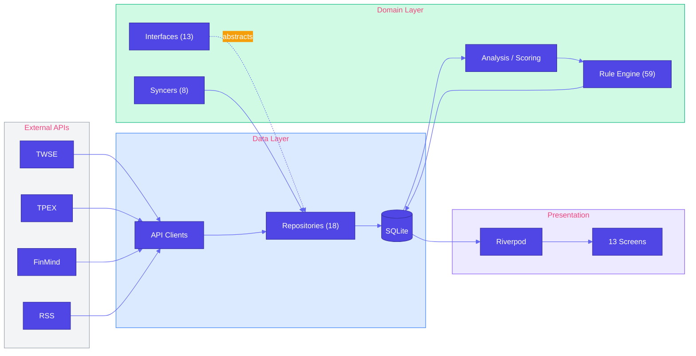
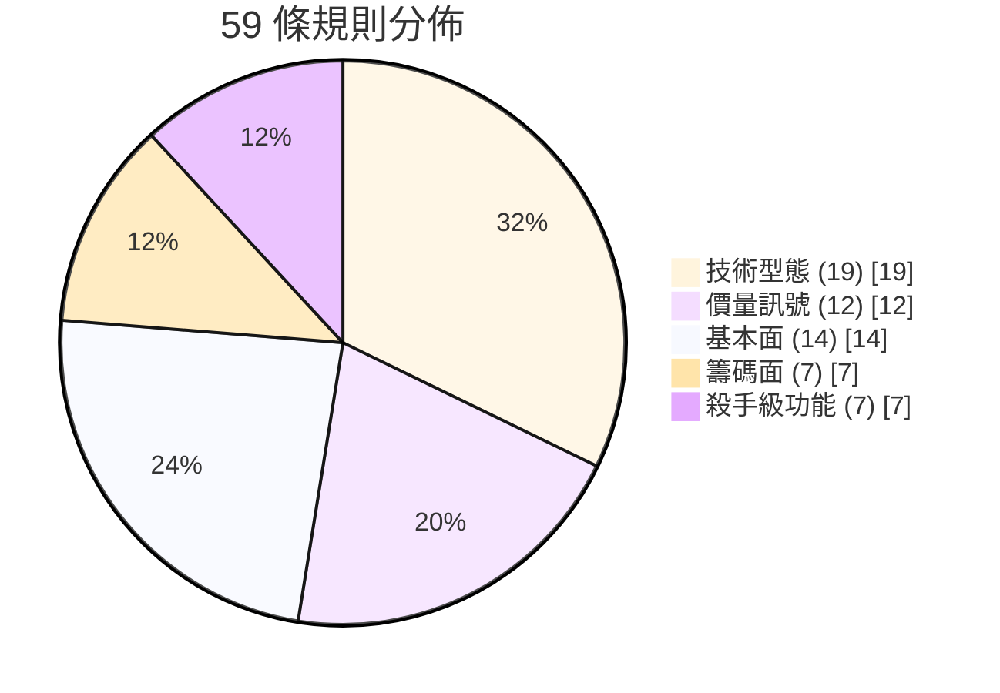

# AfterClose

**Local-First 盤後台股掃描 App** — 收盤後，把整個市場掃一遍，只留下「今天跟平常不一樣的地方」。

[](https://flutter.dev)
[](https://dart.dev)

---

## 核心理念

> 收盤後自動掃描全市場，找出「今天跟平常不一樣」的股票

|      原則       | 說明                   | 優勢        |
|:-------------:|:---------------------|:----------|
| **On-Device** | 所有運算在裝置端完成           | 隱私保護、離線可用 |
|    **零成本**    | 免費公開 API + 本地 SQLite | 無月費、無訂閱   |
|   **盤後批次**    | 收盤後一次更新              | 省電、省流量    |
|   **異常提示**    | 只說「發生什麼」不說「該怎麼做」     | 客觀、不帶立場   |

---

## 功能

| 頁面                   | 功能                  |
|:---------------------|:--------------------|
| **Today**            | 市場摘要 + 今日 Top 20 推薦 |
| **Scan**             | 上市櫃全市場掃描，依評分排序      |
| **Watchlist**        | 自選清單狀態追蹤 + 無限滾動分頁   |
| **Stock Detail**     | 趨勢、關鍵價位、推薦理由、新聞     |
| **Custom Screening** | 自定義篩選策略             |
| **Backtest**         | 策略回測驗證              |
| **Comparison**       | 多檔股票並列比較            |
| **Portfolio**        | 持倉追蹤與損益計算           |
| **News**             | 多源 RSS 新聞彙整         |
| **Alerts**           | 價格提醒管理              |
| **Calendar**         | 事件行事曆               |
| **Industry**         | 產業概覽                |
| **Settings**         | 偏好設定                |

---

## 技術棧

| 類別          | 技術                                |
|:------------|:----------------------------------|
| Framework   | Flutter 3.38 + Dart 3.10          |
| State       | Riverpod 3.2                      |
| Database    | Drift 2.31 (SQLite, 35 tables)    |
| Network     | Dio 5.9                           |
| Navigation  | GoRouter 15                       |
| Charts      | fl_chart + k_chart_plus           |
| Performance | 無限滾動分頁、快取預熱、Request Deduplication |

---

## 資料來源

| 資料   | 來源                                    |
|:-----|:--------------------------------------|
| 台股日價 | TWSE / TPEX Open Data (主)、FinMind (備) |
| 法人籌碼 | FinMind                               |
| 基本面  | TWSE / TPEX / FinMind                 |
| 新聞   | 多源 RSS                                |

---

## 架構

### 資料流



### 目錄結構

```
lib/
├── core/
│   ├── constants/       # 14 files — RuleParams, AppRoutes, DefaultStocks
│   ├── exceptions/      # AppException sealed hierarchy
│   ├── services/        # ShareService
│   ├── theme/           # AppTheme, DesignTokens
│   └── utils/           # Logger, Result, Calendar, PriceCalculator
├── data/
│   ├── database/        # Drift SQLite (35 tables, 10 files)
│   ├── remote/          # TWSE, TPEX, FinMind, RSS clients
│   └── repositories/    # 18 files (15 repos + 3 helpers)
├── domain/
│   ├── models/          # 15 domain model files
│   ├── repositories/    # 13 abstract interfaces
│   └── services/
│       ├── rules/       # 59 stock rules (12 files)
│       ├── update/      # 8 specialized syncers
│       ├── analysis_service.dart
│       ├── scoring_service.dart
│       ├── screening_service.dart
│       └── ohlcv_data.dart
└── presentation/
    ├── providers/       # Riverpod state management
    ├── screens/         # 13 screens
    ├── services/        # ExportService
    └── widgets/         # Shared UI components
```

---

## 效能優化

為確保流暢的使用體驗，AfterClose 實作了多項效能優化：

- **快取預熱**: App 啟動時預載自選股和推薦股資料，提升 30-40% 冷啟動速度
- **無限滾動分頁**: Watchlist 和 Scan 畫面採用虛擬化列表，降低記憶體佔用
- **Request Deduplication**: 避免重複 API 呼叫，減少 30-50% 網路請求
- **Isolate 池重用**: 平行運算時重用 worker，減少 20-30% 啟動開銷
- **資料庫索引優化**: 關鍵表格加入複合索引，查詢速度提升 30%

---

## 推薦系統

59 條異常偵測規則，涵蓋技術面、籌碼面、基本面。



- 每日掃描上市 + 上櫃約 1,770 檔，產出 **Top 20**
- 每檔最多 **2 條理由**，分數上限 **100 分**
- Isolate 平行運算，型別安全通訊

詳見 [docs/RULE_ENGINE.md](docs/RULE_ENGINE.md)

---

## 開發

```bash
flutter pub get                    # 安裝依賴
flutter test                       # 執行測試 (2460+ cases)
flutter analyze                    # 靜態分析
dart run build_runner build --delete-conflicting-outputs  # Drift 程式碼生成
```

---

## 文件

| 文件                                         | 說明      |
|:-------------------------------------------|:--------|
| [CLAUDE.md](CLAUDE.md)                     | AI 開發指引 |
| [RELEASE.md](RELEASE.md)                   | 發布建置指南  |
| [docs/RULE_ENGINE.md](docs/RULE_ENGINE.md) | 規則引擎定義  |

---

## 免責聲明

本應用程式僅供資訊參考，不構成任何投資建議。所有資料來源為公開 API，不保證即時性與準確性。投資決策應由使用者自行判斷。

---

**AfterClose** — _See what changed, without noise._
