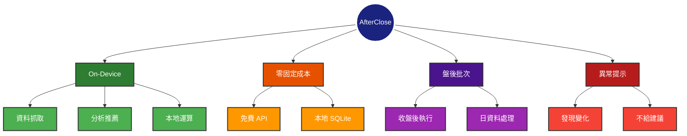
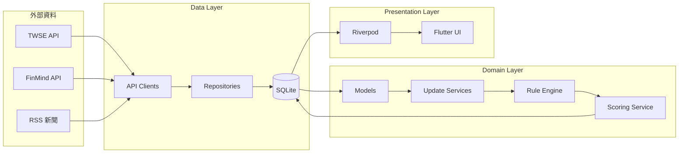
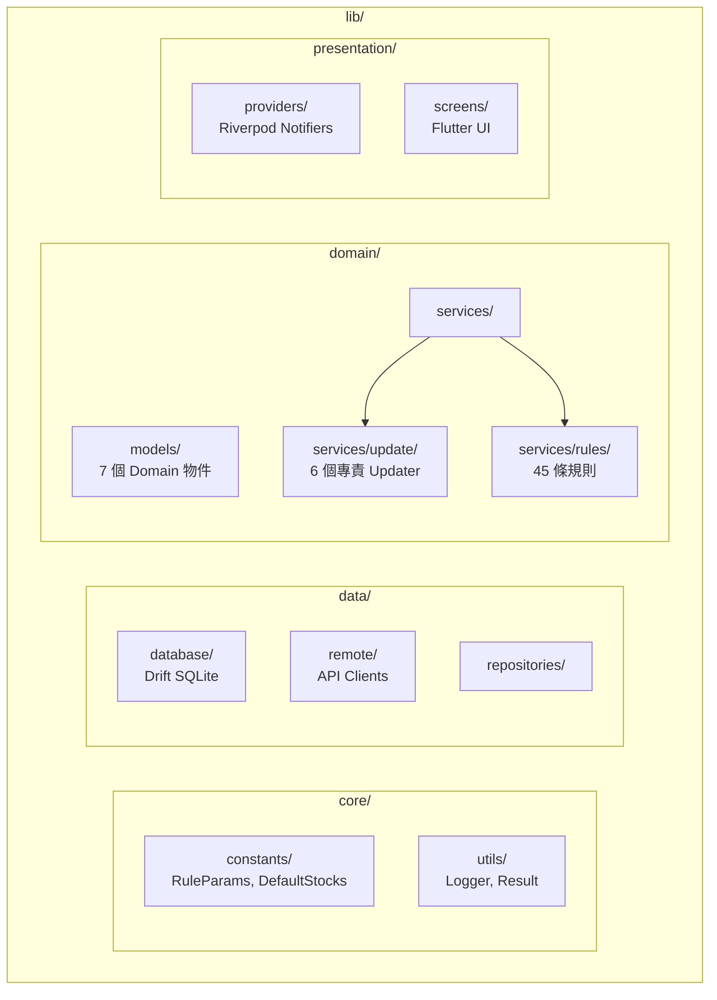
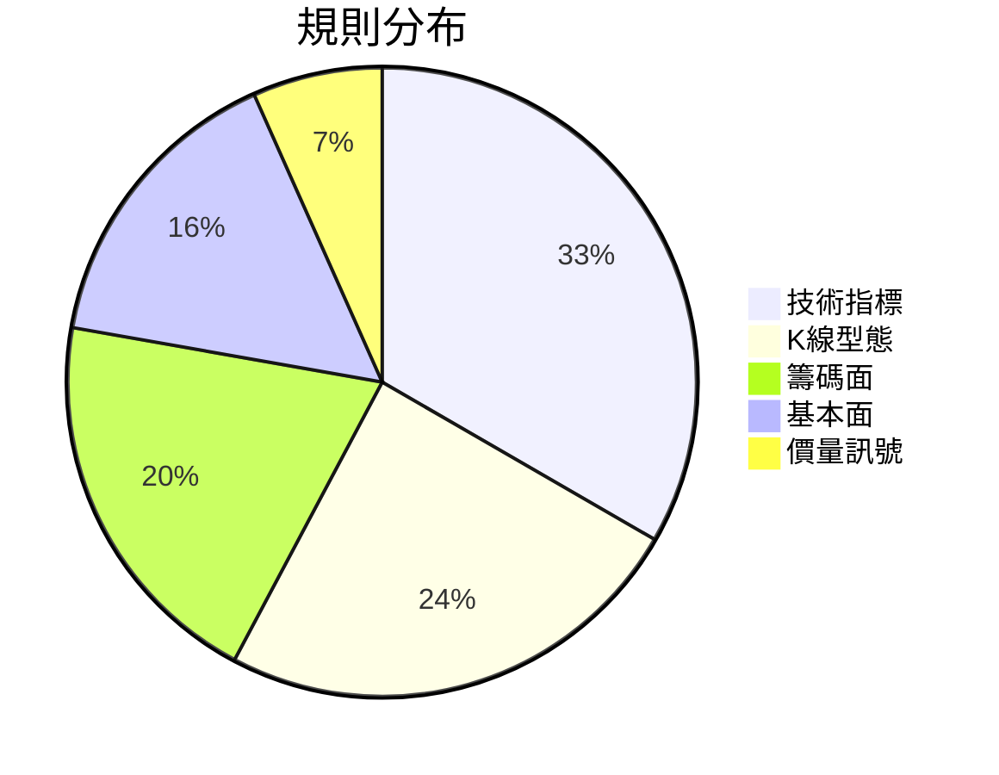

# AfterClose

**Local-First 盤後台股掃描 App** — 收盤後，把整個市場掃一遍，只留下「今天跟平常不一樣的地方」。

[](https://flutter.dev)
[](https://dart.dev)

---

## 核心原則



---

## 功能總覽

| 頁面               | 功能                  |
|------------------|---------------------|
| **Today**        | 市場摘要 + 今日 Top 20 推薦 |
| **Scan**         | 上市櫃全市場掃描，依評分排序      |
| **Watchlist**    | 自選清單狀態追蹤            |
| **Stock Detail** | 趨勢、關鍵價位、推薦理由、新聞     |

---

## 技術棧

| 類別        | 技術                       |
|-----------|--------------------------|
| Framework | Flutter 3.29 + Dart 3.10 |
| State     | Riverpod 2.6             |
| Database  | Drift 2.27 (SQLite)      |
| Network   | Dio 5.8                  |
| Charts    | fl_chart + k_chart_plus  |

---

## 資料來源

| 資料   | 來源                               |
|------|----------------------------------|
| 台股日價 | TWSE Open Data (主) / FinMind (備) |
| 法人籌碼 | FinMind                          |
| 新聞   | 多源 RSS                           |

---

## 架構

### 資料流



### 目錄結構



---

## 推薦系統

45 條規則引擎，涵蓋技術面、籌碼面、基本面。



- 每日產出 **Top 20**（上市+上櫃約 1,770 檔）
- 每檔最多 **2 條理由**
- 分數上限 **80 分**

詳見 [docs/RULE_ENGINE.md](docs/RULE_ENGINE.md)

---

## 常用指令

```bash
flutter pub get                    # 安裝依賴
flutter test                       # 執行測試
dart run build_runner build --delete-conflicting-outputs  # 程式碼生成
```

---

## 文件

| 文件                                         | 說明      |
|--------------------------------------------|---------|
| [CLAUDE.md](CLAUDE.md)                     | AI 開發指引 |
| [RELEASE.md](RELEASE.md)                   | 發布建置指南  |
| [docs/RULE_ENGINE.md](docs/RULE_ENGINE.md) | 規則引擎定義  |

---

## 免責聲明

本應用程式僅供資訊參考，不構成任何投資建議。

- 僅呈現事實與數據，不帶主觀判斷
- 不提供價格預測或買賣建議
- 所有投資決策應由使用者自行判斷
- 資料來源為公開 API，不保證即時性與準確性

---

**AfterClose** — _See what changed, without noise._
