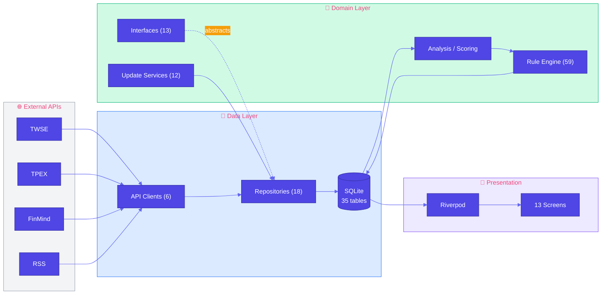
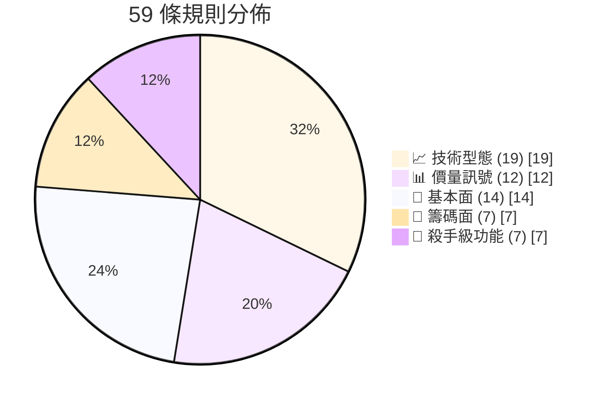

<div align="center">

# AfterClose

**Local-First 盤後台股掃描 App**

收盤後，把整個市場掃一遍，只留下「今天跟平常不一樣的地方」。

_See what changed, without noise._

[](https://flutter.dev)
[](https://dart.dev)
[](LICENSE)
[](https://github.com/Neal75418/afterclose/actions)
[](https://github.com/Neal75418/afterclose/actions/workflows/flutter.yml)
[](https://codecov.io/gh/Neal75418/afterclose)

</div>

---

## 🎯 核心理念

> 收盤後自動掃描全市場，找出「今天跟平常不一樣」的股票

| 原則               | 說明                   | 優勢        |
|:-----------------|:---------------------|:----------|
| 🔒 **On-Device** | 所有運算在裝置端完成           | 隱私保護、離線可用 |
| 💰 **零成本**       | 免費公開 API + 本地 SQLite | 無月費、無訂閱   |
| 🕐 **盤後批次**      | 收盤後一次更新              | 省電、省流量    |
| 📢 **異常提示**      | 只說「發生什麼」不說「該怎麼做」     | 客觀、不帶立場   |

---

## ✨ 功能

| 頁面                      | 功能                  |
|:------------------------|:--------------------|
| 📊 **Today**            | 市場摘要 + 今日 Top 20 推薦 |
| 🔍 **Scan**             | 上市櫃全市場掃描，依評分排序      |
| ⭐ **Watchlist**         | 自選清單狀態追蹤 + 無限滾動分頁   |
| 📈 **Stock Detail**     | 趨勢、關鍵價位、推薦理由、新聞     |
| 🎛 **Custom Screening** | 自定義篩選策略 + 回測驗證      |
| 📉 **Comparison**       | 多檔股票並列比較            |
| 💼 **Portfolio**        | 持倉追蹤與損益計算           |
| 📰 **News**             | 多源 RSS 新聞彙整         |
| 🔔 **Alerts**           | 15 種價格與技術指標警示       |
| 📅 **Calendar**         | 事件行事曆               |
| 🏭 **Industry**         | 產業概覽                |
| ⚙️ **Settings**         | 偏好設定                |
| 👋 **Onboarding**       | 首次使用引導              |

---

## 🛠 技術棧

| 類別              | 技術                                       | 版本               |
|:----------------|:-----------------------------------------|:-----------------|
| Framework       | Flutter + Dart                           | 3.38 / 3.10      |
| State           | Riverpod                                 | 3.2.1            |
| Database        | Drift (SQLite)                           | 2.31 (35 tables) |
| Network         | Dio                                      | 5.9.1            |
| Navigation      | GoRouter                                 | 15.1.3           |
| Charts          | fl_chart + k_chart_plus + candlesticks   | —                |
| Code Gen        | Freezed + Riverpod Generator + Drift Dev | —                |
| Testing         | Flutter Test + Mocktail                  | 2496+ cases      |
| CI/CD           | GitHub Actions + Codecov                 | —                |
| Crash Reporting | Sentry                                   | 9.13.0           |

---

## 📡 資料來源

| 資料   | 來源                                    | 備註   |
|:-----|:--------------------------------------|:-----|
| 台股日價 | TWSE / TPEX Open Data (主)、FinMind (備) | 每日更新 |
| 法人籌碼 | FinMind                               | 每日更新 |
| 基本面  | TWSE / TPEX / FinMind                 | 每週更新 |
| 集保分布 | TDCC                                  | 每週更新 |
| 新聞   | 多源 RSS                                | 即時   |

---

## 🏗 架構

### 資料流


```mermaid
%%{init: {'theme': 'base', 'themeVariables': {'primaryColor': '#4F46E5', 'primaryTextColor': '#fff', 'primaryBorderColor': '#3730A3', 'secondaryColor': '#F59E0B', 'tertiaryColor': '#10B981', 'lineColor': '#6366F1', 'fontSize': '14px'}}}%%
flowchart LR
    subgraph External["🌐 External APIs"]
        TWSE["TWSE"]
        TPEX["TPEX"]
        FM["FinMind"]
        RSS["RSS"]
    end

    subgraph Data["💾 Data Layer"]
        Remote["API Clients (6)"]
        Repo["Repositories (18)"]
        DB[("SQLite\n35 tables")]
    end

    subgraph Domain["🧠 Domain Layer"]
        IF["Interfaces (13)"]
        Services["Analysis / Scoring"]
        Rules["Rule Engine (59)"]
        Update["Update Services (12)"]
    end

    subgraph Presentation["🎨 Presentation"]
        Provider["Riverpod"]
        UI["13 Screens"]
    end

    TWSE & TPEX & FM & RSS --> Remote
    Remote --> Repo --> DB
    IF -.->|abstracts| Repo
    DB --> Services --> Rules
    Rules --> DB
    Update --> Repo
    DB --> Provider --> UI

    style External fill:#F3F4F6,stroke:#9CA3AF
    style Data fill:#DBEAFE,stroke:#3B82F6
    style Domain fill:#D1FAE5,stroke:#10B981
    style Presentation fill:#EDE9FE,stroke:#8B5CF6
```

### 目錄結構

```
lib/
├── core/
│   ├── constants/       # 14 files — RuleParams (200+ 參數), AppRoutes, DataFreshness
│   ├── exceptions/      # AppException sealed hierarchy
│   ├── services/        # CacheWarmup, Notification, BackgroundUpdate
│   ├── theme/           # AppTheme, DesignTokens, IndicatorColors
│   └── utils/           # Logger, Result, Calendar, RequestDeduplicator, LruCache
├── data/
│   ├── database/        # Drift SQLite (35 tables, 20+ DAOs, BatchQueryHelper)
│   ├── remote/          # TWSE, TPEX, FinMind, TDCC, RSS clients (6)
│   ├── repositories/    # 18 files (15 repos + 3 helpers)
│   └── models/          # DTOs with Freezed + JSON serialization
├── domain/
│   ├── models/          # 15 domain model files
│   ├── repositories/    # 13 abstract interfaces
│   └── services/
│       ├── rules/       # 59 stock rules (12 files)
│       ├── update/      # 12 update components (8 syncers + 3 helpers + coordinator)
│       ├── analysis/    # 5 analysis sub-services
│       ├── scoring_service.dart
│       ├── screening_service.dart
│       └── ...19 service files
└── presentation/
    ├── providers/       # Riverpod state management
    ├── screens/         # 13 screens
    ├── controllers/     # Business logic facades
    ├── mappers/         # DTO → UI model conversion
    └── widgets/         # Shared UI components
```

---

## ⚡ 效能優化

為確保流暢的使用體驗，AfterClose 實作了多項效能優化：

- 🔥 **快取預熱** — App 啟動時預載自選股和推薦股資料，冷啟動快 30-40%
- ♻️ **Request Deduplication** — 避免重複 API 呼叫，減少 30-50% 網路請求
- 📜 **無限滾動分頁** — Watchlist 和 Scan 畫面採用虛擬化列表，降低記憶體佔用
- 🧵 **Isolate 並行運算** — 評分引擎使用 Isolate 平行處理，型別安全通訊
- 🗄 **資料庫索引優化** — 關鍵表格加入複合索引，查詢速度提升 30%

---

## 🧠 推薦系統

59 條異常偵測規則，涵蓋技術面、籌碼面、基本面。


```mermaid
%%{init: {'theme': 'base', 'themeVariables': {'pieOuterStrokeWidth': '2px', 'fontSize': '14px'}}}%%
pie showData title 59 條規則分佈
    "📈 技術型態 (19)" : 19
    "📊 價量訊號 (12)" : 12
    "🏦 基本面 (14)" : 14
    "👥 籌碼面 (7)" : 7
    "🚨 殺手級功能 (7)" : 7
```

- 每日掃描上市 + 上櫃約 **1,770 檔**，產出 **Top 20**
- 每檔最多 **2 條理由**，分數上限 **100 分**
- Isolate 平行運算，型別安全通訊
- 200+ 可調參數集中管理於 `rule_params.dart`

📖 詳見 [docs/RULE_ENGINE.md](docs/RULE_ENGINE.md)

---

## 🚀 開始使用

### 環境需求

- Flutter 3.38+ / Dart 3.10+
- Android Studio 或 VS Code
- macOS（iOS 開發，選配）

### 安裝與啟動

```bash
git clone https://github.com/Neal75418/afterclose.git
cd afterclose
flutter pub get
dart run build_runner build --delete-conflicting-outputs
flutter run
```

### 開發指令

```bash
flutter pub get                    # 安裝依賴
flutter test                       # 執行測試 (2496+ cases)
flutter analyze                    # 靜態分析
dart format .                      # 格式化程式碼
dart run build_runner build --delete-conflicting-outputs  # 程式碼生成
```

---

## 🧪 測試

| 指標               | 數值    |
|:-----------------|:------|
| 測試總數             | 2496+ |
| 執行時間             | ~30 秒 |
| Domain 覆蓋率       | 85%+  |
| Data 覆蓋率         | 85%+  |
| Presentation 覆蓋率 | 70%+  |

```bash
flutter test                       # 快速測試
flutter test --coverage            # 含覆蓋率報告
flutter test test/domain/services/ # 測試特定目錄
```

---

## 📚 文件

| 文件                                                       | 說明                |
|:---------------------------------------------------------|:------------------|
| [CLAUDE.md](CLAUDE.md)                                   | 🤖 AI 開發指引        |
| [RELEASE.md](RELEASE.md)                                 | 📦 發布建置指南         |
| [CHANGELOG.md](CHANGELOG.md)                             | 📝 版本變更紀錄         |
| [docs/RULE_ENGINE.md](docs/RULE_ENGINE.md)               | 🧠 規則引擎定義（59 條規則） |
| [docs/PENDING_UPGRADES.md](docs/PENDING_UPGRADES.md)     | ⬆️ 待完成依賴升級        |
| [docs/TEST_COVERAGE_PLAN.md](docs/TEST_COVERAGE_PLAN.md) | 🧪 測試覆蓋率計劃        |

---

## ⚠️ 免責聲明

本應用程式僅供資訊參考，不構成任何投資建議。所有資料來源為公開 API，不保證即時性與準確性。投資決策應由使用者自行判斷。

---

## 📄 授權

[MIT License](LICENSE) © 2026 Neal Chen

---

<div align="center">

**AfterClose** — _See what changed, without noise._

Made with ❤️ for Taiwan Stock Market

</div>
