# AfterClose

**Local-First 盤後台股掃描 App** — 收盤後，把整個市場掃一遍，只留下「今天跟平常不一樣的地方」。

[](https://flutter.dev)
[](https://dart.dev)

---

## 核心原則

> 🎯 **一句話**：收盤後自動掃描全市場，找出「今天跟平常不一樣」的股票

|        原則        | 說明                   | 優勢        |
|:----------------:|----------------------|-----------|
| 📱 **On-Device** | 所有運算在手機完成            | 隱私保護、離線可用 |
|    💰 **零成本**    | 免費公開 API + 本地 SQLite | 無月費、無訂閱   |
|   🕐 **盤後批次**    | 收盤後一次更新              | 省電、省流量    |
|   ⚠️ **異常提示**    | 只說「發生什麼」不說「該怎麼做」     | 客觀、不帶立場   |

---

## 功能總覽

| 頁面               | 功能                  |
|------------------|---------------------|
| **Today**        | 市場摘要 + 今日 Top 20 推薦 |
| **Scan**         | 上市櫃全市場掃描，依評分排序      |
| **Watchlist**    | 自選清單狀態追蹤            |
| **Stock Detail** | 趨勢、關鍵價位、推薦理由、新聞     |

---

## 技術棧

| 類別        | 技術                       |
|-----------|--------------------------|
| Framework | Flutter 3.29 + Dart 3.10 |
| State     | Riverpod 2.6             |
| Database  | Drift 2.27 (SQLite)      |
| Network   | Dio 5.8                  |
| Charts    | fl_chart + k_chart_plus  |

---

## 資料來源

| 資料   | 來源                               |
|------|----------------------------------|
| 台股日價 | TWSE Open Data (主) / FinMind (備) |
| 法人籌碼 | FinMind                          |
| 新聞   | 多源 RSS                           |

---

## 架構

### 資料流

```mermaid
flowchart LR
    subgraph External["☁️ 外部資料"]
        TWSE["TWSE API"]
        FM["FinMind API"]
        RSS["RSS 新聞"]
    end

    subgraph Data["💾 Data Layer"]
        Remote["API Clients"]
        Repo["Repositories"]
        DB[("SQLite")]
    end

    subgraph Domain["⚙️ Domain Layer"]
        Models["Models"]
        Update["Update Services"]
        Rules["Rule Engine"]
        Scoring["Scoring Service"]
    end

    subgraph Presentation["📱 Presentation"]
        Provider["Riverpod"]
        UI["Flutter UI"]
    end

    TWSE --> Remote
    FM --> Remote
    RSS --> Remote
    Remote --> Repo
    Repo --> DB
    DB --> Models
    Models --> Update
    Update --> Rules
    Rules --> Scoring
    Scoring --> DB
    DB --> Provider
    Provider --> UI
```



### 目錄結構

```mermaid
graph TD
    subgraph lib["📁 lib/"]
        subgraph core["🔧 core/"]
            constants["constants/<br/>RuleParams, DefaultStocks"]
            utils["utils/<br/>Logger, Result"]
        end

        subgraph data["💾 data/"]
            database["database/<br/>Drift SQLite"]
            remote["remote/<br/>API Clients"]
            repositories["repositories/"]
        end

        subgraph domain["⚙️ domain/"]
            models["models/<br/>7 個 Domain 物件"]
            services["services/"]
            update["services/update/<br/>6 個專責 Updater"]
            rules["services/rules/<br/>51 條規則"]
        end

        subgraph presentation["📱 presentation/"]
            providers["providers/<br/>Riverpod Notifiers"]
            screens["screens/<br/>Flutter UI"]
        end
    end

    services --> update
    services --> rules
```



---

## 推薦系統

51 條規則引擎，涵蓋技術面、籌碼面、基本面、殺手級功能。

```mermaid
pie showData title 📊 51 條規則分布
    "技術型態" : 19
    "價量訊號" : 12
    "基本面" : 7
    "殺手級功能" : 7
    "籌碼面" : 6
```



- 每日產出 **Top 20**（上市+上櫃約 1,770 檔）
- 每檔最多 **2 條理由**
- 分數上限 **100 分**

詳見 [docs/RULE_ENGINE.md](docs/RULE_ENGINE.md)

---

## 常用指令

```bash
flutter pub get                    # 安裝依賴
flutter test                       # 執行測試
dart run build_runner build --delete-conflicting-outputs  # 程式碼生成
```

---

## 文件

| 文件                                         | 說明      |
|--------------------------------------------|---------|
| [CLAUDE.md](CLAUDE.md)                     | AI 開發指引 |
| [RELEASE.md](RELEASE.md)                   | 發布建置指南  |
| [docs/RULE_ENGINE.md](docs/RULE_ENGINE.md) | 規則引擎定義  |

---

## Roadmap

### v0.1.0 ✅ (2025-01-27)

- 注意/處置股票警示
- 董監持股追蹤
- 外資集中度分析
- Release Workflow

### v0.2.0 🔲 App Store 發布

| 項目                       | 狀態 | 說明          |
|--------------------------|----|-------------|
| Google Play Developer 帳號 | 🔲 | $25 一次性     |
| Android Keystore 簽名      | 🔲 | 產生 keystore |
| Apple Developer 帳號       | 🔲 | $99/年       |
| iOS 憑證 & Provisioning    | 🔲 | 需 Mac 產生    |
| Fastlane 自動發布            | 🔲 | 選配          |

---

## 免責聲明

本應用程式僅供資訊參考，不構成任何投資建議。

- 僅呈現事實與數據，不帶主觀判斷
- 不提供價格預測或買賣建議
- 所有投資決策應由使用者自行判斷
- 資料來源為公開 API，不保證即時性與準確性

---

**AfterClose** — _See what changed, without noise._
