# AfterClose

**Local-First 盤後台股掃描 App** — 收盤後，把整個市場掃一遍，只留下「今天跟平常不一樣的地方」。

[](https://flutter.dev)
[](https://dart.dev)

---

## 核心理念

> 收盤後自動掃描全市場，找出「今天跟平常不一樣」的股票

| 原則 | 說明 | 優勢 |
|:----:|------|------|
| 📱 **On-Device** | 所有運算在裝置端完成 | 隱私保護、離線可用 |
| 💰 **零成本** | 免費公開 API + 本地 SQLite | 無月費、無訂閱 |
| 🕐 **盤後批次** | 收盤後一次更新 | 省電、省流量 |
| ⚠️ **異常提示** | 只說「發生什麼」不說「該怎麼做」 | 客觀、不帶立場 |

---

## 功能

| 頁面 | 功能 |
|------|------|
| **Today** | 市場摘要 + 今日 Top 20 推薦 |
| **Scan** | 上市櫃全市場掃描，依評分排序 |
| **Watchlist** | 自選清單狀態追蹤 |
| **Stock Detail** | 趨勢、關鍵價位、推薦理由、新聞 |
| **Custom Screening** | 自定義篩選策略 + 回測 |
| **Comparison** | 多檔股票並列比較 |
| **Portfolio** | 持倉追蹤與損益計算 |
| **News** | 多源 RSS 新聞彙整 |
| **Alerts** | 價格提醒管理 |
| **Calendar** | 事件行事曆 |
| **Industry** | 產業概覽 |
| **Settings** | 偏好設定 |

---

## 技術棧

| 類別 | 技術 |
|------|------|
| Framework | Flutter 3.29 + Dart 3.10 |
| State | Riverpod 2.6 |
| Database | Drift 2.27（SQLite, 35 tables） |
| Network | Dio 5.8 |
| Charts | fl_chart + k_chart_plus |

---

## 資料來源

| 資料 | 來源 |
|------|------|
| 台股日價 | TWSE / TPEX Open Data（主）、FinMind（備） |
| 法人籌碼 | FinMind |
| 基本面 | TWSE / TPEX / FinMind |
| 新聞 | 多源 RSS |

---

## 架構

### 資料流

```mermaid
flowchart LR
    subgraph External["☁️ 外部資料"]
        TWSE["TWSE API"]
        TPEX["TPEX API"]
        FM["FinMind API"]
        RSS["RSS 新聞"]
    end

    subgraph Data["💾 Data Layer"]
        Remote["API Clients"]
        Repo["Repositories (10)"]
        DB[("SQLite")]
    end

    subgraph Domain["⚙️ Domain Layer"]
        IF["Interfaces (3)"]
        Services["Analysis / Scoring"]
        Rules["Rule Engine (59)"]
        Update["Syncers (7)"]
    end

    subgraph Presentation["📱 Presentation"]
        Provider["Riverpod"]
        UI["13 Screens"]
    end

    TWSE & TPEX & FM & RSS --> Remote
    Remote --> Repo --> DB
    IF -.->|abstracts| Repo
    DB --> Services --> Rules
    Rules --> DB
    Update --> Repo
    DB --> Provider --> UI
```



### 目錄結構

```
lib/
├── core/
│   ├── constants/       # 13 files: RuleParams, AppRoutes, DefaultStocks...
│   ├── exceptions/      # AppException sealed hierarchy
│   ├── services/        # ShareService
│   ├── theme/           # AppTheme, DesignTokens
│   └── utils/           # Logger, Result, Calendar, PriceCalculator
├── data/
│   ├── database/        # Drift SQLite (35 tables, 10 files)
│   ├── remote/          # TWSE, TPEX, FinMind, RSS clients
│   └── repositories/    # 10 concrete implementations
├── domain/
│   ├── models/          # 14 domain model files
│   ├── repositories/    # 3 abstract interfaces
│   └── services/
│       ├── rules/       # 59 stock rules (12 files)
│       ├── update/      # 7 specialized syncers
│       ├── analysis_service.dart
│       ├── scoring_service.dart
│       ├── screening_service.dart
│       └── ohlcv_data.dart
└── presentation/
    ├── providers/       # Riverpod state management
    ├── screens/         # 13 screens
    ├── services/        # ExportService
    └── widgets/         # Shared UI components
```

---

## 推薦系統

59 條異常偵測規則，涵蓋技術面、籌碼面、基本面。

```mermaid
pie showData title 59 條規則分佈
    "技術型態" : 19
    "價量訊號" : 12
    "基本面" : 14
    "籌碼面" : 7
    "殺手級功能" : 7
```



- 每日掃描上市+上櫃約 1,770 檔，產出 **Top 20**
- 每檔最多 **2 條理由**，分數上限 **100 分**
- Isolate 平行運算，型別安全通訊

詳見 [docs/RULE_ENGINE.md](docs/RULE_ENGINE.md)

---

## 開發

```bash
flutter pub get                    # 安裝依賴
flutter test                       # 執行測試
flutter analyze                    # 靜態分析
dart run build_runner build --delete-conflicting-outputs  # Drift 程式碼生成
```

---

## 文件

| 文件 | 說明 |
|------|------|
| [CLAUDE.md](CLAUDE.md) | AI 開發指引 |
| [RELEASE.md](RELEASE.md) | 發布建置指南 |
| [docs/RULE_ENGINE.md](docs/RULE_ENGINE.md) | 規則引擎定義 |

---

## 免責聲明

本應用程式僅供資訊參考，不構成任何投資建議。所有資料來源為公開 API，不保證即時性與準確性。投資決策應由使用者自行判斷。

---

**AfterClose** — _See what changed, without noise._
