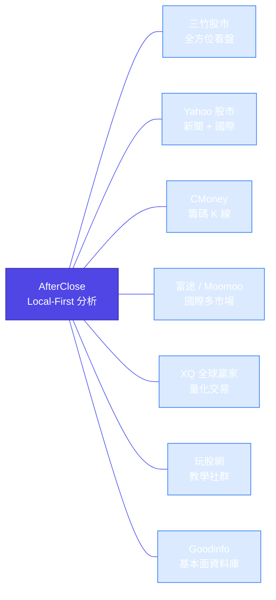
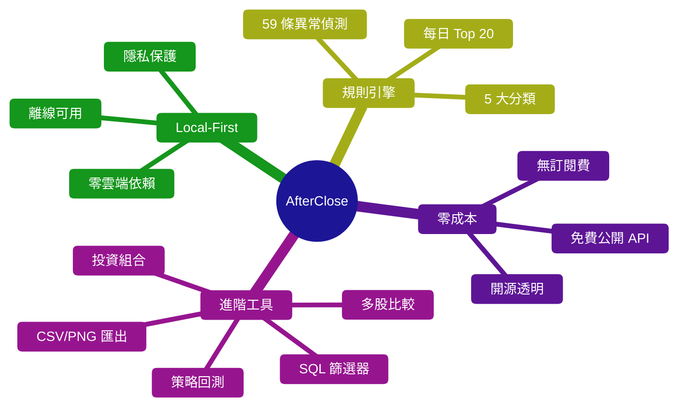
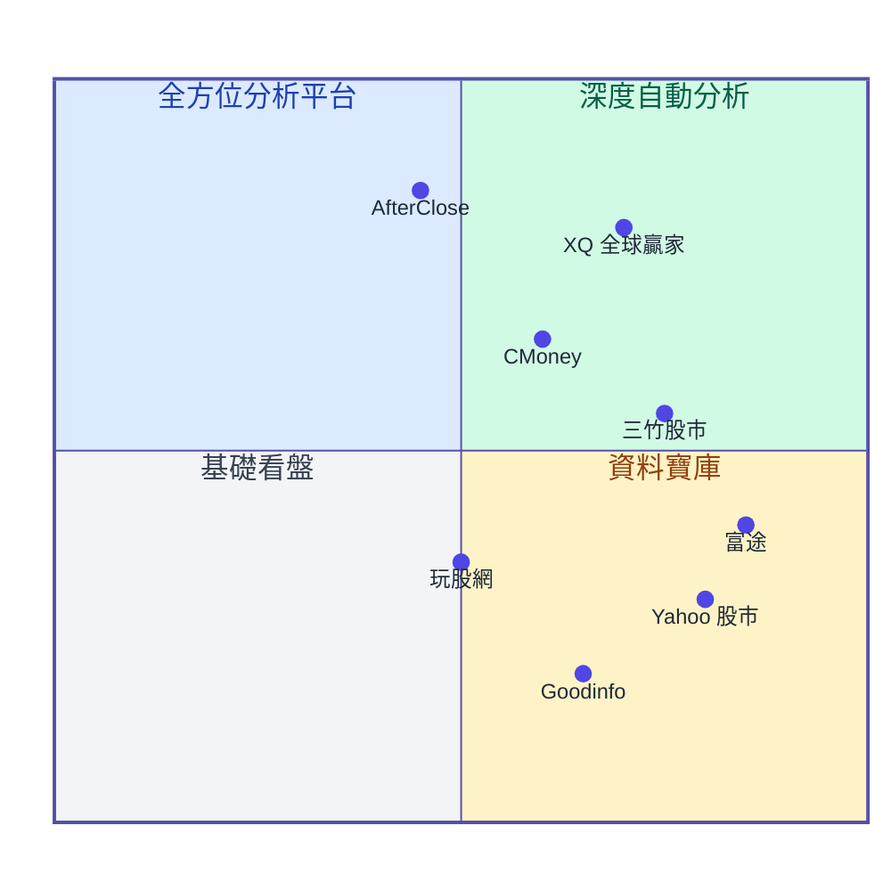

# 競品分析

AfterClose vs 台灣主流看盤軟體 — 功能比較與定位分析

---

## 比較對象



| App           | 定位        | 使用者規模  | 定價        |
|:--------------|:----------|:-------|:----------|
| AfterClose    | 盤後異常提示    | —      | 免費（開源）    |
| 三竹股市          | 全方位看盤     | 百萬+    | 免費為主      |
| Yahoo 股市      | 新聞 + 國際市場 | 極高     | 免費        |
| CMoney 籌碼 K 線 | 籌碼分析      | 700 萬+ | 免費 + 訂閱   |
| 富途牛牛 / Moomoo | 國際多市場交易   | 國際級    | 免費        |
| XQ 全球贏家       | 專業量化      | 專業級    | NT$300+/月 |
| 玩股網           | 投資教學      | 35 萬會員 | 免費 + 付費   |
| Goodinfo      | 基本面資料庫    | 百萬級月流量 | 免費        |

---

## 核心功能比較

> ● 完整支援　◐ 部分支援　○ 不支援

| 功能維度           | AfterClose |  三竹股市   |  Yahoo  | CMoney | 富途  |    XQ    | 玩股網 | Goodinfo |
|:---------------|:----------:|:-------:|:-------:|:------:|:---:|:--------:|:---:|:--------:|
| **即時報價**       |     ○      |    ●    |    ●    |   ●    |  ●  |    ●     |  ●  |    ○     |
| **盤後分析**       |     ●      |    ◐    |    ◐    |   ◐    |  ◐  |    ◐     |  ◐  |    ●     |
| **K 線圖**       |     ●      |    ●    |    ◐    |   ●    |  ●  |    ●     |  ●  |    ○     |
| **技術指標**       |   ● (5+)   | ● (24+) |    ◐    |   ●    |  ●  |  ● (數百)  |  ●  |    ◐     |
| **籌碼分析**       |     ●      |    ◐    |    ◐    |  ● ★   |  ◐  |    ●     |  ◐  |    ●     |
| **分點券商**       |     ○      |    ◐    |    ○    |  ● ★   |  ○  |    ●     |  ○  |    ○     |
| **基本面分析**      |     ●      |    ◐    |    ◐    |   ◐    |  ◐  |    ●     |  ◐  |   ● ★    |
| **選股 / 掃描**    |  ● (30+)   | ● (數千)  | ◐ (30+) |   ●    |  ◐  | ● (300+) |  ●  |    ●     |
| **規則引擎推薦**     |  ● ★ (59)  |    ◐    |    ○    |   ◐    |  ○  |    ○     |  ○  |    ○     |
| **策略回測**       |    ● ★     |    ○    |    ○    |   ○    |  ○  |   ● ★    |  ○  |    ○     |
| **投資組合管理**     |    ● ★     |    ○    |    ○    |   ○    |  ●  |    ○     |  ○  |    ○     |
| **多股比較**       |    ● ★     |    ○    |    ○    |   ○    |  ◐  |    ◐     |  ○  |    ○     |
| **價格提醒**       |     ●      |    ●    |    ●    |   ●    |  ●  |    ●     |  ◐  |    ○     |
| **新聞整合**       |     ●      |    ●    |   ● ★   |   ●    |  ●  |    ●     |  ●  |    ○     |
| **匯出 CSV/PNG** |    ● ★     |    ○    |    ○    |   ○    |  ◐  |    ◐     |  ○  |    ○     |
| **離線使用**       |    ● ★     |    ○    |    ○    |   ○    |  ○  |    ○     |  ○  |    ○     |
| **國際市場**       |     ○      |    ◐    |   ● ★   |   ◐    | ● ★ |    ●     |  ◐  |    ○     |
| **下單交易**       |     ○      |   ● ★   |    ○    |   ○    | ● ★ |    ●     |  ○  |    ○     |
| **社群互動**       |     ○      |    ○    |    ●    |   ●    |  ●  |    ○     | ● ★ |    ○     |

> ★ = 該維度中表現最突出者

---

## 各 App 詳細剖析

### 三竹股市

| 項目   | 說明                            |
|:-----|:------------------------------|
| 核心優勢 | 即時報價覆蓋全市場（台、美、日、期權、加密貨幣）      |
| 選股   | 數千種選股指標、AI 智選股、大師策略（巴菲特、彼得林區） |
| 交易   | 支援多家券商線上下單                    |
| 形態   | App + 電腦版（可攜式 USB 軟體）         |
| 弱點   | 無策略回測、無投資組合管理、付費功能邊界模糊        |

### Yahoo 股市

| 項目   | 說明                              |
|:-----|:--------------------------------|
| 核心優勢 | 每日 2,000+ 則即時財經新聞、國際市場覆蓋完整      |
| 選股   | 30+ 種篩選指標                       |
| 國際   | 道瓊、那斯達克、S&P 500、匯率、ADR、原物料、加密貨幣 |
| 形態   | App + 網站                        |
| 弱點   | 技術分析工具有限、無籌碼深度分析、無下單            |

### CMoney 籌碼 K 線

| 項目   | 說明                                       |
|:-----|:-----------------------------------------|
| 核心優勢 | 台灣最強籌碼分析：分點券商進出、主力動向、秘密券商                |
| AI   | AI 產業健診、AI 個股概覽、個股健檢                     |
| 定價   | 免費版 + 專業版（月 $560 / 半年 $2,880 / 年 $4,680） |
| 形態   | App                                      |
| 弱點   | 付費門檻高、無策略回測、無離線功能                        |

### 富途牛牛 / Moomoo

| 項目   | 說明                           |
|:-----|:-----------------------------|
| 核心優勢 | 全球多市場交易（港股、美股、A 股）、零佣金、高現金利率 |
| 介面   | 流暢現代 UI、投資社群（牛牛圈）            |
| 定價   | 免費、交易手續費                     |
| 形態   | App + 桌面版                    |
| 弱點   | 台股支援有限（需國際版）、無台股即時報價、無規則引擎   |

### XQ 全球贏家

| 項目   | 說明                                |
|:-----|:----------------------------------|
| 核心優勢 | 專業級量化工具：300+ 種選股策略、數百種技術指標、策略回測   |
| 市場   | 台股、美股、港股、中國、韓國、日本                 |
| 定價   | 模組訂閱制（台股 $300/月、籌碼 $500/月）、7 天鑑賞期 |
| 交易   | 支援 26 家券商                         |
| 弱點   | 付費門檻高、學習曲線陡峭、無離線功能                |

### 玩股網

| 項目   | 說明                        |
|:-----|:--------------------------|
| 核心優勢 | 台灣最大投資教學平台、35 萬會員、月百萬造訪   |
| 資料   | 國際指數即時報價、飆股搜尋、閃電通 APP 推播  |
| 定價   | 基本免費 + 進階付費               |
| 形態   | 網站 + App                  |
| 弱點   | 分析工具較淺、無策略回測、無離線功能        |

### Goodinfo

| 項目   | 說明                        |
|:-----|:--------------------------|
| 核心優勢 | 台股資訊最完整的網站：歷史財務、股利分派、股東結構 |
| 籌碼   | 法人買賣超、當沖統計、排行榜            |
| 定價   | 完全免費                      |
| 形態   | 網站（無 App）                 |
| 弱點   | 無即時報價、無 App、查詢型態為主而非看盤    |

---

## AfterClose 獨有優勢



| 優勢        | 說明                            | 競品狀況          |
|:----------|:------------------------------|:--------------|
| 規則引擎推薦    | 59 條規則、5 大分類、每日 Top 20 異常提示   | 僅三竹有 AI 選股    |
| 完全離線      | Local-First 架構、本地 SQLite 運算   | 所有競品皆需網路      |
| 零訂閱費      | 使用免費公開 API（TWSE/TPEX/FinMind） | CMoney/XQ 需付費 |
| 策略回測      | 回測期間 + 持有天數 + 報酬分佈圖           | 僅 XQ 有類似功能    |
| 多股比較      | 最多 5 檔並列、雷達圖 + 疊圖 + CSV 匯出    | 競品幾乎無此功能      |
| 自訂 SQL 篩選 | 條件建構器、策略儲存載入                  | XQ 有類似、門檻較高   |
| 投資組合管理    | 持倉追蹤、損益計算、配置圓餅圖、股利分析          | 僅富途有完整組合管理    |
| 匯出分享      | CSV + PNG 多格式匯出               | 競品少見          |
| 客觀中立      | 只說「發生什麼」不說「該怎麼做」              | 競品多帶主觀建議      |

---

## AfterClose 待補強項目

| 項目   | 現況     | 競品標竿                | 優先度 |
|:-----|:-------|:--------------------|:---:|
| 即時報價 | 盤後批次更新 | 三竹、Yahoo、CMoney 皆即時 |  中  |
| 下單功能 | 純分析工具  | 三竹、富途、XQ 可直接下單      |  低  |
| 分點券商 | 無此資料   | CMoney 為業界最強        |  中  |
| 社群互動 | 無      | Yahoo、CMoney、玩股網    |  低  |
| 國際市場 | 僅台股    | 富途、XQ、Yahoo 支援全球    |  中  |
| 投資教學 | 無      | 玩股網為業界最強            |  低  |

> **設計決策**：AfterClose 定位為「盤後異常提示工具」，即時報價與下單並非核心訴求。專注做好盤後分析，與即時看盤 App 形成互補而非競爭關係。

---

## 定位總結



| 象限       | App                   | 特徵          |
|:---------|:----------------------|:------------|
| 深度自動分析   | **AfterClose**、XQ     | 高度自動化、資料聚焦  |
| 全方位分析平台  | 三竹、CMoney             | 自動分析與資料廣度兼具 |
| 資料寶庫     | Goodinfo、Yahoo、富途     | 資料豐富但自動分析少  |
| 基礎看盤     | 玩股網                   | 入門友善、功能基礎   |

---

## 核心差異化定位

```
┌─────────────────────────────────────────────────┐
│              台股軟體生態系                         │
│                                                 │
│  盤中即時 ◄──────────────────────► 盤後深度分析     │
│                                                 │
│  三竹/Yahoo/CMoney/富途          AfterClose       │
│  「盤中追蹤行情」                 「盤後發現異常」      │
│                                                 │
│              互補而非競爭                           │
└─────────────────────────────────────────────────┘
```

AfterClose 的價值主張：**不是「更好的看盤軟體」，而是「你下班後的股市異常偵探」**。
