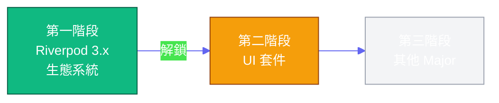
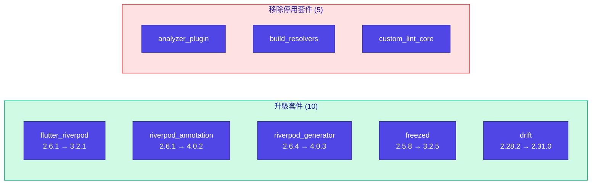
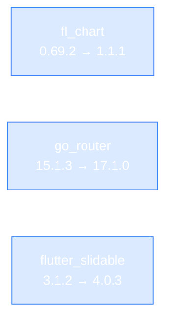

# 待完成的依賴升級任務

本文檔記錄尚未完成的 Major 版本升級，因涉及大量程式碼修改而需要獨立計劃。

---

## 升級路線圖

---

## 第一階段：Riverpod 3.x 生態系統 ✅ 已完成

> 2026-02-13 完成，解鎖後續 UI 套件升級路徑

| 項目    | 說明                                                  |
|:------|:----------------------------------------------------|
| 程式碼變更 | 14 個 provider 檔案添加 `legacy.dart` import             |
| 依賴衝突  | `dependency_overrides` 解決（analyzer, dart_style, io） |
| 測試結果  | 1069/1069 通過                                        |
| 實際工作量 | ~3 小時                                               |

### Patch & Minor 版本升級 ✅

| 套件               | 版本變更            | 備註                                  |
|:-----------------|:----------------|:------------------------------------|
| dio              | 5.9.0 → 5.9.1   |                                     |
| csv              | 6.0.0 → 7.1.0   | `ListToCsvConverter` → `CsvEncoder` |
| workmanager      | 0.5.2 → 0.9.0+3 | 移除 `isInDebugMode`、Policy 改名        |
| flutter_slidable | 3.1.0 → 3.1.2   |                                     |
| fl_chart         | 0.69.0 → 0.69.2 |                                     |
| go_router        | 15.1.2 → 15.1.3 |                                     |

---

## 第二階段：UI 套件升級 🟠 P1

| 套件               | 目標版本   | 影響範圍                     | 工作量    |
|:-----------------|:-------|:-------------------------|:-------|
| fl_chart         | 1.1.1  | 約 5 個圖表元件                | 2-3 小時 |
| go_router        | 17.1.0 | `app_routes.dart` + 導航呼叫 | 2-3 小時 |
| flutter_slidable | 4.0.3  | Watchlist 滑動操作           | 1-2 小時 |

---

## 第三階段：其他 Major 升級 🟡 P2

| 套件                          | 目標版本   | 工作量          |
|:----------------------------|:-------|:-------------|
| flutter_local_notifications | 20.1.0 | 1-2 小時       |
| flutter_secure_storage      | 10.0.0 | 1-2 小時       |
| share_plus                  | 12.0.1 | 30 分鐘 - 1 小時 |

---

## 參考資源

- [Riverpod 3.0 Migration Guide](https://riverpod.dev/docs/3.0_migration)
- [Riverpod 3.0 What's New](https://riverpod.dev/docs/whats_new)
- [Workmanager Changelog](https://pub.dev/packages/workmanager/changelog)
- [CSV Package Documentation](https://pub.dev/packages/csv)

---

**最後更新**: 2026-02-22
**下次審查**: 第二階段 UI 套件升級時
