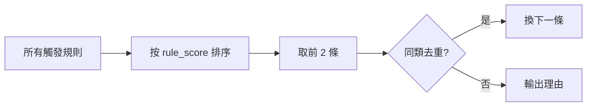
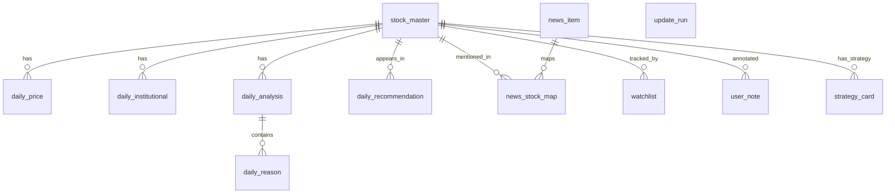
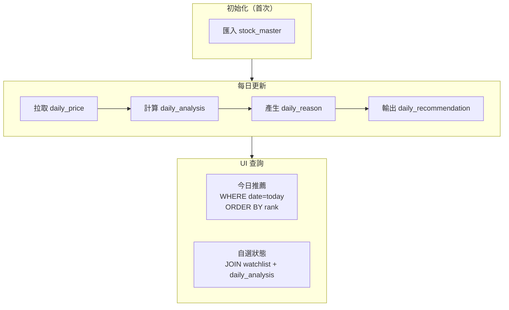

<div align="center">

# Rule Engine & Schema

### AfterClose 推薦規則引擎 v2 + SQLite Schema

</div>

---

## 📋 目錄

- [推薦規則表](#-推薦規則表-v2)
- [參數定義](#-參數定義)
- [規則清單](#-規則清單)
- [分數合成](#-分數合成與輸出)
- [SQLite Schema](#-sqlite-schema)
- [實作指南](#-實作指南)

---

## ⭐ 推薦規則表 v2

### 定位

| 項目       | 說明                              |
|:---------|:--------------------------------|
| **目的**   | 異常提示（Attention Alert），不是選股      |
| **產出**   | 每檔股票最多 **2 個理由**（rank=1,2）      |
| **分數**   | `score = Σ(rule_score)` + 加成/剎車 |
| **分數上限** | **80 分**（防止分數膨脹）                |
| **效能策略** | 先篩候選再深算，避免全市場重算                 |

---

## 🔧 參數定義

> v2 參數，已根據實際運作調整

| 參數                        |     值 | 說明                    |
|:--------------------------|------:|:----------------------|
| `LOOKBACK_PRICE`          |   120 | 分析視窗（日）               |
| `VOL_MA`                  |    20 | 均量計算天數                |
| `RANGE_LOOKBACK`          |    60 | 區間判斷天數                |
| `SWING_WINDOW`            |    20 | Swing High/Low 偵測視窗   |
| `PRICE_SPIKE_PCT`         |    3% | 價格異常門檻（已下調）           |
| `VOLUME_SPIKE_MULT`       |    4x | 放量門檻（vs 20日均量）        |
| `MIN_PRICE_CHANGE_VOL`    |  1.5% | 放量訊號最低價格變動門檻          |
| `BREAKOUT_BUFFER`         |    1% | 突破容忍值（已上調）            |
| `BREAKDOWN_BUFFER`        |  0.5% | 跌破容忍值（寬鬆）             |
| `COOLDOWN_DAYS`           |     2 | 連續推薦降權天數              |
| `RSI_PERIOD`              |    14 | RSI 計算周期              |
| `RSI_OVERBOUGHT`          |    70 | RSI 超買門檻              |
| `RSI_OVERSOLD`            |    30 | RSI 超賣門檻              |
| `KD_PERIOD_K`             |     9 | KD %K 計算周期            |
| `WEEK_52_NEAR_THRESHOLD`  |    2% | 52週高低點接近度門檻           |

---

## 📜 規則清單

### Phase 1：基礎規則（8 條）

| 規則                    |  分數 | 觸發條件                     |
|:----------------------|----:|:-------------------------|
| `REVERSAL_W2S`        | +35 | 弱轉強：跌勢結構破壞 / 突破區間上緣      |
| `REVERSAL_S2W`        | +35 | 強轉弱：跌破支撐 / 跌破區間下緣        |
| `TECH_BREAKOUT`       | +25 | 收盤突破壓力位（1% buffer）       |
| `TECH_BREAKDOWN`      | +25 | 收盤跌破支撐位（0.5% buffer）     |
| `VOLUME_SPIKE`        | +22 | 量 ≥ 4x 均量且價格變動 ≥ 1.5%    |
| `PRICE_SPIKE`         | +15 | 日漲跌幅 ≥ 3%                |
| `INSTITUTIONAL_SHIFT` | +18 | 外資方向反轉 / 買賣超擴大           |
| `NEWS_RELATED`        |  +8 | 近 24 小時相關新聞（正/負面關鍵字匹配）   |

---

### Phase 2：技術指標（4 條）

| 規則                          |  分數 | 觸發條件             |
|:----------------------------|----:|:-----------------|
| `KD_GOLDEN_CROSS`           | +18 | K 線向上穿越 D 線（低檔區） |
| `KD_DEATH_CROSS`            | +18 | K 線向下穿越 D 線（高檔區） |
| `INSTITUTIONAL_BUY_STREAK`  | +20 | 法人連續買超 3 日以上     |
| `INSTITUTIONAL_SELL_STREAK` | +20 | 法人連續賣超 3 日以上     |

---

### Phase 3：K線型態 + 技術訊號（17 條）

#### K線型態

| 規則                             |  分數 | 說明       |
|:-------------------------------|----:|:---------|
| `PATTERN_DOJI`                 | +10 | 十字線      |
| `PATTERN_BULLISH_ENGULFING`    | +22 | 多頭吞噬     |
| `PATTERN_BEARISH_ENGULFING`    | +22 | 空頭吞噬     |
| `PATTERN_HAMMER`               | +18 | 錘子線      |
| `PATTERN_HANGING_MAN`          | +18 | 吊人線      |
| `PATTERN_GAP_UP`               | +20 | 跳空上漲     |
| `PATTERN_GAP_DOWN`             | +20 | 跳空下跌     |
| `PATTERN_MORNING_STAR`         | +25 | 晨星（三日反轉） |
| `PATTERN_EVENING_STAR`         | +25 | 暮星（三日反轉） |
| `PATTERN_THREE_WHITE_SOLDIERS` | +22 | 三白兵      |
| `PATTERN_THREE_BLACK_CROWS`    | +22 | 三黑鴉      |

#### 技術訊號

| 規則                       |  分數 | 說明               |
|:-------------------------|----:|:-----------------|
| `WEEK_52_HIGH`           | +28 | 52 週新高           |
| `WEEK_52_LOW`            | +22 | 52 週新低           |
| `MA_ALIGNMENT_BULLISH`   | +22 | 多頭排列（5>10>20>60） |
| `MA_ALIGNMENT_BEARISH`   | +22 | 空頭排列（5<10<20<60） |
| `RSI_EXTREME_OVERBOUGHT` | +15 | RSI > 80         |
| `RSI_EXTREME_OVERSOLD`   | +15 | RSI < 20         |

---

### Phase 4：擴展市場數據（5 條）

| 規則                                |  分數 | 說明             |
|:----------------------------------|----:|:---------------|
| `FOREIGN_SHAREHOLDING_INCREASING` | +18 | 外資持股增加 ≥ 0.5%  |
| `FOREIGN_SHAREHOLDING_DECREASING` | +18 | 外資持股減少 ≥ 0.5%  |
| `DAY_TRADING_HIGH`                | +12 | 當沖比例 > 30%     |
| `DAY_TRADING_EXTREME`             | +15 | 當沖比例 > 40%（警示） |
| `CONCENTRATION_HIGH`              | +16 | 大戶持股 > 60%     |

---

### Phase 5：價量背離（4 條）

| 規則                                |  分數 | 說明         |
|:----------------------------------|----:|:-----------|
| `PRICE_VOLUME_BULLISH_DIVERGENCE` | +15 | 價漲量縮（警示訊號） |
| `PRICE_VOLUME_BEARISH_DIVERGENCE` | +18 | 價跌量增（恐慌訊號） |
| `HIGH_VOLUME_BREAKOUT`            | +22 | 高檔爆量突破     |
| `LOW_VOLUME_ACCUMULATION`         | +16 | 低檔縮量吸籌     |

---

### Phase 6：基本面分析（7 條）

| 規則                    |  分數 | 說明             |
|:----------------------|----:|:---------------|
| `REVENUE_YOY_SURGE`   | +20 | 營收年增 > 30%     |
| `REVENUE_YOY_DECLINE` | +15 | 營收年減 > 20%（警示） |
| `REVENUE_MOM_GROWTH`  | +15 | 營收月增連續 2 個月正成長 |
| `HIGH_DIVIDEND_YIELD` | +18 | 殖利率 > 5%       |
| `PE_UNDERVALUED`      | +15 | PE < 10（且 > 0） |
| `PE_OVERVALUED`       | +10 | PE > 50（警示）    |
| `PBR_UNDERVALUED`     | +12 | 股價淨值比 < 1      |

---

## 🧮 分數合成與輸出

### 分數計算

```
base_score = Σ(rule_score)

// 額外加成
if (BREAKOUT + VOLUME_SPIKE) → +6
if (REVERSAL_* + VOLUME_SPIKE) → +6
if (PATTERN + VOLUME_SPIKE) → +5
if (INSTITUTIONAL + BREAKOUT|REVERSAL) → +15
```

### 冷卻機制

```
if (同股票在 COOLDOWN_DAYS 內已推薦) {
    score *= 0.5  // 降 50%
}
```

### 分數上限

```
if (score > 80) score = 80  // 防止分數膨脹
```

### 理由輸出規則



### 每日 Top N

| 項目 | 規則            |
|:---|:--------------|
| 排序 | 依 `score` 降序  |
| 數量 | `N = 10`      |
| 去重 | 同產業最多 3 檔（v2） |

---

## 🗃️ SQLite Schema

### ER Diagram



### 完整 DDL

```sql
-- =========================================================
-- AfterClose SQLite Schema v1
-- =========================================================

PRAGMA foreign_keys = ON;

-- -----------------------------
-- 1) Master: stock list
-- -----------------------------
CREATE TABLE IF NOT EXISTS stock_master (
    symbol      TEXT PRIMARY KEY,
    name        TEXT NOT NULL,
    market      TEXT NOT NULL,          -- "TWSE" | "TPEx"
    industry    TEXT,
    is_active   INTEGER NOT NULL DEFAULT 1,
    updated_at  TEXT NOT NULL DEFAULT (datetime('now'))
);

CREATE INDEX IF NOT EXISTS idx_stock_master_market ON stock_master(market);
CREATE INDEX IF NOT EXISTS idx_stock_master_industry ON stock_master(industry);

-- -----------------------------
-- 2) Daily OHLCV
-- -----------------------------
CREATE TABLE IF NOT EXISTS daily_price (
    symbol  TEXT NOT NULL,
    date    TEXT NOT NULL,              -- YYYY-MM-DD
    open    REAL,
    high    REAL,
    low     REAL,
    close   REAL,
    volume  REAL,
    PRIMARY KEY (symbol, date),
    FOREIGN KEY (symbol) REFERENCES stock_master(symbol) ON DELETE CASCADE
);

CREATE INDEX IF NOT EXISTS idx_daily_price_date ON daily_price(date);

-- -----------------------------
-- 3) Institutional (optional)
-- -----------------------------
CREATE TABLE IF NOT EXISTS daily_institutional (
    symbol                TEXT NOT NULL,
    date                  TEXT NOT NULL,
    foreign_net           REAL,
    investment_trust_net  REAL,
    dealer_net            REAL,
    PRIMARY KEY (symbol, date),
    FOREIGN KEY (symbol) REFERENCES stock_master(symbol) ON DELETE CASCADE
);

CREATE INDEX IF NOT EXISTS idx_daily_inst_date ON daily_institutional(date);

-- -----------------------------
-- 4) News (RSS metadata)
-- -----------------------------
CREATE TABLE IF NOT EXISTS news_item (
    id            TEXT PRIMARY KEY,
    source        TEXT NOT NULL,
    title         TEXT NOT NULL,
    url           TEXT NOT NULL,
    category      TEXT NOT NULL,        -- "EARNINGS"|"POLICY"|"INDUSTRY"|"COMPANY_EVENT"|"OTHER"
    published_at  TEXT NOT NULL,
    fetched_at    TEXT NOT NULL DEFAULT (datetime('now'))
);

CREATE INDEX IF NOT EXISTS idx_news_published_at ON news_item(published_at);
CREATE INDEX IF NOT EXISTS idx_news_category ON news_item(category);

CREATE TABLE IF NOT EXISTS news_stock_map (
    news_id  TEXT NOT NULL,
    symbol   TEXT NOT NULL,
    PRIMARY KEY (news_id, symbol),
    FOREIGN KEY (news_id) REFERENCES news_item(id) ON DELETE CASCADE,
    FOREIGN KEY (symbol) REFERENCES stock_master(symbol) ON DELETE CASCADE
);

CREATE INDEX IF NOT EXISTS idx_news_stock_map_symbol ON news_stock_map(symbol);

-- -----------------------------
-- 5) Analysis result (immutable)
-- -----------------------------
CREATE TABLE IF NOT EXISTS daily_analysis (
    symbol            TEXT NOT NULL,
    date              TEXT NOT NULL,
    trend_state       TEXT NOT NULL,    -- "UP"|"DOWN"|"RANGE"
    reversal_state    TEXT NOT NULL DEFAULT 'NONE',
    support_level     REAL,
    resistance_level  REAL,
    score             REAL NOT NULL DEFAULT 0,
    computed_at       TEXT NOT NULL DEFAULT (datetime('now')),
    PRIMARY KEY (symbol, date),
    FOREIGN KEY (symbol) REFERENCES stock_master(symbol) ON DELETE CASCADE
);

CREATE INDEX IF NOT EXISTS idx_daily_analysis_date ON daily_analysis(date);
CREATE INDEX IF NOT EXISTS idx_daily_analysis_score ON daily_analysis(date, score DESC);
CREATE INDEX IF NOT EXISTS idx_daily_analysis_trend ON daily_analysis(date, trend_state);

CREATE TABLE IF NOT EXISTS daily_reason (
    symbol        TEXT NOT NULL,
    date          TEXT NOT NULL,
    rank          INTEGER NOT NULL,
    reason_type   TEXT NOT NULL,
    evidence_json TEXT NOT NULL,
    rule_score    REAL NOT NULL DEFAULT 0,
    PRIMARY KEY (symbol, date, rank),
    FOREIGN KEY (symbol, date) REFERENCES daily_analysis(symbol, date) ON DELETE CASCADE
);

CREATE INDEX IF NOT EXISTS idx_daily_reason_date ON daily_reason(date);
CREATE INDEX IF NOT EXISTS idx_daily_reason_type ON daily_reason(date, reason_type);

CREATE TABLE IF NOT EXISTS daily_recommendation (
    date    TEXT NOT NULL,
    rank    INTEGER NOT NULL,
    symbol  TEXT NOT NULL,
    score   REAL NOT NULL,
    PRIMARY KEY (date, rank),
    UNIQUE (date, symbol),
    FOREIGN KEY (symbol) REFERENCES stock_master(symbol) ON DELETE CASCADE
);

CREATE INDEX IF NOT EXISTS idx_daily_reco_symbol ON daily_recommendation(symbol);

-- -----------------------------
-- 6) User data (mutable)
-- -----------------------------
CREATE TABLE IF NOT EXISTS watchlist (
    symbol      TEXT PRIMARY KEY,
    created_at  TEXT NOT NULL DEFAULT (datetime('now')),
    FOREIGN KEY (symbol) REFERENCES stock_master(symbol) ON DELETE CASCADE
);

CREATE TABLE IF NOT EXISTS user_note (
    id          INTEGER PRIMARY KEY AUTOINCREMENT,
    symbol      TEXT NOT NULL,
    date        TEXT,
    content     TEXT NOT NULL,
    created_at  TEXT NOT NULL DEFAULT (datetime('now')),
    updated_at  TEXT NOT NULL DEFAULT (datetime('now')),
    FOREIGN KEY (symbol) REFERENCES stock_master(symbol) ON DELETE CASCADE
);

CREATE INDEX IF NOT EXISTS idx_user_note_symbol ON user_note(symbol);
CREATE INDEX IF NOT EXISTS idx_user_note_date ON user_note(date);

CREATE TABLE IF NOT EXISTS strategy_card (
    id          INTEGER PRIMARY KEY AUTOINCREMENT,
    symbol      TEXT NOT NULL,
    for_date    TEXT,
    if_a        TEXT,
    then_a      TEXT,
    if_b        TEXT,
    then_b      TEXT,
    else_plan   TEXT,
    created_at  TEXT NOT NULL DEFAULT (datetime('now')),
    updated_at  TEXT NOT NULL DEFAULT (datetime('now')),
    FOREIGN KEY (symbol) REFERENCES stock_master(symbol) ON DELETE CASCADE
);

CREATE INDEX IF NOT EXISTS idx_strategy_symbol ON strategy_card(symbol);
CREATE INDEX IF NOT EXISTS idx_strategy_for_date ON strategy_card(for_date);

CREATE TABLE IF NOT EXISTS update_run (
    id          INTEGER PRIMARY KEY AUTOINCREMENT,
    run_date    TEXT NOT NULL,
    started_at  TEXT NOT NULL DEFAULT (datetime('now')),
    finished_at TEXT,
    status      TEXT NOT NULL,          -- "SUCCESS"|"FAILED"|"PARTIAL"
    message     TEXT
);

CREATE INDEX IF NOT EXISTS idx_update_run_date ON update_run(run_date);
```

---

## 🚀 實作指南

### 資料流



### 常用查詢

```sql
-- 今日推薦 Top 10
SELECT r.rank, r.symbol, m.name, r.score
FROM daily_recommendation r
JOIN stock_master m ON r.symbol = m.symbol
WHERE r.date = date('now')
ORDER BY r.rank;

-- 自選清單今日狀態
SELECT w.symbol, m.name, a.trend_state, a.reversal_state, a.score
FROM watchlist w
JOIN stock_master m ON w.symbol = m.symbol
LEFT JOIN daily_analysis a ON w.symbol = a.symbol AND a.date = date('now');

-- 某股票推薦理由
SELECT reason_type, evidence_json, rule_score
FROM daily_reason
WHERE symbol = '2330' AND date = date('now')
ORDER BY rank;
```

---

<div align="center">

*Rule Engine v2 — 45 Rules across 6 Phases*

</div>
