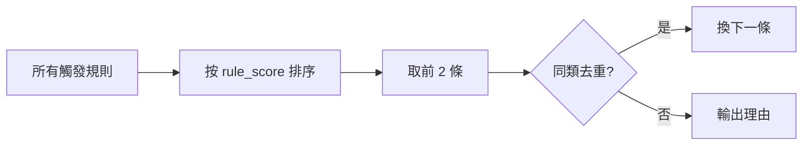
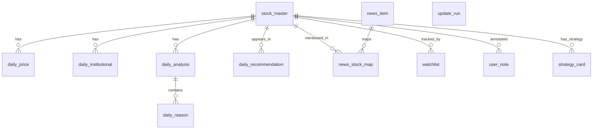
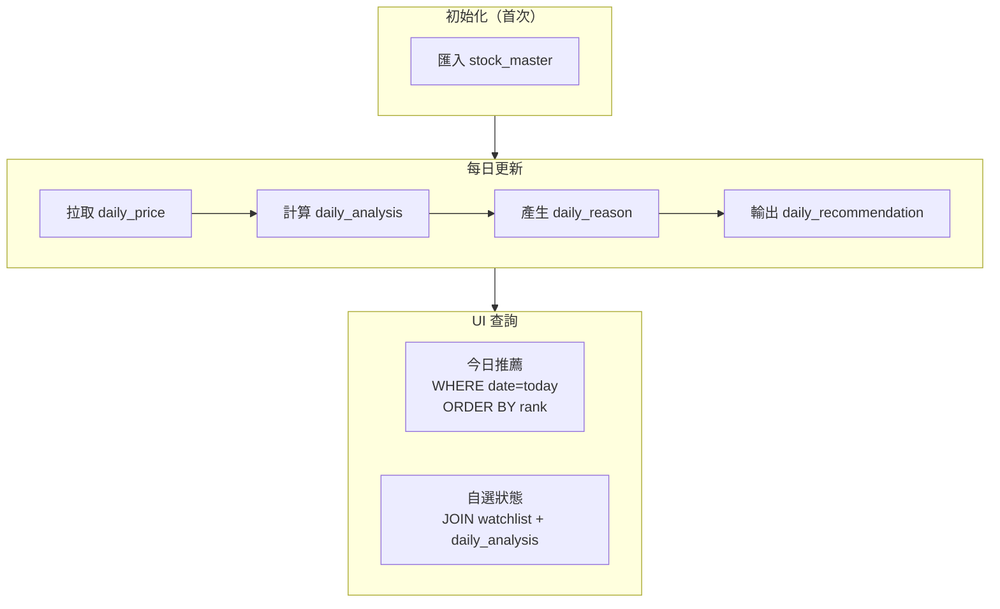

<div align="center">

# Rule Engine & Schema

### AfterClose 推薦規則引擎 v1 + SQLite Schema

</div>

---

## 📋 目錄

- [推薦規則表](#-推薦規則表-v1)
- [參數定義](#-參數定義)
- [規則清單](#-規則清單)
- [分數合成](#-分數合成與輸出)
- [SQLite Schema](#-sqlite-schema)
- [實作指南](#-實作指南)

---

## ⭐ 推薦規則表 v1

### 定位

| 項目       | 說明                              |
|:---------|:--------------------------------|
| **目的**   | 異常提示（Attention Alert），不是選股      |
| **產出**   | 每檔股票最多 **2 個理由**（rank=1,2）      |
| **分數**   | `score = Σ(rule_score)` + 加成/剎車 |
| **效能策略** | 先篩候選再深算，避免全市場重算                 |

---

## 🔧 參數定義

> v1 固定值，v2 再開放設定

| 參數                  |   值    | 說明                  |
|:--------------------|:------:|:--------------------|
| `LOOKBACK_PRICE`    |  120   | 分析視窗（日）             |
| `VOL_MA`            |   20   | 均量計算天數              |
| `RANGE_LOOKBACK`    |   60   | 區間判斷天數              |
| `SWING_WINDOW`      |   20   | Swing High/Low 偵測視窗 |
| `PRICE_SPIKE_PCT`   |  5.0%  | 價格異常門檻              |
| `VOLUME_SPIKE_MULT` |  2.0x  | 放量門檻（vs 20日均量）      |
| `BREAKOUT_BUFFER`   | 0~0.5% | 突破容忍值               |
| `COOLDOWN_DAYS`     |   2    | 連續推薦降權天數            |

---

## 📜 規則清單

### R1 — REVERSAL_W2S（弱轉強）

**分數：+35**

```
觸發條件（任一）：
├── 跌勢被破壞：不再創新低 + 形成較高低點
├── 突破盤整上緣：close > range_top_60d × (1 + buffer)
└── 跌破後收復：先跌破支撐後收在支撐上（可選）
```

| 欄位             | 內容                                                 |
|:---------------|:---------------------------------------------------|
| **ReasonType** | `REVERSAL_W2S`                                     |
| **模板**         | `弱轉強：跌勢結構被破壞` / `弱轉強：突破盤整區上緣 {range_top}`          |
| **evidence**   | `{"range_top", "last_low", "today_low", "buffer"}` |

---

### R2 — REVERSAL_S2W（強轉弱）

**分數：+35**

```
觸發條件（任一）：
├── 上升結構破壞：close < support_level
└── 跌破盤整下緣：close < range_bottom_60d × (1 - buffer)
```

| 欄位             | 內容                                                    |
|:---------------|:------------------------------------------------------|
| **ReasonType** | `REVERSAL_S2W`                                        |
| **模板**         | `強轉弱：跌破關鍵支撐 {support}` / `強轉弱：跌破盤整區下緣 {range_bottom}` |
| **evidence**   | `{"support", "range_bottom", "close"}`                |

---

### R3 — TECH_BREAKOUT（技術突破）

**分數：+25**

```
觸發條件：
└── close > resistance_level × (1 + buffer)
    resistance 來源：Swing High 或 區間上緣
```

| 欄位             | 內容                                  |
|:---------------|:------------------------------------|
| **ReasonType** | `TECH_BREAKOUT`                     |
| **模板**         | `技術突破：收盤突破壓力 {resistance}`          |
| **evidence**   | `{"resistance", "close", "buffer"}` |

---

### R4 — TECH_BREAKDOWN（技術跌破）

**分數：+25**

```
觸發條件：
└── close < support_level × (1 - buffer)
```

| 欄位             | 內容                               |
|:---------------|:---------------------------------|
| **ReasonType** | `TECH_BREAKDOWN`                 |
| **模板**         | `技術跌破：收盤跌破支撐 {support}`          |
| **evidence**   | `{"support", "close", "buffer"}` |

---

### R5 — VOLUME_SPIKE（放量異常）

**分數：+18**

```
觸發條件：
└── volume_today >= vol_ma20 × VOLUME_SPIKE_MULT
```

| 欄位             | 內容                               |
|:---------------|:---------------------------------|
| **ReasonType** | `VOLUME_SPIKE`                   |
| **模板**         | `放量：成交量 {vol}（約為20日均量的 {mult}x）` |
| **evidence**   | `{"vol", "vol_ma20", "mult"}`    |

---

### R6 — PRICE_SPIKE（價格異常）

**分數：+15**

```
觸發條件：
└── abs(pct_change_today) >= PRICE_SPIKE_PCT
```

| 欄位             | 內容                                    |
|:---------------|:--------------------------------------|
| **ReasonType** | `PRICE_SPIKE`                         |
| **模板**         | `價格異常：今日 {pct}%（波動超過門檻 {threshold}%）` |
| **evidence**   | `{"pct", "threshold"}`                |

---

### R7 — INSTITUTIONAL_SHIFT（法人異常）

**分數：+12** ｜ *可選：有法人資料才啟用*

```
觸發條件（任一）：
├── 近 3 日 net_sum 與今日方向反轉
└── 今日淨買賣超絕對值超過近 20 日分位數
```

| 欄位             | 內容                                          |
|:---------------|:--------------------------------------------|
| **ReasonType** | `INSTITUTIONAL_SHIFT`                       |
| **模板**         | `法人變化：外資方向反轉（{prev_dir} → {today_dir}）`     |
| **evidence**   | `{"foreign_net", "dir_prev3", "dir_today"}` |

---

### R8 — NEWS_RELATED（新聞關聯）

**分數：+8** ｜ *可選：有 RSS 才啟用*

```
觸發條件：
└── 當日或近 1-2 日有新聞標題匹配到股票
```

| 欄位             | 內容                           |
|:---------------|:-----------------------------|
| **ReasonType** | `NEWS_RELATED`               |
| **模板**         | `新聞關聯：{source} - {title}`    |
| **evidence**   | `{"source", "title", "url"}` |

---

## 🧮 分數合成與輸出

### 分數計算

```
base_score = Σ(rule_score)

// 額外加成（可選）
if (BREAKOUT + VOLUME_SPIKE) → +6
if (REVERSAL_* + VOLUME_SPIKE) → +6
```

### 冷卻機制

```
if (同股票在 COOLDOWN_DAYS 內已推薦) {
    score *= 0.7  // 或固定 -10
}
```

### 理由輸出規則



### 每日 Top N

| 項目 | 規則            |
|:---|:--------------|
| 排序 | 依 `score` 降序  |
| 數量 | `N = 10`      |
| 去重 | 同產業最多 3 檔（v2） |

---

## 🗃️ SQLite Schema

### ER Diagram



### 完整 DDL

```sql
-- =========================================================
-- AfterClose SQLite Schema v1
-- =========================================================

PRAGMA foreign_keys = ON;

-- -----------------------------
-- 1) Master: stock list
-- -----------------------------
CREATE TABLE IF NOT EXISTS stock_master (
    symbol      TEXT PRIMARY KEY,
    name        TEXT NOT NULL,
    market      TEXT NOT NULL,          -- "TWSE" | "TPEx"
    industry    TEXT,
    is_active   INTEGER NOT NULL DEFAULT 1,
    updated_at  TEXT NOT NULL DEFAULT (datetime('now'))
);

CREATE INDEX IF NOT EXISTS idx_stock_master_market ON stock_master(market);
CREATE INDEX IF NOT EXISTS idx_stock_master_industry ON stock_master(industry);

-- -----------------------------
-- 2) Daily OHLCV
-- -----------------------------
CREATE TABLE IF NOT EXISTS daily_price (
    symbol  TEXT NOT NULL,
    date    TEXT NOT NULL,              -- YYYY-MM-DD
    open    REAL,
    high    REAL,
    low     REAL,
    close   REAL,
    volume  REAL,
    PRIMARY KEY (symbol, date),
    FOREIGN KEY (symbol) REFERENCES stock_master(symbol) ON DELETE CASCADE
);

CREATE INDEX IF NOT EXISTS idx_daily_price_date ON daily_price(date);

-- -----------------------------
-- 3) Institutional (optional)
-- -----------------------------
CREATE TABLE IF NOT EXISTS daily_institutional (
    symbol                TEXT NOT NULL,
    date                  TEXT NOT NULL,
    foreign_net           REAL,
    investment_trust_net  REAL,
    dealer_net            REAL,
    PRIMARY KEY (symbol, date),
    FOREIGN KEY (symbol) REFERENCES stock_master(symbol) ON DELETE CASCADE
);

CREATE INDEX IF NOT EXISTS idx_daily_inst_date ON daily_institutional(date);

-- -----------------------------
-- 4) News (RSS metadata)
-- -----------------------------
CREATE TABLE IF NOT EXISTS news_item (
    id            TEXT PRIMARY KEY,
    source        TEXT NOT NULL,
    title         TEXT NOT NULL,
    url           TEXT NOT NULL,
    category      TEXT NOT NULL,        -- "EARNINGS"|"POLICY"|"INDUSTRY"|"COMPANY_EVENT"|"OTHER"
    published_at  TEXT NOT NULL,
    fetched_at    TEXT NOT NULL DEFAULT (datetime('now'))
);

CREATE INDEX IF NOT EXISTS idx_news_published_at ON news_item(published_at);
CREATE INDEX IF NOT EXISTS idx_news_category ON news_item(category);

CREATE TABLE IF NOT EXISTS news_stock_map (
    news_id  TEXT NOT NULL,
    symbol   TEXT NOT NULL,
    PRIMARY KEY (news_id, symbol),
    FOREIGN KEY (news_id) REFERENCES news_item(id) ON DELETE CASCADE,
    FOREIGN KEY (symbol) REFERENCES stock_master(symbol) ON DELETE CASCADE
);

CREATE INDEX IF NOT EXISTS idx_news_stock_map_symbol ON news_stock_map(symbol);

-- -----------------------------
-- 5) Analysis result (immutable)
-- -----------------------------
CREATE TABLE IF NOT EXISTS daily_analysis (
    symbol            TEXT NOT NULL,
    date              TEXT NOT NULL,
    trend_state       TEXT NOT NULL,    -- "UP"|"DOWN"|"RANGE"
    reversal_state    TEXT NOT NULL DEFAULT 'NONE',
    support_level     REAL,
    resistance_level  REAL,
    score             REAL NOT NULL DEFAULT 0,
    computed_at       TEXT NOT NULL DEFAULT (datetime('now')),
    PRIMARY KEY (symbol, date),
    FOREIGN KEY (symbol) REFERENCES stock_master(symbol) ON DELETE CASCADE
);

CREATE INDEX IF NOT EXISTS idx_daily_analysis_date ON daily_analysis(date);
CREATE INDEX IF NOT EXISTS idx_daily_analysis_score ON daily_analysis(date, score DESC);
CREATE INDEX IF NOT EXISTS idx_daily_analysis_trend ON daily_analysis(date, trend_state);

CREATE TABLE IF NOT EXISTS daily_reason (
    symbol        TEXT NOT NULL,
    date          TEXT NOT NULL,
    rank          INTEGER NOT NULL,
    reason_type   TEXT NOT NULL,
    evidence_json TEXT NOT NULL,
    rule_score    REAL NOT NULL DEFAULT 0,
    PRIMARY KEY (symbol, date, rank),
    FOREIGN KEY (symbol, date) REFERENCES daily_analysis(symbol, date) ON DELETE CASCADE
);

CREATE INDEX IF NOT EXISTS idx_daily_reason_date ON daily_reason(date);
CREATE INDEX IF NOT EXISTS idx_daily_reason_type ON daily_reason(date, reason_type);

CREATE TABLE IF NOT EXISTS daily_recommendation (
    date    TEXT NOT NULL,
    rank    INTEGER NOT NULL,
    symbol  TEXT NOT NULL,
    score   REAL NOT NULL,
    PRIMARY KEY (date, rank),
    UNIQUE (date, symbol),
    FOREIGN KEY (symbol) REFERENCES stock_master(symbol) ON DELETE CASCADE
);

CREATE INDEX IF NOT EXISTS idx_daily_reco_symbol ON daily_recommendation(symbol);

-- -----------------------------
-- 6) User data (mutable)
-- -----------------------------
CREATE TABLE IF NOT EXISTS watchlist (
    symbol      TEXT PRIMARY KEY,
    created_at  TEXT NOT NULL DEFAULT (datetime('now')),
    FOREIGN KEY (symbol) REFERENCES stock_master(symbol) ON DELETE CASCADE
);

CREATE TABLE IF NOT EXISTS user_note (
    id          INTEGER PRIMARY KEY AUTOINCREMENT,
    symbol      TEXT NOT NULL,
    date        TEXT,
    content     TEXT NOT NULL,
    created_at  TEXT NOT NULL DEFAULT (datetime('now')),
    updated_at  TEXT NOT NULL DEFAULT (datetime('now')),
    FOREIGN KEY (symbol) REFERENCES stock_master(symbol) ON DELETE CASCADE
);

CREATE INDEX IF NOT EXISTS idx_user_note_symbol ON user_note(symbol);
CREATE INDEX IF NOT EXISTS idx_user_note_date ON user_note(date);

CREATE TABLE IF NOT EXISTS strategy_card (
    id          INTEGER PRIMARY KEY AUTOINCREMENT,
    symbol      TEXT NOT NULL,
    for_date    TEXT,
    if_a        TEXT,
    then_a      TEXT,
    if_b        TEXT,
    then_b      TEXT,
    else_plan   TEXT,
    created_at  TEXT NOT NULL DEFAULT (datetime('now')),
    updated_at  TEXT NOT NULL DEFAULT (datetime('now')),
    FOREIGN KEY (symbol) REFERENCES stock_master(symbol) ON DELETE CASCADE
);

CREATE INDEX IF NOT EXISTS idx_strategy_symbol ON strategy_card(symbol);
CREATE INDEX IF NOT EXISTS idx_strategy_for_date ON strategy_card(for_date);

CREATE TABLE IF NOT EXISTS update_run (
    id          INTEGER PRIMARY KEY AUTOINCREMENT,
    run_date    TEXT NOT NULL,
    started_at  TEXT NOT NULL DEFAULT (datetime('now')),
    finished_at TEXT,
    status      TEXT NOT NULL,          -- "SUCCESS"|"FAILED"|"PARTIAL"
    message     TEXT
);

CREATE INDEX IF NOT EXISTS idx_update_run_date ON update_run(run_date);
```

---

## 🚀 實作指南

### 資料流



### 常用查詢

```sql
-- 今日推薦 Top 10
SELECT r.rank, r.symbol, m.name, r.score
FROM daily_recommendation r
JOIN stock_master m ON r.symbol = m.symbol
WHERE r.date = date('now')
ORDER BY r.rank;

-- 自選清單今日狀態
SELECT w.symbol, m.name, a.trend_state, a.reversal_state, a.score
FROM watchlist w
JOIN stock_master m ON w.symbol = m.symbol
LEFT JOIN daily_analysis a ON w.symbol = a.symbol AND a.date = date('now');

-- 某股票推薦理由
SELECT reason_type, evidence_json, rule_score
FROM daily_reason
WHERE symbol = '2330' AND date = date('now')
ORDER BY rank;
```

---

<div align="center">

*Rule Engine v1 — Keep it simple, ship it first.*

</div>
