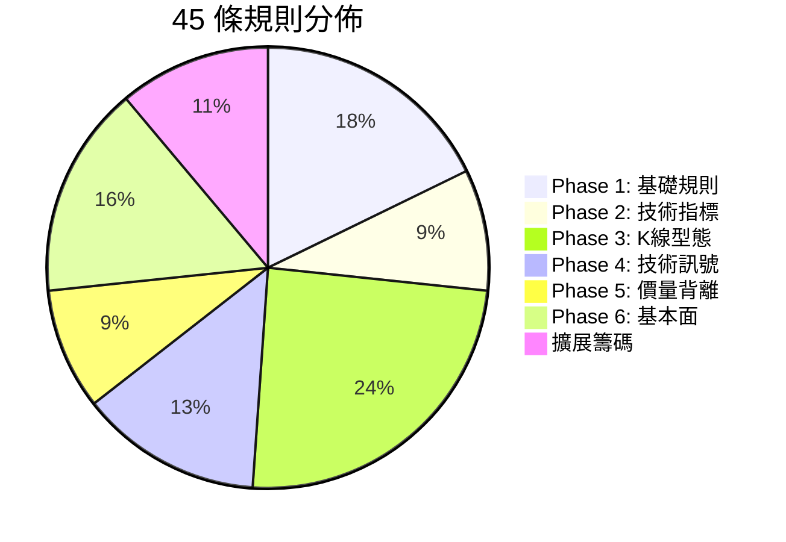
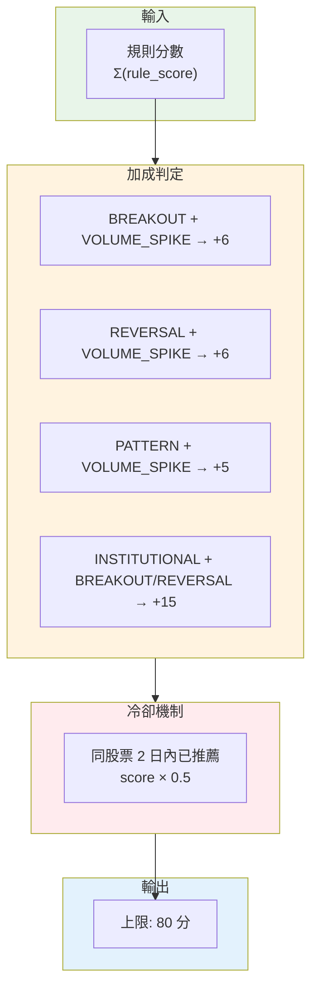

# Rule Engine v2

AfterClose 推薦規則引擎 - 45 條異常偵測規則

---

## 定位

| 項目 | 說明                     |
|:---|:-----------------------|
| 目的 | 異常提示 (Attention Alert) |
| 產出 | 每檔最多 2 個理由             |
| 分數 | 上限 80 分                |
| 輸出 | 每日 Top 20              |

---

## 參數

> **來源**: `lib/core/constants/rule_params.dart`

| 參數                |   值 | 說明         |
|:------------------|----:|:-----------|
| LOOKBACK_PRICE    | 120 | 分析視窗 (日)   |
| VOL_MA            |  20 | 均量計算天數     |
| SWING_WINDOW      |  20 | Swing 偵測視窗 |
| PRICE_SPIKE_PCT   |  3% | 價格異常門檻     |
| VOLUME_SPIKE_MULT |  4x | 放量門檻       |
| RSI_PERIOD        |  14 | RSI 周期     |
| RSI_OVERBOUGHT    |  70 | RSI 超買     |
| RSI_OVERSOLD      |  30 | RSI 超賣     |

---

## 規則分佈

---

## 規則清單

### Phase 1: 基礎規則 (8)

| 規則                  |  分數 | 條件                  |
|:--------------------|----:|:--------------------|
| REVERSAL_W2S        | +35 | 弱轉強：突破區間上緣          |
| REVERSAL_S2W        | +35 | 強轉弱：跌破支撐            |
| TECH_BREAKOUT       | +25 | 突破壓力位 (1% buffer)   |
| TECH_BREAKDOWN      | +25 | 跌破支撐位 (0.5% buffer) |
| VOLUME_SPIKE        | +22 | 量 ≥ 4x 均量且價變 ≥ 1.5% |
| PRICE_SPIKE         | +15 | 日漲跌幅 ≥ 3%           |
| INSTITUTIONAL_SHIFT | +18 | 外資方向反轉              |
| NEWS_RELATED        |  +8 | 近 24h 相關新聞          |

### Phase 2: 技術指標 (4)

| 規則                        |  分數 | 條件           |
|:--------------------------|----:|:-------------|
| KD_GOLDEN_CROSS           | +18 | K 上穿 D (低檔區) |
| KD_DEATH_CROSS            | +18 | K 下穿 D (高檔區) |
| INSTITUTIONAL_BUY_STREAK  | +20 | 法人連買 ≥ 3 日   |
| INSTITUTIONAL_SELL_STREAK | +20 | 法人連賣 ≥ 3 日   |

### Phase 3: K線型態 (11)

| 規則                           |  分數 | 說明   |
|:-----------------------------|----:|:-----|
| PATTERN_DOJI                 | +10 | 十字線  |
| PATTERN_BULLISH_ENGULFING    | +22 | 多頭吞噬 |
| PATTERN_BEARISH_ENGULFING    | +22 | 空頭吞噬 |
| PATTERN_HAMMER               | +18 | 錘子線  |
| PATTERN_HANGING_MAN          | +18 | 吊人線  |
| PATTERN_GAP_UP               | +20 | 跳空上漲 |
| PATTERN_GAP_DOWN             | +20 | 跳空下跌 |
| PATTERN_MORNING_STAR         | +25 | 晨星   |
| PATTERN_EVENING_STAR         | +25 | 暮星   |
| PATTERN_THREE_WHITE_SOLDIERS | +22 | 三白兵  |
| PATTERN_THREE_BLACK_CROWS    | +22 | 三黑鴉  |

### Phase 4: 技術訊號 (6)

| 規則                     |  分數 | 條件       |
|:-----------------------|----:|:---------|
| WEEK_52_HIGH           | +28 | 52 週新高   |
| WEEK_52_LOW            | +22 | 52 週新低   |
| MA_ALIGNMENT_BULLISH   | +22 | 多頭排列     |
| MA_ALIGNMENT_BEARISH   | +22 | 空頭排列     |
| RSI_EXTREME_OVERBOUGHT | +15 | RSI > 80 |
| RSI_EXTREME_OVERSOLD   | +15 | RSI < 20 |

### Phase 5: 價量背離 (4)

| 規則                              |  分數 | 說明   |
|:--------------------------------|----:|:-----|
| PRICE_VOLUME_BULLISH_DIVERGENCE | +15 | 價漲量縮 |
| PRICE_VOLUME_BEARISH_DIVERGENCE | +18 | 價跌量增 |
| HIGH_VOLUME_BREAKOUT            | +22 | 高檔爆量 |
| LOW_VOLUME_ACCUMULATION         | +16 | 低檔吸籌 |

### Phase 6: 基本面 (7)

| 規則                  |  分數 | 條件              |
|:--------------------|----:|:----------------|
| REVENUE_YOY_SURGE   | +20 | 營收年增 > 30%      |
| REVENUE_YOY_DECLINE | +15 | 營收年減 > 20%      |
| REVENUE_MOM_GROWTH  | +15 | 營收月增連續 2 月正成長   |
| HIGH_DIVIDEND_YIELD | +18 | 殖利率 > 5%        |
| PE_UNDERVALUED      | +15 | PE < 10 (且 > 0) |
| PE_OVERVALUED       | +10 | PE > 50         |
| PBR_UNDERVALUED     | +12 | 股價淨值比 < 1       |

### 擴展籌碼 (5)

| 規則                              |  分數 | 說明           |
|:--------------------------------|----:|:-------------|
| FOREIGN_SHAREHOLDING_INCREASING | +18 | 外資持股增 ≥ 0.5% |
| FOREIGN_SHAREHOLDING_DECREASING | +18 | 外資持股減 ≥ 0.5% |
| DAY_TRADING_HIGH                | +12 | 當沖比例 > 30%   |
| DAY_TRADING_EXTREME             | +15 | 當沖比例 > 40%   |
| CONCENTRATION_HIGH              | +16 | 大戶持股 > 60%   |

---

## 分數合成

---

## 資料表

> 完整 Schema 定義於 `lib/data/database/tables.drift`

| 表                    | 用途       |
|:---------------------|:---------|
| stock_master         | 股票主檔     |
| daily_price          | 日 K 資料   |
| daily_institutional  | 法人買賣超    |
| daily_analysis       | 分析結果     |
| daily_reason         | 推薦理由     |
| daily_recommendation | 每日 Top N |
| watchlist            | 自選清單     |
