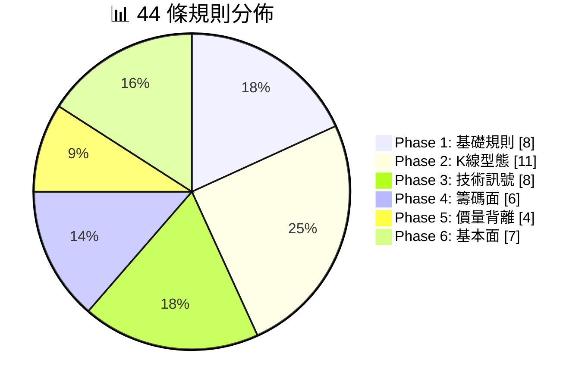
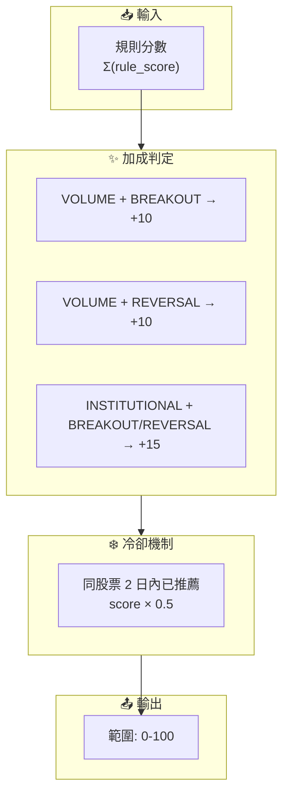

# Rule Engine v2

AfterClose 推薦規則引擎 - 44 條異常偵測規則

---

## 定位

| 項目 | 說明                     |
|:---|:-----------------------|
| 目的 | 異常提示 (Attention Alert) |
| 產出 | 每檔最多 2 個理由             |
| 分數 | 範圍 0-100（負分歸零）         |
| 輸出 | 每日 Top 20              |

---

## 參數

> **來源**: `lib/core/constants/rule_params.dart`

| 參數                      |    值 | 說明                |
|:------------------------|-----:|:------------------|
| lookbackPrice           |  370 | 分析視窗（日曆日，涵蓋 52 週） |
| volMa                   |   20 | 均量計算天數            |
| swingWindow             |   20 | Swing 偵測視窗        |
| priceSpikePercent       |   6% | 價格異動門檻            |
| volumeSpikeMult         |   4x | 放量門檻（均量倍數）        |
| minPriceChangeForVolume | 1.5% | 放量訊號需配合價格變動       |
| rsiPeriod               |   14 | RSI 週期            |
| rsiOverbought           |   80 | RSI 超買            |
| rsiOversold             |   20 | RSI 超賣            |
| institutionalStreakDays |    6 | 法人連續買賣天數          |
| minScoreThreshold       |   25 | 最低評分門檻            |

---

## 規則分佈

---

## 規則清單

> **多空分離**：正分為多方訊號（推薦做多），負分為空方訊號（降低推薦機率）

### Phase 1: 基礎規則 (8)

| 規則                  |  分數 | 條件                  |
|:--------------------|----:|:--------------------|
| REVERSAL_W2S        | +35 | 弱轉強：突破區間上緣          |
| REVERSAL_S2W        | -25 | 強轉弱：跌破支撐            |
| TECH_BREAKOUT       | +25 | 突破壓力位（1% buffer）    |
| TECH_BREAKDOWN      | -20 | 跌破支撐位（1% buffer）    |
| VOLUME_SPIKE        | +22 | 量 ≥ 4x 均量且價變 ≥ 1.5% |
| PRICE_SPIKE         | +15 | 日漲跌幅 ≥ 6%           |
| INSTITUTIONAL_SHIFT | +18 | 法人買賣轉向              |
| NEWS_RELATED        |  +8 | 近期相關新聞              |

### Phase 2: K線型態 (11)

| 規則                           |  分數 | 說明        |
|:-----------------------------|----:|:----------|
| PATTERN_DOJI                 | +10 | 十字線（猶豫訊號） |
| PATTERN_BULLISH_ENGULFING    | +22 | 多頭吞噬      |
| PATTERN_BEARISH_ENGULFING    | -18 | 空頭吞噬      |
| PATTERN_HAMMER               | +18 | 錘子線（底部反轉） |
| PATTERN_HANGING_MAN          | -12 | 吊人線（頭部警示） |
| PATTERN_GAP_UP               | +20 | 跳空上漲      |
| PATTERN_GAP_DOWN             | -15 | 跳空下跌      |
| PATTERN_MORNING_STAR         | +25 | 晨星（底部反轉）  |
| PATTERN_EVENING_STAR         | -20 | 暮星（頭部反轉）  |
| PATTERN_THREE_WHITE_SOLDIERS | +22 | 三白兵       |
| PATTERN_THREE_BLACK_CROWS    | -18 | 三黑鴉       |

### Phase 3: 技術訊號 (8)

| 規則                     |  分數 | 條件               |
|:-----------------------|----:|:-----------------|
| WEEK_52_HIGH           | +28 | 52 週新高           |
| WEEK_52_LOW            |  +8 | 52 週新低（逆勢機會）     |
| MA_ALIGNMENT_BULLISH   | +22 | 多頭排列（5>10>20>60） |
| MA_ALIGNMENT_BEARISH   | -15 | 空頭排列             |
| RSI_EXTREME_OVERBOUGHT |  -8 | RSI > 85（警示）     |
| RSI_EXTREME_OVERSOLD   | +10 | RSI < 30（反彈機會）   |
| KD_GOLDEN_CROSS        | +18 | K 上穿 D（低檔區 < 30） |
| KD_DEATH_CROSS         | -12 | K 下穿 D（高檔區 > 70） |

### Phase 4: 籌碼面 (6)

| 規則                              |  分數 | 條件               |
|:--------------------------------|----:|:-----------------|
| INSTITUTIONAL_BUY_STREAK        | +20 | 法人連買 ≥ 6 日       |
| INSTITUTIONAL_SELL_STREAK       | -15 | 法人連賣 ≥ 6 日       |
| FOREIGN_SHAREHOLDING_INCREASING | +18 | 外資持股 5 日增 ≥ 0.5% |
| FOREIGN_SHAREHOLDING_DECREASING | -12 | 外資持股 5 日減 ≥ 0.5% |
| DAY_TRADING_HIGH                | +12 | 當沖比例 > 45%       |
| DAY_TRADING_EXTREME             |  -5 | 當沖比例 > 60%（投機警示） |

> 備註：`CONCENTRATION_HIGH` 已移除（需付費 API）

### Phase 5: 價量背離 (4)

| 規則                              |  分數 | 說明       |
|:--------------------------------|----:|:---------|
| PRICE_VOLUME_BULLISH_DIVERGENCE |  -8 | 價漲量縮（警示） |
| PRICE_VOLUME_BEARISH_DIVERGENCE | -15 | 價跌量增（恐慌） |
| HIGH_VOLUME_BREAKOUT            | +22 | 高檔爆量突破   |
| LOW_VOLUME_ACCUMULATION         | +16 | 低檔吸籌     |

### Phase 6: 基本面 (7)

| 規則                  |  分數 | 條件             |
|:--------------------|----:|:---------------|
| REVENUE_YOY_SURGE   | +20 | 營收年增 > 30%     |
| REVENUE_YOY_DECLINE | -10 | 營收年減 > 20%     |
| REVENUE_MOM_GROWTH  | +15 | 營收月增 > 10%     |
| HIGH_DIVIDEND_YIELD | +18 | 殖利率 > 5.5%     |
| PE_UNDERVALUED      | +15 | PE < 10（且 > 0） |
| PE_OVERVALUED       |  -8 | PE > 100       |
| PBR_UNDERVALUED     | +12 | 股價淨值比 < 0.8    |

---

## 分數合成

**分數計算邏輯**（`rule_engine.dart:calculateScore`）：

1. **基礎分數**：累計所有觸發規則的分數
2. **組合加成**：
   - 放量 + 突破 → +10
   - 放量 + 反轉 → +10
   - 法人 + (突破或反轉) → +15
3. **多空抵消**：正負分數自然相抵
4. **冷卻懲罰**：近期推薦過 → ×0.5
5. **範圍限制**：負分歸零，上限 100

---

## 資料表

> 完整 Schema 定義於 `lib/data/database/tables.drift`

| 表                    | 用途       |
|:---------------------|:---------|
| stock_master         | 股票主檔     |
| daily_price          | 日 K 資料   |
| daily_institutional  | 法人買賣超    |
| daily_analysis       | 分析結果     |
| daily_reason         | 推薦理由     |
| daily_recommendation | 每日 Top N |
| watchlist            | 自選清單     |
