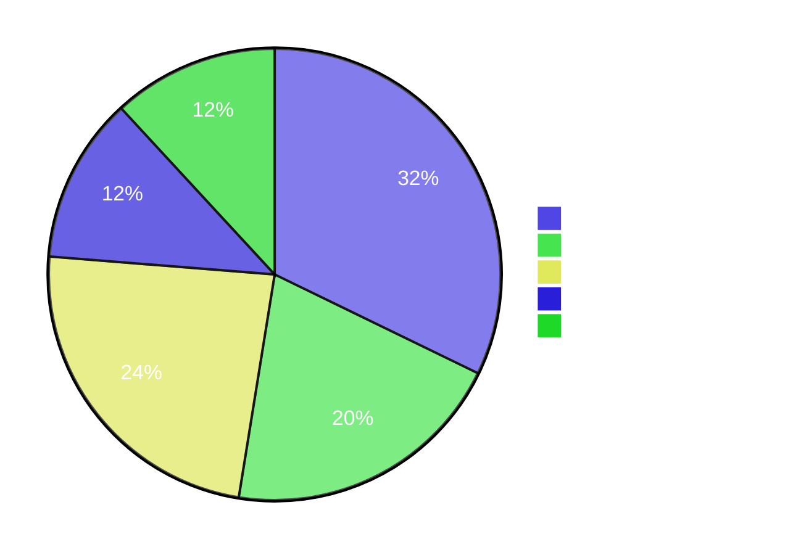
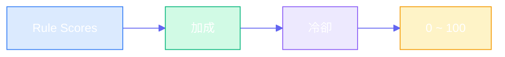

# Rule Engine

AfterClose 推薦規則引擎 — **59 條異常偵測規則**

---

## 定位

| 項目 | 說明                    |
|:---|:----------------------|
| 目的 | 異常提示（Attention Alert） |
| 產出 | 每檔最多 2 個理由            |
| 分數 | 0 ~ 100（負分歸零）         |
| 輸出 | 每日 Top 20             |

---

## 規則分佈

---

## 技術型態 (19)

### 基礎規則 (8)

| 規則                  |  分數 | 條件                         |
|:--------------------|----:|:---------------------------|
| REVERSAL_W2S        | +35 | 弱轉強：突破區間上緣                 |
| REVERSAL_S2W        | -25 | 強轉弱：跌破支撐                   |
| TECH_BREAKOUT       | +25 | 突破壓力位（3% buffer + MA20 確認） |
| TECH_BREAKDOWN      | -20 | 跌破支撐位（3% buffer + MA20 確認） |
| VOLUME_SPIKE        | +22 | 量 >= 4x 均量且價變 >= 1.5%      |
| PRICE_SPIKE         | +15 | 日漲跌幅 >= 6%                 |
| INSTITUTIONAL_SHIFT | +18 | 法人買賣轉向                     |
| NEWS_RELATED        |  +8 | 近期相關新聞                     |

### K 線型態 (11)

| 規則                           |  分數 | 說明        |
|:-----------------------------|----:|:----------|
| PATTERN_DOJI                 | +10 | 十字線（猶豫訊號） |
| PATTERN_BULLISH_ENGULFING    | +22 | 多頭吞噬      |
| PATTERN_BEARISH_ENGULFING    | -18 | 空頭吞噬      |
| PATTERN_HAMMER               | +18 | 錘子線（底部反轉） |
| PATTERN_HANGING_MAN          | -12 | 吊人線（頭部警示） |
| PATTERN_GAP_UP               | +20 | 跳空上漲      |
| PATTERN_GAP_DOWN             | -15 | 跳空下跌      |
| PATTERN_MORNING_STAR         | +25 | 晨星（底部反轉）  |
| PATTERN_EVENING_STAR         | -20 | 暮星（頭部反轉）  |
| PATTERN_THREE_WHITE_SOLDIERS | +22 | 三白兵       |
| PATTERN_THREE_BLACK_CROWS    | -18 | 三黑鴉       |

---

## 價量訊號 (12)

### 技術指標 (8)

| 規則                     |  分數 | 條件               |
|:-----------------------|----:|:-----------------|
| WEEK_52_HIGH           | +28 | 52 週新高           |
| WEEK_52_LOW            |  +8 | 52 週新低（逆勢機會）     |
| MA_ALIGNMENT_BULLISH   | +22 | 多頭排列（5>10>20>60） |
| MA_ALIGNMENT_BEARISH   | -15 | 空頭排列             |
| RSI_EXTREME_OVERBOUGHT |  -8 | RSI > 85（警示）     |
| RSI_EXTREME_OVERSOLD   | +10 | RSI < 30（反彈機會）   |
| KD_GOLDEN_CROSS        | +18 | K 上穿 D（低檔區 < 30） |
| KD_DEATH_CROSS         | -12 | K 下穿 D（高檔區 > 70） |

### 價量背離 (4)

| 規則                              |  分數 | 說明       |
|:--------------------------------|----:|:---------|
| PRICE_VOLUME_BULLISH_DIVERGENCE |  -8 | 價漲量縮（警示） |
| PRICE_VOLUME_BEARISH_DIVERGENCE | -15 | 價跌量增（恐慌） |
| HIGH_VOLUME_BREAKOUT            | +22 | 高檔爆量突破   |
| LOW_VOLUME_ACCUMULATION         | +16 | 低檔吸籌     |

---

## 籌碼面 (7)

| 規則                              |  分數 | 條件                   |
|:--------------------------------|----:|:---------------------|
| INSTITUTIONAL_BUY_STREAK        | +20 | 法人連買 >= 4 日          |
| INSTITUTIONAL_SELL_STREAK       | -15 | 法人連賣 >= 4 日          |
| FOREIGN_SHAREHOLDING_INCREASING | +18 | 外資持股 5 日增 >= 0.5%    |
| FOREIGN_SHAREHOLDING_DECREASING | -12 | 外資持股 5 日減 >= 0.5%    |
| DAY_TRADING_HIGH                | +12 | 當沖比例 >= 50% + 萬張以上   |
| DAY_TRADING_EXTREME             |  -5 | 當沖比例 >= 70% + 3 萬張以上 |
| CONCENTRATION_HIGH              | +16 | 大戶持股集中度 >= 60%       |

---

## 基本面 (14)

### 營收與估值 (7)

| 規則                  |  分數 | 條件                      |
|:--------------------|----:|:------------------------|
| REVENUE_YOY_SURGE   | +20 | 營收年增 > 50% + 站上 MA60    |
| REVENUE_YOY_DECLINE | -10 | 營收年減 > 20%              |
| REVENUE_MOM_GROWTH  | +15 | 營收月增連續正成長 + 站上 MA20     |
| HIGH_DIVIDEND_YIELD | +18 | 殖利率 > 5%                |
| PE_UNDERVALUED      | +15 | PE < 10（且 > 0）+ 站上 MA20 |
| PE_OVERVALUED       |  -8 | PE > 100 + RSI > 75     |
| PBR_UNDERVALUED     | +12 | 股價淨值比 < 0.8             |

### EPS 分析 (4)

| 規則                     |  分數 | 條件                                |
|:-----------------------|----:|:----------------------------------|
| EPS_YOY_SURGE          | +22 | EPS 年增 >= 50% + 站上 MA60           |
| EPS_CONSECUTIVE_GROWTH | +18 | 連續 >= 2 季 EPS 季增 >= 10% + 站上 MA20 |
| EPS_TURNAROUND         | +15 | 前季虧損、本季 EPS >= 0.3 元              |
| EPS_DECLINE_WARNING    | -12 | 連續 2 季 EPS 季減 >= 20%              |

### ROE 分析 (3)

| 規則            |  分數 | 條件                                |
|:--------------|----:|:----------------------------------|
| ROE_EXCELLENT | +18 | ROE >= 15% + 站上 MA20              |
| ROE_IMPROVING | +15 | 連續 >= 2 季 ROE 改善 >= 5pt + 站上 MA20 |
| ROE_DECLINING | -10 | 連續 >= 2 季 ROE 衰退 >= 5pt           |

---

## 殺手級功能 (7)

### 警示股票 (2)

| 規則                        |  分數 | 條件      | 來源        |
|:--------------------------|----:|:--------|:----------|
| TRADING_WARNING_ATTENTION | -15 | 被列為注意股票 | TWSE/TPEX |
| TRADING_WARNING_DISPOSAL  | -50 | 被列為處置股票 | TWSE/TPEX |

### 董監持股 (3)

| 規則                         |  分數 | 條件             |
|:---------------------------|----:|:---------------|
| INSIDER_SELLING_STREAK     | -25 | 董監連續減持 >= 3 個月 |
| INSIDER_SIGNIFICANT_BUYING | +20 | 董監增持 >= 5%     |
| HIGH_PLEDGE_RATIO          | -18 | 質押比例 >= 50%    |

### 外資集中度 (2)

| 規則                            |  分數 | 條件              |
|:------------------------------|----:|:----------------|
| FOREIGN_CONCENTRATION_WARNING |  -8 | 外資持股 >= 60%     |
| FOREIGN_EXODUS                | -20 | 5 日外資流出 >= 0.5% |

---

## 分數合成

| 階段 | 邏輯                                                                                      |
|:---|:----------------------------------------------------------------------------------------|
| 加成 | VOLUME + BREAKOUT → +10、VOLUME + REVERSAL → +10、INSTITUTIONAL + BREAKOUT/REVERSAL → +15 |
| 冷卻 | 同股票 2 日內已推薦 → -15 分（固定扣分）                                                               |
| 截斷 | 負分歸零、上限 100                                                                             |

---

## 關鍵參數

> 來源：`lib/core/constants/rule_params.dart`（200+ 參數）

| 參數                          |   值 | 說明         |
|:----------------------------|----:|:-----------|
| lookbackPrice               | 370 | 分析視窗（日曆日）  |
| volMa                       |  20 | 均量計算天數     |
| volumeSpikeMult             |  4x | 放量門檻       |
| breakoutBuffer              |  3% | 突破緩衝區      |
| institutionalStreakDays     |   4 | 法人連續買賣天數   |
| insiderSellingStreakMonths  |   3 | 董監連續減持月數   |
| highPledgeRatioThreshold    | 50% | 高質押門檻      |
| foreignConcentrationWarning | 60% | 外資集中警告     |
| concentrationHighThreshold  | 60% | 籌碼集中度門檻    |
| epsYoYSurgeThreshold        | 50% | EPS 年增暴增門檻 |
| epsConsecutiveQuarters      |   2 | EPS 連續成長季數 |
| roeExcellentThreshold       | 15% | ROE 優異門檻   |
| minScoreThreshold           |  25 | 最低評分門檻     |

---

## 資料表

| 表                    | 用途       |
|:---------------------|:---------|
| stock_master         | 股票主檔     |
| daily_price          | 日 K 資料   |
| daily_institutional  | 法人買賣超    |
| trading_warning      | 注意/處置股票  |
| insider_holding      | 董監持股     |
| daily_analysis       | 分析結果     |
| daily_recommendation | 每日 Top N |
