# Rule Engine v2

AfterClose 推薦規則引擎 — **51 條異常偵測規則**

---

## 定位

```mermaid
flowchart LR
    Data["📊 市場資料"] --> Engine["⚙️ Rule Engine<br/>51 Rules"]
    Engine --> Score["🧮 分數合成"]
    Score --> Top["🏆 Top 20"]
```

| 項目 | 說明                     |
|:---|:-----------------------|
| 目的 | 異常提示 (Attention Alert) |
| 產出 | 每檔最多 2 個理由             |
| 分數 | 範圍 0-100（負分歸零）         |
| 輸出 | 每日 Top 20              |

---

## 規則分佈

```mermaid
pie showData title 📊 51 條規則分佈
    "技術型態" : 19
    "籌碼面" : 6
    "價量訊號" : 12
    "基本面" : 7
    "殺手級功能" : 7
```

---

## Phase 1-6: 基礎規則 (44)

### 基礎規則 (8)

| 規則                  |  分數 | 條件                         |
|:--------------------|----:|:---------------------------|
| REVERSAL_W2S        | +35 | 弱轉強：突破區間上緣                 |
| REVERSAL_S2W        | -25 | 強轉弱：跌破支撐                   |
| TECH_BREAKOUT       | +25 | 突破壓力位（3% buffer + MA20 確認） |
| TECH_BREAKDOWN      | -20 | 跌破支撐位（3% buffer + MA20 確認） |
| VOLUME_SPIKE        | +22 | 量 ≥ 4x 均量且價變 ≥ 1.5%        |
| PRICE_SPIKE         | +15 | 日漲跌幅 ≥ 6%                  |
| INSTITUTIONAL_SHIFT | +18 | 法人買賣轉向                     |
| NEWS_RELATED        |  +8 | 近期相關新聞                     |

### K線型態 (11)

| 規則                           |  分數 | 說明        |
|:-----------------------------|----:|:----------|
| PATTERN_DOJI                 | +10 | 十字線（猶豫訊號） |
| PATTERN_BULLISH_ENGULFING    | +22 | 多頭吞噬      |
| PATTERN_BEARISH_ENGULFING    | -18 | 空頭吞噬      |
| PATTERN_HAMMER               | +18 | 錘子線（底部反轉） |
| PATTERN_HANGING_MAN          | -12 | 吊人線（頭部警示） |
| PATTERN_GAP_UP               | +20 | 跳空上漲      |
| PATTERN_GAP_DOWN             | -15 | 跳空下跌      |
| PATTERN_MORNING_STAR         | +25 | 晨星（底部反轉）  |
| PATTERN_EVENING_STAR         | -20 | 暮星（頭部反轉）  |
| PATTERN_THREE_WHITE_SOLDIERS | +22 | 三白兵       |
| PATTERN_THREE_BLACK_CROWS    | -18 | 三黑鴉       |

### 技術訊號 (8)

| 規則                     |  分數 | 條件               |
|:-----------------------|----:|:-----------------|
| WEEK_52_HIGH           | +28 | 52 週新高           |
| WEEK_52_LOW            |  +8 | 52 週新低（逆勢機會）     |
| MA_ALIGNMENT_BULLISH   | +22 | 多頭排列（5>10>20>60） |
| MA_ALIGNMENT_BEARISH   | -15 | 空頭排列             |
| RSI_EXTREME_OVERBOUGHT |  -8 | RSI > 85（警示）     |
| RSI_EXTREME_OVERSOLD   | +10 | RSI < 30（反彈機會）   |
| KD_GOLDEN_CROSS        | +18 | K 上穿 D（低檔區 < 30） |
| KD_DEATH_CROSS         | -12 | K 下穿 D（高檔區 > 70） |

### 籌碼面 (6)

| 規則                              |  分數 | 條件               |
|:--------------------------------|----:|:-----------------|
| INSTITUTIONAL_BUY_STREAK        | +20 | 法人連買 ≥ 6 日       |
| INSTITUTIONAL_SELL_STREAK       | -15 | 法人連賣 ≥ 6 日       |
| FOREIGN_SHAREHOLDING_INCREASING | +18 | 外資持股 5 日增 ≥ 0.5% |
| FOREIGN_SHAREHOLDING_DECREASING | -12 | 外資持股 5 日減 ≥ 0.5% |
| DAY_TRADING_HIGH                | +12 | 當沖比例 > 45%       |
| DAY_TRADING_EXTREME             |  -5 | 當沖比例 > 60%（投機警示） |

### 價量背離 (4)

| 規則                              |  分數 | 說明       |
|:--------------------------------|----:|:---------|
| PRICE_VOLUME_BULLISH_DIVERGENCE |  -8 | 價漲量縮（警示） |
| PRICE_VOLUME_BEARISH_DIVERGENCE | -15 | 價跌量增（恐慌） |
| HIGH_VOLUME_BREAKOUT            | +22 | 高檔爆量突破   |
| LOW_VOLUME_ACCUMULATION         | +16 | 低檔吸籌     |

### 基本面 (7)

| 規則                  |  分數 | 條件             |
|:--------------------|----:|:---------------|
| REVENUE_YOY_SURGE   | +20 | 營收年增 > 30%     |
| REVENUE_YOY_DECLINE | -10 | 營收年減 > 20%     |
| REVENUE_MOM_GROWTH  | +15 | 營收月增 > 10%     |
| HIGH_DIVIDEND_YIELD | +18 | 殖利率 > 5.5%     |
| PE_UNDERVALUED      | +15 | PE < 10（且 > 0） |
| PE_OVERVALUED       |  -8 | PE > 100       |
| PBR_UNDERVALUED     | +12 | 股價淨值比 < 0.8    |

---

## Phase 7: 殺手級功能 (7) 🆕

> v0.1.0 新增 — 風險警示與機構動向

### 警示股票規則

| 規則                        |  分數 | 條件      | 來源       |
|:--------------------------|----:|:--------|:---------|
| TRADING_WARNING_ATTENTION | -30 | 被列為注意股票 | TPEX API |
| TRADING_WARNING_DISPOSAL  | -50 | 被列為處置股票 | TPEX API |

### 董監持股規則

| 規則                         |  分數 | 條件            | 說明   |
|:---------------------------|----:|:--------------|:-----|
| INSIDER_SELLING_STREAK     | -25 | 董監連續減持 ≥ 3 個月 | 強賣訊號 |
| INSIDER_SIGNIFICANT_BUYING | +20 | 董監增持 ≥ 5%     | 買進訊號 |
| HIGH_PLEDGE_RATIO          | -20 | 質押比例 ≥ 50%    | 風險警示 |

### 外資集中度規則

| 規則                            |  分數 | 條件            | 說明    |
|:------------------------------|----:|:--------------|:------|
| FOREIGN_CONCENTRATION_WARNING | -15 | 外資持股 ≥ 60%    | 集中度警告 |
| FOREIGN_EXODUS                | -25 | 10 日外資流出 ≥ 2% | 外資出逃  |

---

## 分數合成

```mermaid
flowchart TB
    subgraph Input["📥 輸入"]
        Rules["規則分數 Σ(rule_score)"]
    end

    subgraph Bonus["✨ 加成"]
        B1["VOLUME + BREAKOUT → +10"]
        B2["VOLUME + REVERSAL → +10"]
        B3["INSTITUTIONAL + BREAKOUT/REVERSAL → +15"]
    end

    subgraph Penalty["❄️ 冷卻"]
        P1["同股票 2 日內已推薦 → ×0.5"]
    end

    subgraph Output["📤 輸出"]
        Cap["範圍: 0-100"]
    end

    Rules --> Bonus --> Penalty --> Cap
```

---

## 參數配置

> 來源: `lib/core/constants/rule_params.dart`

| 參數                          |   值 | 說明        |
|:----------------------------|----:|:----------|
| lookbackPrice               | 370 | 分析視窗（日曆日） |
| volMa                       |  20 | 均量計算天數    |
| volumeSpikeMult             |  4x | 放量門檻      |
| breakoutBuffer              |  3% | 突破緩衝區     |
| institutionalStreakDays     |   6 | 法人連續買賣天數  |
| insiderSellingStreakMonths  |   3 | 董監連續減持月數  |
| highPledgeRatioThreshold    | 50% | 高質押門檻     |
| foreignConcentrationWarning | 60% | 外資集中警告    |
| minScoreThreshold           |  25 | 最低評分門檻    |

---

## 資料表

| 表                    | 用途       |
|:---------------------|:---------|
| stock_master         | 股票主檔     |
| daily_price          | 日 K 資料   |
| daily_institutional  | 法人買賣超    |
| trading_warning      | 注意/處置股票  |
| insider_holding      | 董監持股     |
| daily_analysis       | 分析結果     |
| daily_recommendation | 每日 Top N |
