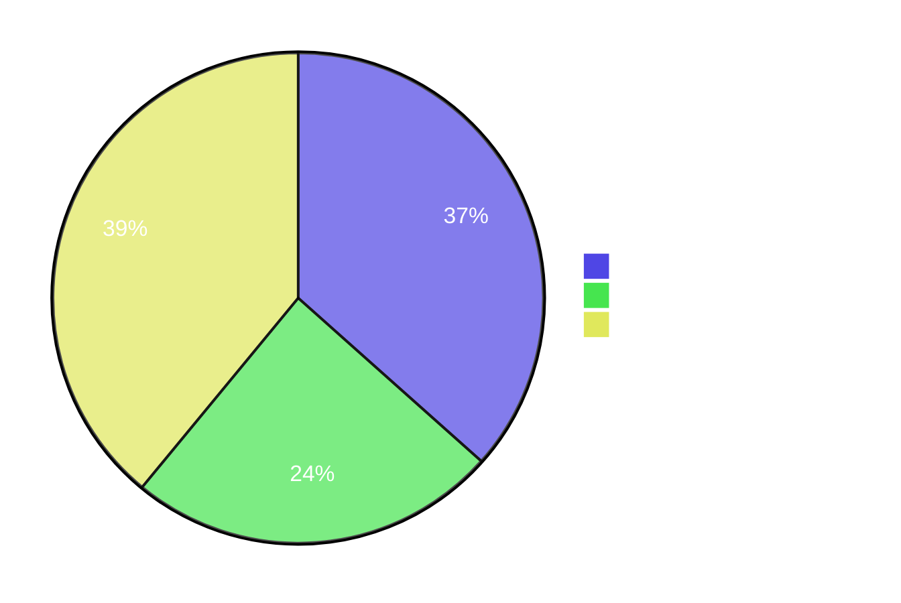
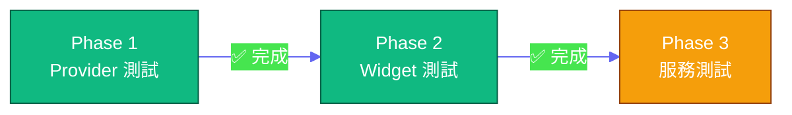
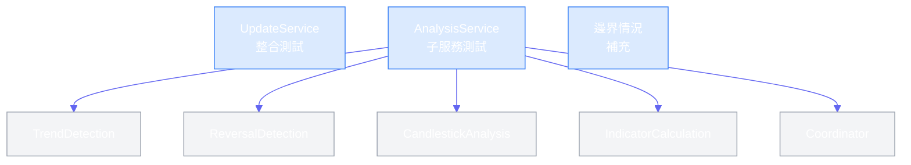

# 測試覆蓋率計劃

---

## 當前狀況

| 指標               | 數值    |
|:-----------------|:------|
| 測試總數             | 2460+ |
| 執行時間             | ~33 秒 |
| Domain 覆蓋率       | 85%+  |
| Data 覆蓋率         | 85%+  |
| Presentation 覆蓋率 | 70%+  |

---

## 完成進度

---

## 待完成：Phase 3 — 大型服務測試

### UpdateService 整合測試

| 項目 | 說明                                              |
|:---|:------------------------------------------------|
| 檔案 | `test/domain/services/update_service_test.dart` |
| 範圍 | 同步流程協調、錯誤處理重試、進度追蹤、Rate Limit、Syncer 呼叫順序       |

### AnalysisService 子服務測試

| 項目 | 說明                                                |
|:---|:--------------------------------------------------|
| 檔案 | `test/domain/services/analysis_service_test.dart` |
| 範圍 | 趨勢檢測、反轉檢測、K 線型態、指標計算、邊界條件                         |
| 備註 | 已拆分為 5 個子服務，可分別測試                                 |

### 邊界情況補充

| 類別     | 測試項目                        |
|:-------|:----------------------------|
| 空列表    | 空自選股、空搜尋結果、無歷史資料            |
| Null 值 | 缺失價格 / 基本面 / 技術指標資料         |
| 極端數值   | 股價 >10000 或 <1、成交量 0 或極大值   |
| 時間     | 假日 / 停牌、開盤前後、資料延遲           |
| 網路     | API timeout、連線中斷、Rate Limit |

---

## 測試慣例

詳見 [CLAUDE.md](../CLAUDE.md) 的「Widget 測試慣例」章節。

---

*最後更新: 2026-02-22*
