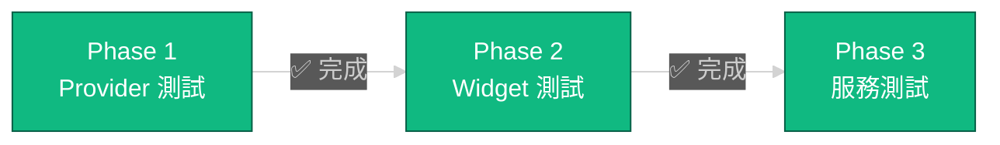
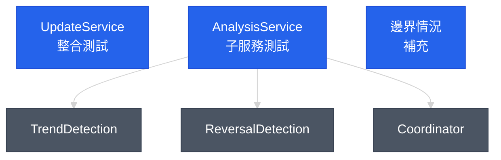

# 🧪 測試覆蓋率計劃

> ← [Back to README](../README.md)

---

## 📊 當前狀況

> 測試總數與各層覆蓋率以 CI / Codecov 為準（本地：`flutter test --coverage`）。
> 下表為 2026-07-08 實測快照（排除 `*.g.dart` / `*.drift.dart` 生成碼）。

| 層級           | 實測覆蓋率 | 目標   | 差距        |
|:-------------|:------|:-----|:----------|
| Core         | 73.2% | —    | —         |
| Domain       | 68.2% | 85%+ | 主要在大型服務   |
| Data         | 35.5% | 85%+ | ⚠️ 最大缺口：API client（twse 11% / tpex 8% / finmind 13%）與 repositories |
| Presentation | 61.5% | 70%+ | widget 邊角 |
| **手寫碼總體**    | 57.6% | —    | —         |

---

## ✅ 完成進度

```mermaid
%%{init: {'theme': 'dark'}}%%
flowchart LR
    P1["Phase 1\nProvider 測試"]
    P2["Phase 2\nWidget 測試"]
    P3["Phase 3\n服務測試"]

    P1 -->|✅ 完成| P2
    P2 -->|✅ 完成| P3

    style P1 fill:#10B981,stroke:#065F46,color:#fff
    style P2 fill:#10B981,stroke:#065F46,color:#fff
    style P3 fill:#10B981,stroke:#065F46,color:#fff
```

---

## 🚧 待完成：Phase 3 — 大型服務測試

```mermaid
%%{init: {'theme': 'dark'}}%%
flowchart TB
    US["UpdateService\n整合測試"]
    AS["AnalysisService\n子服務測試"]
    Edge["邊界情況\n補充"]

    AS --> TD["TrendDetection"]
    AS --> RD["ReversalDetection"]
    AS --> CO["Coordinator"]

    style US fill:#2563EB,color:#fff,stroke:#1D4ED8
    style AS fill:#2563EB,color:#fff,stroke:#1D4ED8
    style Edge fill:#2563EB,color:#fff,stroke:#1D4ED8
    style TD fill:#4B5563,color:#fff,stroke:#374151
    style RD fill:#4B5563,color:#fff,stroke:#374151
    style CO fill:#4B5563,color:#fff,stroke:#374151
```

### UpdateService 整合測試

| 項目 | 說明                                              |
|:---|:------------------------------------------------|
| 檔案 | `test/domain/services/update_service_test.dart` |
| 範圍 | 同步流程協調、錯誤處理重試、進度追蹤、Rate Limit、Syncer 呼叫順序       |
| 備註 | 🚧 2026-07-08 已建立最小 harness（輔助資料失敗可見性 4 例）；其餘範圍待補 |

### AnalysisService 子服務測試

| 項目 | 說明                                                       |
|:---|:---------------------------------------------------------|
| 檔案 | `test/domain/services/analysis_service_test.dart`        |
| 範圍 | 趨勢檢測、反轉檢測、協調器、邊界條件                                       |
| 備註 | ✅ `analysis_service_test.dart` 已建立；UpdateService 整合測試仍待補 |

### 邊界情況補充

| 類別     | 測試項目                        |
|:-------|:----------------------------|
| 空列表    | 空自選股、空搜尋結果、無歷史資料            |
| Null 值 | 缺失價格 / 基本面 / 技術指標資料         |
| 極端數值   | 股價 >10000 或 <1、成交量 0 或極大值   |
| 時間     | 假日 / 停牌、開盤前後、資料延遲           |
| 網路     | API timeout、連線中斷、Rate Limit |

---

## 📏 測試慣例

詳見 [CLAUDE.md](../CLAUDE.md) 的「Widget 測試慣例」章節。

---

← [Back to README](../README.md) | 📚 [All Documentation](../README.md#文件)

*最後更新: 2026-07-08*
